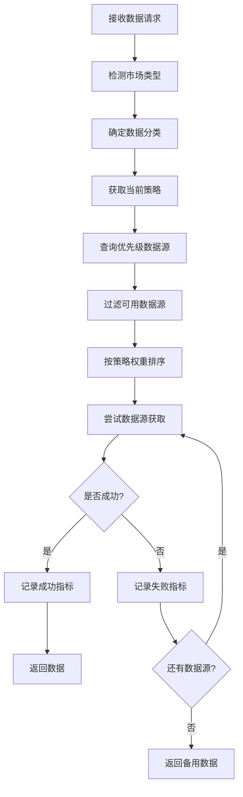
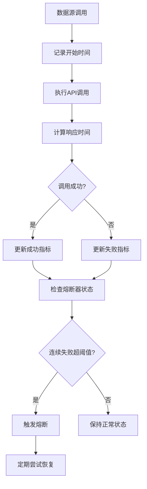

# 动态策略切换技术文档

## 概述

动态策略切换是 Get Stock Data 微服务的核心功能之一，它能够根据数据源的性能表现、可用性和业务需求，实时调整数据源的选择策略，确保数据获取的可靠性和效率。

## 核心组件

### 1. 策略引擎 (StrategyEngine)

位置：`src/services/strategy_engine.py`

#### 主要功能
- **实时性能监控**：跟踪每个数据源的响应时间、成功率、连续失败次数
- **熔断器机制**：当数据源连续失败达到阈值时，自动熔断，避免级联故障
- **动态优先级调整**：根据性能指标实时调整数据源优先级
- **自动优化**：后台定期分析性能数据，自动优化策略配置

#### 核心方法

```python
class StrategyEngine:
    def __init__(self):
        self.source_metrics = {}      # 数据源性能指标
        self.circuit_breakers = {}    # 熔断器状态
        self.active_strategies = {}   # 当前活跃策略
        self.auto_adjustment_enabled = True  # 自动调整开关
```

**性能指标记录**：
```python
def record_source_result(self, source: str, success: bool, response_time: float):
    """记录数据源调用结果，更新性能指标"""
    metrics = self.source_metrics[source]
    metrics.request_count += 1

    if success:
        metrics.success_count += 1
        metrics.total_response_time += response_time
        metrics.consecutive_failures = 0
        metrics.last_success_time = datetime.now()
    else:
        metrics.failure_count += 1
        metrics.consecutive_failures += 1
        metrics.last_failure_time = datetime.now()
```

**最优数据源选择**：
```python
async def get_optimal_sources(self, data_type: str, market: str, strategy: Optional[StrategyType] = None):
    """根据当前性能和策略获取最优数据源排序"""
    # 1. 获取基础优先级列表
    base_priorities = self._get_base_priorities(data_type, market)

    # 2. 过滤熔断的数据源
    available_sources = self._filter_available_sources(base_priorities)

    # 3. 根据策略权重计算得分
    scored_sources = self._calculate_strategy_scores(available_sources, strategy)

    # 4. 返回按得分排序的数据源列表
    return sorted(scored_sources, key=lambda x: x[1], reverse=True)
```

### 2. 数据源配置管理器 (DataSourceConfig)

位置：`src/config/data_source_config.py`

#### 数据分类 (DataCategory)
```python
class DataCategory(Enum):
    MARKET_DATA = "market_data"        # 市场数据
    PRICE_DATA = "price_data"          # 价格数据
    VOLUME_DATA = "volume_data"        # 成交量数据
    COMPANY_DATA = "company_data"      # 公司数据
    FINANCIAL_DATA = "financial_data"  # 财务数据
    TECHNICAL_DATA = "technical_data"  # 技术指标数据
```

#### 策略类型 (DataSourceStrategy)
```python
class DataSourceStrategy(Enum):
    SPEED_FIRST = "speed_first"        # 速度优先
    COST_FIRST = "cost_first"          # 成本优先
    RELIABILITY_FIRST = "reliability_first"  # 可靠性优先
    ACCURACY_FIRST = "accuracy_first"  # 精度优先
    BALANCED = "balanced"              # 平衡策略
```

#### 策略权重配置
每种策略都有对应的权重配置：

```python
"strategy_profiles": {
    "speed_first": {
        "description": "速度优先策略",
        "weight": {
            "speed": 0.5,        # 速度权重50%
            "reliability": 0.2,  # 可靠性权重20%
            "accuracy": 0.2,     # 精度权重20%
            "cost": 0.1          # 成本权重10%
        }
    },
    "reliability_first": {
        "description": "可靠性优先策略",
        "weight": {
            "reliability": 0.5,  # 可靠性权重50%
            "accuracy": 0.25,    # 精度权重25%
            "speed": 0.15,       # 速度权重15%
            "cost": 0.1          # 成本权重10%
        }
    }
}
```

### 3. 增强版股票数据服务 (EnhancedStockService)

位置：`src/services/enhanced_stock_service.py`

#### 数据类型枚举
```python
class DataType(Enum):
    REALTIME = "realtime"      # 实时行情
    HISTORICAL = "historical"  # 历史K线
    TICK = "tick"              # 分笔成交
    FINANCIAL = "financial"    # 财务报表
    SECTOR = "sector"          # 板块指数
    MACRO = "macro"            # 宏观经济
```

#### 市场类型检测
```python
def detect_market_type(self, symbol: str) -> MarketType:
    """根据股票代码格式自动检测市场类型"""
    if len(symbol) == 6 and symbol.isdigit():
        if symbol.startswith(('000', '002', '300', '600', '688')):
            return MarketType.A_STOCKS
    elif symbol.endswith('.HK'):
        return MarketType.HK_STOCKS
    elif symbol.isalpha() or symbol.isdigit():
        return MarketType.US_STOCKS
```

#### 优先级数据源获取
```python
def get_priority_sources(self, data_type: DataType, market_type: MarketType) -> List[str]:
    """获取指定数据类型和市场类型的数据源优先级列表"""
    priority_list = self.data_source_priorities.get(data_type, {}).get(market_type, [])

    # 过滤掉不健康的数据源
    healthy_sources = []
    for source in priority_list:
        if self.source_health[source]["status"] == "healthy":
            healthy_sources.append(source)
        elif self.source_health[source]["failures"] < 3:
            healthy_sources.append(source)

    return healthy_sources
```

## 策略切换流程

### 1. 请求处理流程



### 2. 性能监控流程



### 3. 自动调整机制

```python
async def _auto_adjustment_task(self):
    """后台自动调整任务"""
    while self.auto_adjustment_enabled:
        try:
            # 1. 分析各数据源性能趋势
            performance_analysis = self._analyze_performance_trends()

            # 2. 识别需要调整的策略
            adjustments = self._identify_needed_adjustments(performance_analysis)

            # 3. 应用调整
            for adjustment in adjustments:
                self._apply_strategy_adjustment(adjustment)

            # 4. 记录调整日志
            self._log_adjustments(adjustments)

        except Exception as e:
            logger.error(f"自动调整任务异常: {e}")

        await asyncio.sleep(self.adjustment_interval)
```

## API 接口

### 1. 策略管理接口

**获取策略状态**：
```
GET /api/v1/strategies/status
```

**更新策略配置**：
```
POST /api/v1/strategies/update
{
    "data_type": "realtime",
    "strategy": "speed_first"
}
```

**批量更新策略**：
```
POST /api/v1/strategies/bulk-update
{
    "strategies": {
        "realtime": "speed_first",
        "historical": "reliability_first",
        "financial": "accuracy_first"
    }
}
```

### 2. 性能测试接口

**启动策略测试**：
```
POST /api/v1/strategies/test?test_duration=300&test_symbol=000001&test_frequency=10
{
    "data_type": "realtime",
    "strategy": "balanced"
}
```

**获取测试结果**：
```
GET /api/v1/strategies/test/{task_id}
```

### 3. 监控接口

**获取数据源指标**：
```
GET /api/v1/strategies/metrics
```

**控制自动调整**：
```
POST /api/v1/strategies/auto-adjustment?enabled=true
```

## 配置示例

### 数据源优先级配置

```json
{
  "strategies": {
    "price_data": {
      "default_strategy": "reliability_first",
      "priorities": {
        "A股": ["akshare", "tushare", "baostock"],
        "港股": ["akshare", "mootdx"],
        "美股": ["yfinance", "pandas", "alpha_vantage"]
      },
      "settings": {
        "max_retries": 3,
        "timeout": 8,
        "cache_ttl": 30
      }
    },
    "volume_data": {
      "default_strategy": "speed_first",
      "priorities": {
        "A股": ["akshare", "tushare"],
        "港股": ["akshare", "mootdx"],
        "美股": ["yfinance", "alpha_vantage"]
      },
      "settings": {
        "max_retries": 2,
        "timeout": 3,
        "cache_ttl": 60
      }
    }
  }
}
```

## 使用场景

### 1. 高频交易场景
- **策略选择**：`speed_first`（速度优先）
- **优化目标**：最小化延迟
- **数据源选择**：优先选择响应速度最快的数据源

### 2. 长期投资分析
- **策略选择**：`accuracy_first`（精度优先）
- **优化目标**：确保数据准确性
- **数据源选择**：优先选择权威数据源

### 3. 成本敏感场景
- **策略选择**：`cost_first`（成本优先）
- **优化目标**：最小化数据获取成本
- **数据源选择**：优先选择免费数据源

### 4. 生产环境
- **策略选择**：`reliability_first`（可靠性优先）
- **优化目标**：确保服务稳定性
- **数据源选择**：优先选择稳定可靠的数据源

## 性能优化

### 1. 缓存策略
- **实时数据**：缓存5秒
- **历史数据**：缓存1小时
- **分笔数据**：缓存2秒
- **财务数据**：缓存1天

### 2. 连接池管理
- 复用HTTP连接
- 合理设置连接池大小
- 定期清理空闲连接

### 3. 熔断器配置
- **失败阈值**：连续失败5次
- **熔断时间**：30秒
- **半开状态**：允许少量测试请求

## 监控指标

### 1. 数据源级别指标
- 请求总数
- 成功率
- 平均响应时间
- 连续失败次数
- 可用性评分

### 2. 策略级别指标
- 策略执行次数
- 策略切换频率
- 自动调整次数
- 性能提升幅度

### 3. 系统级别指标
- 整体可用性
- 数据获取延迟
- 错误率
- 缓存命中率

## 故障处理

### 1. 数据源故障
- 自动切换到备用数据源
- 触发熔断器保护
- 记录故障指标
- 定期尝试恢复

### 2. 策略配置错误
- 回退到默认策略
- 记录错误日志
- 返回友好的错误信息

### 3. 性能降级
- 逐步减少非核心功能
- 增加缓存时间
- 限制并发请求

## 总结

动态策略切换机制通过实时监控、智能决策和自动调整，确保了数据获取服务的高可用性和高性能。它不仅能够适应不同的业务场景，还能够在数据源故障时自动恢复，为整个微服务系统提供了强大的容错能力。

---

*文档版本：v1.0*
*最后更新：2025-11-17*