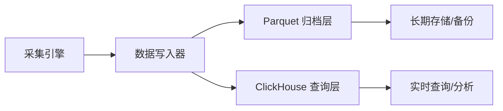

# EPIC-003: 双写存储架构

**Epic ID**: EPIC-003  
**优先级**: P1  
**预估工期**: 2 周  
**状态**: 📝 规划中  
**依赖**: EPIC-002 (高可用采集引擎)

---

## 📋 Epic 概述

构建 **Parquet + ClickHouse 双写存储架构**，实现数据的安全归档与高效查询的完美结合。Parquet 作为数据湖提供长期归档和灾难恢复能力，ClickHouse 作为 OLAP 引擎提供毫秒级的实时查询性能。

### 业务价值
- **查询性能提升**: ClickHouse 使复杂查询从分钟级降至毫秒级
- **数据安全保障**: Parquet 文件提供可靠的数据备份和恢复能力
- **存储成本优化**: Parquet 压缩率 > 8:1，显著降低存储成本
- **分析能力增强**: 支持实时监控、回测分析、策略优化等多种场景

---

## 🔍 现状分析

### 当前架构
目前系统仅使用 Parquet 文件进行数据存储：
```python
# 现有代码
storage = ParquetStorage(base_dir="data/tick")
await storage.save(stock_code, date, dataframe)
```

**存在的问题**:
1. **查询效率低**: 需要扫描全部 Parquet 文件，查询慢
2. **分析不便**: 缺乏 SQL 支持，需要手写 Pandas 代码
3. **实时性差**: 数据写入后无法立即查询
4. **功能受限**: 难以实现复杂的聚合、关联查询

### 目标架构
实现双写架构：


---

## 🎯 用户故事 (User Stories)

### 🟢 高优先级 (P0) - 核心功能

#### **Story 1: ClickHouse 服务部署**
**状态**: 待开始

**优先级**: P0  
**估算**: 2 天  
**依赖**: 无

**问题描述**:  
当前系统缺少 OLAP 数据库，无法进行高效的实时查询和分析。

**目标**:
部署生产级 ClickHouse 服务，并验证其与 Python 应用的连接。

**验收标准**:
- [ ] 使用 Docker Compose 部署 ClickHouse 服务
- [ ] 配置持久化存储（避免容器重启丢失数据）
- [ ] 配置用户权限和访问控制
- [ ] 验证 Python `clickhouse-driver` 库连接成功
- [ ] 创建测试数据库 `stock_data`

**技术设计**:
```yaml
# docker-compose.yml 片段
services:
  clickhouse:
    image: clickhouse/clickhouse-server:latest
    container_name: clickhouse
    ports:
      - "9000:9000"  # Native protocol
      - "8123:8123"  # HTTP interface
    volumes:
      - ./data/clickhouse:/var/lib/clickhouse
      - ./config/clickhouse:/etc/clickhouse-server
    environment:
      CLICKHOUSE_DB: stock_data
      CLICKHOUSE_USER: stock_user
      CLICKHOUSE_PASSWORD: ${CLICKHOUSE_PASSWORD}
```

---

#### **Story 2: Tick Data 表结构设计**
**状态**: 待开始

**优先级**: P0  
**估算**: 1 天  
**依赖**: Story 1

**问题描述**:  
需要设计高效的 ClickHouse 表结构以支持 Tick 数据的存储和查询。

**目标**:
建立优化的 Tick 数据表，支持按时间、股票代码的高效查询。

**验收标准**:
- [ ] 设计符合 ClickHouse 最佳实践的表结构
- [ ] 选择合适的主键和排序键
- [ ] 配置分区策略（按日期分区）
- [ ] 设置数据保留策略（TTL）
- [ ] 创建必要的索引

**技术设计**:
```sql
CREATE TABLE IF NOT EXISTS stock_data.tick_data
(
    trade_date Date,
    trade_time DateTime64(3),
    stock_code String,
    price Decimal(10, 3),
    volume UInt64,
    amount Decimal(18, 2),
    direction String,
    -- 扩展字段
    bid_price1 Decimal(10, 3),
    ask_price1 Decimal(10, 3),
    bid_volume1 UInt64,
    ask_volume1 UInt64,
    -- ... 其他五档数据
    
    INDEX idx_stock stock_code TYPE bloom_filter GRANULARITY 1
)
ENGINE = MergeTree()
PARTITION BY toYYYYMM(trade_date)
ORDER BY (stock_code, trade_time)
TTL trade_date + INTERVAL 180 DAY
SETTINGS index_granularity = 8192;
```

**设计要点**:
1. **分区策略**: 按月分区，便于数据管理和删除
2. **排序键**: `(stock_code, trade_time)`，优化按股票查询时间序列
3. **TTL**: 自动清理 180 天前数据
4. **Bloom Filter**: 加速股票代码的等值查询

---

#### **Story 3: ClickHouse Writer 实现**
**状态**: 待开始

**优先级**: P0  
**估算**: 3 天  
**依赖**: Story 2

**问题描述**:  
需要实现高性能的 ClickHouse 数据写入器。

**目标**:
实现批量写入、异步提交、错误重试的 ClickHouseWriter。

**验收标准**:
- [ ] 实现 `ClickHouseWriter` 类
- [ ] 支持批量写入（1000-10000 行/批）
- [ ] 实现异步提交机制
- [ ] 实现写入失败的重试逻辑
- [ ] 写入性能 > 10万行/秒

**技术设计**:
```python
class ClickHouseWriter:
    def __init__(
        self, 
        host: str = "localhost",
        port: int = 9000,
        database: str = "stock_data",
        batch_size: int = 5000
    ):
        self.client = Client(host=host, port=port, database=database)
        self.batch_size = batch_size
        self._buffer = []
        
    async def write_tick_data(self, data: List[TickData]):
        """异步批量写入"""
        self._buffer.extend(data)
        
        if len(self._buffer) >= self.batch_size:
            await self._flush()
            
    async def _flush(self):
        """提交批次"""
        if not self._buffer:
            return
            
        try:
            self.client.execute(
                "INSERT INTO tick_data VALUES",
                [self._to_row(tick) for tick in self._buffer]
            )
            logger.info(f"✅ Wrote {len(self._buffer)} rows to ClickHouse")
            self._buffer.clear()
        except Exception as e:
            logger.error(f"❌ ClickHouse write failed: {e}")
            # 重试逻辑...
```

---

### 🟡 中优先级 (P1) - 增强功能

#### **Story 4: Parquet 归档优化**
**状态**: 待开始

**优先级**: P1  
**估算**: 2 天  
**依赖**: Story 3

**问题描述**:  
当前 Parquet 文件存储策略简单，缺乏分片、压缩优化和自动清理。

**目标**:
优化 Parquet 存储策略，提升压缩率和访问效率。

**验收标准**:
- [ ] 实现按日期/小时的分片策略
- [ ] 启用 Snappy 压缩
- [ ] 添加元数据（文件创建时间、记录数、MD5 校验）
- [ ] 实现 180 天自动清理机制
- [ ] 压缩率 > 8:1

**技术设计**:
```python
# 目录结构
data/tick/
  ├── 2025-11-29/
  │   ├── 09/  # 小时分片
  │   │   ├── 000001.parquet
  │   │   └── 000002.parquet
  │   ├── 10/
  │   └── ...
  └── 2025-11-30/

# 写入逻辑
class ParquetWriter:
    def save(self, stock_code, datetime, df):
        date_dir = datetime.strftime("%Y-%m-%d")
        hour_dir = datetime.strftime("%H")
        path = f"{self.base_dir}/{date_dir}/{hour_dir}/{stock_code}.parquet"
        
        df.to_parquet(
            path,
            compression='snappy',
            engine='pyarrow',
            index=False
        )
        
        # 记录元数据
        self._save_metadata(path, len(df))
```

---

#### **Story 5: 双写协调器**
**状态**: 待开始

**优先级**: P1  
**估算**: 2 天  
**依赖**: Story 3, Story 4

**问题描述**:  
需要一个统一的接口来协调 Parquet 和 ClickHouse 的双写操作。

**目标**:
实现 `DualStorageWriter`，确保两个存储层的一致性。

**验收标准**:
- [ ] 实现 `DualStorageWriter` 类
- [ ] 支持事务性双写（要么都成功，要么都失败）
- [ ] 一方失败时能回滚或记录差异
- [ ] 提供一致性校验接口
- [ ] 写入性能不低于单写的 80%

**技术设计**:
```python
class DualStorageWriter:
    def __init__(
        self, 
        parquet_writer: ParquetWriter,
        clickhouse_writer: ClickHouseWriter
    ):
        self.parquet = parquet_writer
        self.clickhouse = clickhouse_writer
        
    async def write(self, stock_code: str, date: datetime, data: List[TickData]):
        """双写逻辑"""
        errors = []
        
        # 1. 写入 Parquet (快速，失败率低)
        try:
            await self.parquet.write(stock_code, date, data)
        except Exception as e:
            errors.append(('parquet', e))
            
        # 2. 写入 ClickHouse (慢，可能失败)
        try:
            await self.clickhouse.write_tick_data(data)
        except Exception as e:
            errors.append(('clickhouse', e))
            # 记录到差异日志，稍后补偿
            await self._log_diff(stock_code, date, data)
            
        if errors:
            logger.warning(f"Partial write failure: {errors}")
            
        return len(errors) == 0
```

---

#### **Story 6: 数据一致性校验**
**状态**: 待开始

**优先级**: P1  
**估算**: 2 天  
**依赖**: Story 5

**问题描述**:  
双写可能导致 Parquet 和 ClickHouse 数据不一致。

**目标**:
实现每日一致性校验和自动修复机制。

**验收标准**:
- [ ] 实现行数对比校验
- [ ] 实现关键字段（价格、成交量）的聚合校验
- [ ] 发现不一致时生成详细报告
- [ ] 实现自动补偿机制（从 Parquet 回填 ClickHouse）
- [ ] 校验任务能定时执行（每日凌晨）

**技术设计**:
```python
class ConsistencyChecker:
    async def check_daily(self, date: datetime.date):
        """检查某一天的数据一致性"""
        parquet_count = await self._count_parquet(date)
        clickhouse_count = await self._count_clickhouse(date)
        
        if parquet_count != clickhouse_count:
            logger.warning(
                f"Inconsistency detected: "
                f"Parquet={parquet_count}, ClickHouse={clickhouse_count}"
            )
            
            # 自动修复
            if parquet_count > clickhouse_count:
                await self._repair_from_parquet(date)
                
        return parquet_count == clickhouse_count
```

---

## 📅 实施路线图

| Week | Story | 估算 | 状态 |
| :--- | :--- | :--- | :--- |
| **Week 1** | Story 1: ClickHouse 部署 | 2 天 | 待开始 |
| **Week 1** | Story 2: 表结构设计 | 1 天 | 待开始 |
| **Week 1** | Story 3: Writer 实现 | 2 天 | 待开始 |
| **Week 2** | Story 4: Parquet 优化 | 2 天 | 待开始 |
| **Week 2** | Story 5: 双写协调器 | 2 天 | 待开始 |
| **Week 2** | Story 6: 一致性校验 | 1 天 | 待开始 |

---

## ⚠️ 风险与应对

### 风险 1: ClickHouse 写入性能瓶颈
**可能性**: 中  
**影响**: 高  
**应对**:
- 优化批次大小（5000-10000 行）
- 使用异步写入
- 必要时使用 ClickHouse 的 Buffer 表

### 风险 2: 双写导致数据不一致
**可能性**: 中  
**影响**: 高  
**应对**:
- 实施每日一致性校验
- 建立差异日志和补偿机制
- Parquet 作为 Source of Truth

### 风险 3: 存储成本增加
**可能性**: 低  
**影响**: 中  
**应对**:
- ClickHouse 也设置 TTL（180 天）
- Parquet 高压缩率抵消部分成本
- 定期清理过期数据

---

## ✅ 成功标准

1. **写入性能**: 双写吞吐量 > 5万行/秒
2. **查询性能**: ClickHouse 查询 < 100ms (百万级数据)
3. **数据一致性**: 每日一致性校验通过率 > 99.9%
4. **存储效率**: Parquet 压缩率 > 8:1
5. **可用性**: ClickHouse 服务可用性 > 99%

---

**文档版本**: v1.0  
**创建时间**: 2025-11-29  
**最后更新**: 2025-11-29  
**状态**: 📝 规划完成，待启动实施
