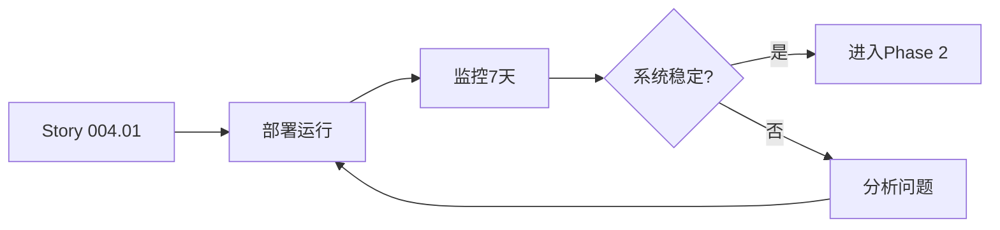
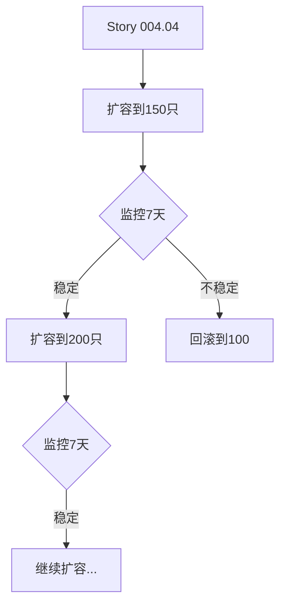
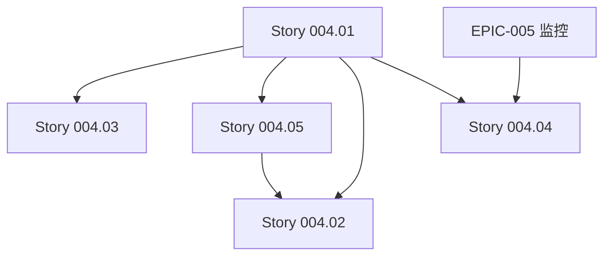

# EPIC-004: 股票池动态管理 - Stories 汇总

**版本**: v2.0  
**创建日期**: 2025-12-01  
**状态**: 📝 待实施  
**预估总工期**: 10.5 天

---

## 📋 Epic 概述

实现渐进式股票池管理，从100只精选股票起步，基于系统监控指标智能扩容至全市场覆盖。采用**小步快跑、快速验证**的策略，避免资源过载风险。

---

## 🎯 核心设计变更

### 原方案 vs. 优化方案

| 维度 | 原方案 | 优化方案 | 变更原因 |
|------|--------|----------|----------|
| **初始规模** | 800只（沪深300+中证500） | 100只（沪深300 Top 100） | 系统承载能力未知，需验证 |
| **扩容策略** | 固定规模 | 渐进式（100→150→200→300→500→800） | 基于实际监控指标动态调整 |
| **数据来源** | 固定指数成分股 | 初期固定，后期切换热门赛道 | 提高数据商业价值 |
| **管理方式** | 静态配置 | 动态晋升 + 智能扩容 | 捕捉市场异动，自动化运维 |

---

## 📚 User Stories 列表

### [Story 004.01: 初始股票池管理](file:///home/bxgh/microservice-stock/services/get-stockdata/docs/plans/epics/stories/story_004_01_initial_pool.md)
**工期**: 2 天  
**优先级**: P0（必须最先实施）

**目标**: 从沪深300成分股按成交额Top 100构建初始股票池

**关键功能**:
- 自动获取沪深300成分股并按成交额排序
- 实现缓存降级机制（API失败时使用本地缓存）
- 集成到 `AcquisitionScheduler`
- 支持每日自动更新

**交付物**:
- `src/services/stock_pool/pool_initializer.py`
- `config/stock_pools.yaml`
- 单元测试和集成测试

---

### [Story 004.02: 热门赛道股票池配置](file:///home/bxgh/microservice-stock/services/get-stockdata/docs/plans/epics/stories/story_004_02_hot_sectors.md)
**工期**: 3 天  
**优先级**: P1（稳定运行后实施）

**目标**: 支持切换到5大热门赛道精选股票池（100只）

**关键功能**:
- 实现5大赛道分组配置：
  - 科技芯片（20只）
  - 新能源车（20只）
  - 医药生物（20只）
  - 消费白酒（15只）
  - 金融周期（15只）
  - 超级妖股（10只，动态）
- 支持ETF成分股自动获取
- 实现股票池切换器（HS300 ↔ 热门赛道）

**交付物**:
- `src/services/stock_pool/hot_sectors_manager.py`
- `src/services/stock_pool/pool_switcher.py`
- `config/hot_sectors.yaml`

---

### [Story 004.03: 动态晋升机制](file:///home/bxgh/microservice-stock/services/get-stockdata/docs/plans/epics/stories/story_004_03_dynamic_promotion.md)
**工期**: 2 天  
**优先级**: P1

**目标**: 自动识别异动股票并临时加入高频采集池

**关键功能**:
- 5分钟涨幅 > 3% 自动晋升
- 5分钟换手率 > 1% 自动晋升
- 晋升股票临时进入L1池30分钟
- 支持手动添加紧急监控股票
- RESTful API接口

**交付物**:
- `src/services/stock_pool/anomaly_detector.py`
- `src/services/stock_pool/dynamic_pool_manager.py`
- `src/api/routers/stock_pool.py`（手动操作API）

---

### [Story 004.04: 智能扩容系统](file:///home/bxgh/microservice-stock/services/get-stockdata/docs/plans/epics/stories/story_004_04_scaling_engine.md)
**工期**: 2 天  
**优先级**: P1  
**前置依赖**: EPIC-005 监控体系

**目标**: 基于监控指标自动建议或执行股票池扩容

**关键功能**:
- 扩容路径：100 → 150 → 200 → 300 → 500 → 800
- 扩容条件：QPS < 0.8 && 成功率 > 99% && CPU < 60%
- 连续3天满足条件时触发建议
- 人工审批机制
- 自动回滚功能

**交付物**:
- `src/monitoring/system_metrics_collector.py`
- `src/services/stock_pool/scaling_engine.py`
- `config/scaling_strategy.yaml`

---

### [Story 004.05: 股票池配置管理](file:///home/bxgh/microservice-stock/services/get-stockdata/docs/plans/epics/stories/story_004_05_config_management.md)
**工期**: 1.5 天  
**优先级**: P1

**目标**: 支持灵活的股票池配置和自定义分组

**关键功能**:
- YAML格式统一配置
- 黑名单/白名单支持（ST股、退市股过滤）
- 配置热重载（30秒内生效）
- 配置变更审计日志
- RESTful API管理接口

**交付物**:
- `src/services/stock_pool/config_manager.py`
- `config/stock_pools_unified.yaml`
- `src/api/routers/config.py`

---

## 🚀 实施路径

### Phase 1: 初始验证（第1-2周）

**目标**: 验证系统基本承载能力  
**关键指标**:
- 成功率 > 99%
- QPS < 0.5 (远低于1.3的限制)
- CPU < 40%

---

### Phase 2: 功能增强（第3-4周）

**目标**: 增强数据采集价值  
**可选**: 如系统资源充足，可同时实施 Story 004.04

---

### Phase 3: 智能扩容（第5周+）

**目标**: 逐步扩大市场覆盖  
**最终目标**: 800只核心股票池

---

## 📊 成功指标

### 技术指标
- [x] 系统稳定性 > 99.5%
- [x] 采集成功率 > 99.8%
- [x] QPS使用率 < 80%
- [x] CPU使用率 < 60%（扩容前）

### 业务指标
- [x] 股票池按计划扩容（每2周评估一次）
- [x] 异动股票捕获率 > 90%（动态晋升）
- [x] 数据质量评分 > 95%

### 运维指标
- [x] 配置变更生效时间 < 30秒
- [x] 人工干预频率 < 1次/周
- [x] 扩容失败自动回滚成功率 = 100%

---

## 🔗 依赖关系

---

## 📝 风险与缓解

| 风险 | 影响 | 概率 | 缓解措施 |
|------|------|------|----------|
| akshare API不稳定 | 股票池更新失败 | 中 | 实现缓存降级，保留7天历史数据 |
| 扩容后系统性能下降 | 采集成功率下降 | 中 | 自动回滚机制，人工审批扩容 |
| 热门赛道配置不合理 | 数据价值低 | 低 | 支持快速切换回HS300池 |
| 动态晋升误报率高 | 资源浪费 | 中 | 可调阈值，初期设置保守（5%涨幅） |

---

## 📂 相关文档

- [EPIC-004 在 5level_epics.md 中的定义](file:///home/bxgh/microservice-stock/services/get-stockdata/docs/plans/epics/5level_epics.md#L148-L191)
- [数据采集架构总览](file:///home/bxgh/microservice-stock/services/get-stockdata/docs/plans/data_acquisition_architecture_and_roadmap.md)
- [分层采集策略](file:///home/bxgh/microservice-stock/services/get-stockdata/docs/plans/tiered_acquisition_strategy.md)

---

**文档版本**: v2.0  
**创建人**: AI 系统架构师  
**审核人**: 待定  
**最后更新**: 2025-12-01
