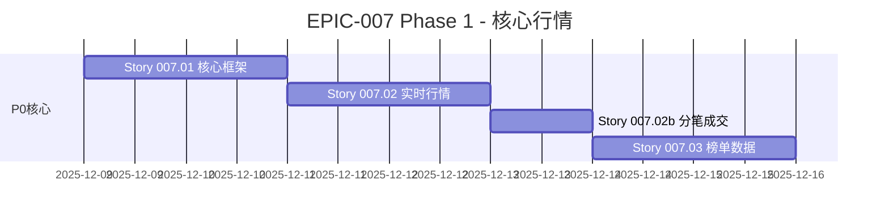
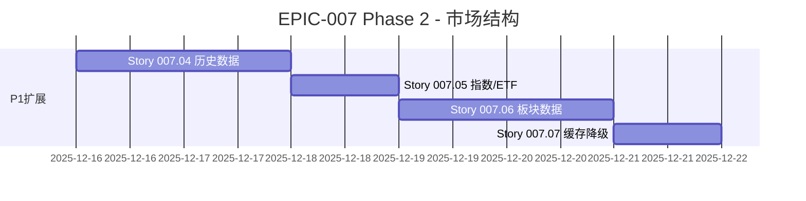
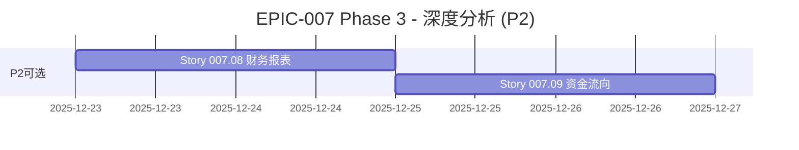
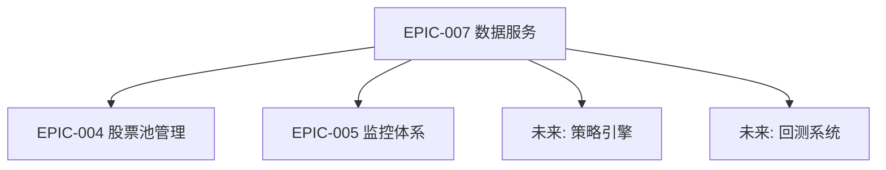

# EPIC-007: 数据服务基础设施

**版本**: v1.0  
**创建日期**: 2025-12-05  
**完成日期**: 2025-12-07  
**状态**: ✅ 已完成  
**优先级**: P0（基础设施，所有策略的前置依赖）  
**实际工期**: 约 2 周

---

## 📋 Epic 概述

构建统一的数据服务层，为所有选股策略、量化分析和系统功能提供标准化的数据访问接口。这是系统的"数据中台"，所有上层应用都将依赖此层获取市场数据。

### 设计理念

```
┌─────────────────────────────────────────────────────────────────┐
│                    上层应用 (Applications)                       │
│  ┌─────────┐ ┌─────────┐ ┌─────────┐ ┌─────────┐ ┌─────────┐   │
│  │选股策略  │ │回测系统  │ │风险监控  │ │行情展示  │ │AI模型   │   │
│  └─────────┘ └─────────┘ └─────────┘ └─────────┘ └─────────┘   │
└─────────────────────────────────────────────────────────────────┘
                              ▲
                              │ 统一接口
┌─────────────────────────────────────────────────────────────────┐
│                 数据服务层 (Data Service Layer)                  │
│  ┌──────────────────────────────────────────────────────────┐   │
│  │              DataServiceManager (统一入口)                │   │
│  └──────────────────────────────────────────────────────────┘   │
│        │           │           │           │           │        │
│  ┌─────────┐ ┌─────────┐ ┌─────────┐ ┌─────────┐ ┌─────────┐   │
│  │Quotes   │ │History  │ │Ranking  │ │FundFlow │ │Meta     │   │
│  │实时行情  │ │历史数据  │ │榜单数据  │ │资金流向  │ │基础信息  │   │
│  └─────────┘ └─────────┘ └─────────┘ └─────────┘ └─────────┘   │
└─────────────────────────────────────────────────────────────────┘
                              ▲
                              │ 封装
┌─────────────────────────────────────────────────────────────────┐
│                 底层数据源 (Raw Data Sources)                    │
│  ┌─────────┐ ┌─────────┐ ┌─────────┐ ┌─────────┐               │
│  │ mootdx  │ │ akshare │ │ 付费源   │ │ 本地缓存 │               │
│  │ (通达信) │ │ (东方财富)│ │(Tushare)│ │(Parquet)│               │
│  └─────────┘ └─────────┘ └─────────┘ └─────────┘               │
└─────────────────────────────────────────────────────────────────┘
```

---

## 🔬 数据源可用性验证报告

**测试时间**: 2025-12-06 18:20  
**测试环境**: Docker 容器 (get-stockdata)

### 验证结果汇总

| 数据类别 | 数据源/API | 状态 | 备注 |
|---------|-----------|------|------|
| **实时行情** | mootdx | ✅ | 通达信协议，稳定 |
| **实时行情(备)** | easyquotation | ✅ | sina/tencent多源，5599只全市场 |
| **分笔成交** | mootdx | ✅ | 4207条/2.36s |
| **历史K线** | mootdx | ✅ | 日线/5分钟线 |
| **历史K线(备)** | baostock | ✅ | 需 proxychains4，1990年至今 |
| **人气榜** | akshare `stock_hot_rank_em` | ✅ | 100行 |
| **飙升榜** | akshare `stock_hot_up_em` | ✅ | 100行 |
| **盘口异动** | akshare `stock_changes_em` | ✅ | 1501行 |
| **涨停池** | akshare `stock_zt_pool_em` | ✅ | 73行 |
| **连板统计** | akshare `stock_zt_pool_strong_em` | ✅ | 151行 |
| **龙虎榜** | akshare `stock_lhb_detail_em` | ✅ | 342行 |
| **指数成分** | akshare `index_stock_cons` | ✅ | 300行 |
| **ETF持仓** | akshare `fund_portfolio_hold_em` | ✅ | 1075行 |
| **NL选股** | pywencai | ✅ | 自然语言选股，需Node.js |
| **板块涨幅** | pywencai | ✅ | 行业/概念涨幅榜 |
| 板块数据 | akshare `stock_board_*` | ❌ | 被反爬虫拦截 |

### 关键发现

1. **完全可用的数据源 (5个)**:
   - ✅ mootdx (实时行情、分笔、K线)
   - ✅ akshare (榜单、指数成分、ETF)
   - ✅ easyquotation (实时行情备份)
   - ✅ pywencai (自然语言选股、板块涨幅)
   - ✅ **baostock (历史K线备份，需proxychains4)**

2. **受限/替代方案**:
   - ❌ akshare 板块数据被拦截 → pywencai 替代

3. **环境依赖**:
   - **Node.js v16+**: pywencai 需要（执行JS代码）
   - **proxychains4**: baostock 需要（TCP代理）
   - 已更新 Dockerfile 添加 nodejs npm 依赖

---

## 📚 User Stories 列表

### Story 007.01: 数据服务层核心框架 - 多数据源互补架构
**工期**: 3 天  
**优先级**: P0

**目标**: 构建可扩展的多数据源互补框架，确保选股策略能够正常运行

---

#### 核心设计原则

| 原则 | 描述 | 实现方式 |
|-----|------|---------|
| **数据源互补** | 不同数据源各有专长，组合使用满足完整需求 | mootdx=行情，akshare=榜单，各司其职 |
| **易于扩展** | 新增数据源只需实现接口，无需修改核心代码 | DataProvider 抽象接口 + 注册机制 |
| **容错降级** | 同类型数据多数据源备份，一个失败自动切换 | ProviderChain 降级链 |
| **配置驱动** | 通过配置管理数据源，支持热切换 | YAML/JSON 配置文件 |

---

#### 多数据源互补矩阵

```
                    选股策略完整数据需求
    ┌───────────────────────────────────────────────────────────┐
    │  实时行情  分笔成交  K线历史  榜单情绪  指数成分  NL选股  │
    └───────────────────────────────────────────────────────────┘
          │        │        │        │        │        │
          ▼        ▼        ▼        ▼        ▼        ▼
    ┌──────────────────────────────────────────────────────────┐
    │                    DataServiceManager                     │
    │  ┌────────┐ ┌────────┐ ┌────────┐ ┌────────┐ ┌────────┐ │
    │  │Quotes  │ │Tick    │ │History │ │Ranking │ │Screen  │ │
    │  │Service │ │Service │ │Service │ │Service │ │Service │ │
    │  └───┬────┘ └───┬────┘ └───┬────┘ └───┬────┘ └───┬────┘ │
    └──────┼──────────┼──────────┼──────────┼──────────┼───────┘
           │          │          │          │          │
           ▼          ▼          ▼          ▼          ▼
    ┌─────────────────────────────────────────────────────────────┐
    │            数据源能力矩阵 (已验证 2025-12-06)                 │
    │  ┌───────────────┬────────┬────────┬──────┬──────┬──────┬────────┐│
    │  │               │实时行情│分笔成交│ K线  │ 榜单 │ 板块 │NL选股  ││
    │  ├───────────────┼────────┼────────┼──────┼──────┼──────┼────────┤│
    │  │ mootdx        │   ✅   │   ✅   │  ✅  │  ❌  │  ❌  │   ❌   ││
    │  │ akshare       │   ❌   │   ❌   │  ❌  │  ✅  │  ❌  │   ❌   ││
    │  │ easyquotation │   ✅   │   ❌   │  ❌  │  ❌  │  ❌  │   ❌   ││
    │  │ pywencai      │   ❌   │   ❌   │  ❌  │  ✅  │  ✅  │   ✅⭐  ││
    │  │ baostock      │   ❌   │   ❌   │  ✅⭐ │  ❌  │  ❌  │   ❌   ││
    │  │ local_cache   │   ⚠️   │   ✅   │  ✅  │  ⚠️  │  ⚠️  │   ❌   ││
    │  └───────────────┴────────┴────────┴──────┴──────┴──────┴────────┘│
    │  ✅=已验证可用  ❌=不支持  ⚠️=缓存  ⭐=独特能力(1990年至今/NL)    │
    └─────────────────────────────────────────────────────────────────┘

NL选股 = 自然语言选股 (Natural Language Stock Screening)
```

**新增数据源说明**：

| 数据源 | 能力 | 验证结果 | 依赖 |
|-------|------|---------|------|
| **easyquotation** | 多源实时行情(sina/tencent) | ✅ 5599只全市场 3.2s | 无 |
| **pywencai** | 自然语言选股+板块涨幅 | ✅ 涨停/连板/龙虎榜/板块涨幅 | **Node.js v16+** |
| **baostock** | 历史K线(1990年至今) | ✅ 完整历史数据 | **proxychains4** |

---

#### 可扩展性设计

**新增数据源只需 3 步**：

```python
# Step 1: 实现 DataProvider 接口
class TushareProvider(DataProvider):
    @property
    def name(self) -> str:
        return "tushare"
    
    @property
    def capabilities(self) -> List[DataType]:
        return [DataType.HISTORY, DataType.RANKING, DataType.INDEX]
    
    async def fetch(self, data_type: DataType, **kwargs) -> DataResult:
        # 具体实现
        ...

# Step 2: 注册到配置
PROVIDER_REGISTRY = {
    'tushare': {
        'class': TushareProvider,
        'enabled': True,
        'api_key': 'xxx',
        'priority': {
            DataType.HISTORY: 2,    # K线数据优先级2
            DataType.RANKING: 1,    # 榜单数据优先级1（主数据源）
        }
    }
}

# Step 3: 框架自动装配
# DataServiceManager 会自动发现并使用 tushare
```

---

#### DataProvider 接口规范

```python
# src/data_services/providers/base.py

class DataProvider(ABC):
    """
    数据提供者抽象基类
    
    所有数据源必须实现此接口，确保可以无缝接入框架。
    """
    
    # ===== 元信息 =====
    
    @property
    @abstractmethod
    def name(self) -> str:
        """数据源唯一标识"""
        pass
    
    @property
    @abstractmethod
    def capabilities(self) -> List[DataType]:
        """
        声明该数据源支持的数据类型列表
        
        用于框架自动路由：
        - QuotesService 会找 capabilities 包含 DataType.QUOTES 的 provider
        - RankingService 会找 capabilities 包含 DataType.RANKING 的 provider
        """
        pass
    
    @property
    def priority_map(self) -> Dict[DataType, int]:
        """
        各数据类型的优先级 (1=最高)
        
        示例：mootdx 的 QUOTES 优先级为 1，LOCAL_CACHE 的 QUOTES 优先级为 2
        当 mootdx 失败时，降级到 LOCAL_CACHE
        """
        return {dt: 1 for dt in self.capabilities}
    
    # ===== 生命周期 =====
    
    async def initialize(self) -> bool:
        """初始化连接（可选）"""
        return True
    
    async def close(self) -> None:
        """关闭连接（可选）"""
        pass
    
    async def health_check(self) -> bool:
        """健康检查"""
        return True
    
    # ===== 数据获取 =====
    
    @abstractmethod
    async def fetch(self, data_type: DataType, **kwargs) -> DataResult:
        """
        统一数据获取入口
        
        框架通过此方法获取数据，子类根据 data_type 路由到具体方法。
        """
        pass
```

---

#### 选股策略数据需求覆盖

| 选股策略 | 需要的数据 | 数据来源 | 是否可用 |
|---------|-----------|---------|---------|
| **妖股策略** | 涨停池、连板数据、龙虎榜 | akshare | ✅ |
| **异动检测** | 实时行情、盘口异动 | mootdx + akshare | ✅ |
| **成交量策略** | 分笔成交、历史量价 | mootdx | ✅ |
| **趋势跟踪** | K线历史、指数成分 | mootdx + akshare | ✅ |
| **板块轮动** | 板块行情、成分股 | ETF替代方案 | ⚠️ |

**结论**：通过 mootdx + akshare + pywencai + easyquotation 组合，可以覆盖绝大部分选股策略的数据需求。

---

#### 存储策略

**当前阶段暂不引入 MySQL**，使用已有存储：

| 存储 | 用途 | 数据类型 |
|-----|------|---------|
| **ClickHouse** | 时序数据存储 | 分笔成交、历史K线 |
| **Redis** | 实时缓存 | 行情快照（TTL 3秒） |
| **Parquet** | 本地文件存储 | 分笔数据备份 |
| **JSON** | 配置/静态数据 | 指数成分、榜单缓存 |

**后续如需关系型存储（用户数据、策略配置）可独立 EPIC 引入 MySQL。**

---
#### 架构设计

```
┌─────────────────────────────────────────────────────────────────────┐
│                     DataServiceManager (入口)                        │
│  ┌──────────┐ ┌──────────┐ ┌──────────┐ ┌──────────┐               │
│  │ Quotes   │ │ Tick     │ │ History  │ │ Ranking  │ ...           │
│  │ Service  │ │ Service  │ │ Service  │ │ Service  │               │
│  └────┬─────┘ └────┬─────┘ └────┬─────┘ └────┬─────┘               │
└───────┼────────────┼────────────┼────────────┼──────────────────────┘
        │            │            │            │
        ▼            ▼            ▼            ▼
┌─────────────────────────────────────────────────────────────────────┐
│              ProviderChain (降级链管理)                              │
│  ┌────────────────────────────────────────────────────────────┐    │
│  │  Priority 1    Priority 2    Priority 3    Fallback        │    │
│  │  ┌─────────┐   ┌─────────┐   ┌─────────┐   ┌─────────┐    │    │
│  │  │ Primary │──▶│ Secondary│──▶│ Tertiary│──▶│  Cache  │    │    │
│  │  │Provider │   │ Provider│   │ Provider│   │Provider │    │    │
│  │  └─────────┘   └─────────┘   └─────────┘   └─────────┘    │    │
│  └────────────────────────────────────────────────────────────┘    │
└─────────────────────────────────────────────────────────────────────┘
        │            │            │            │
        ▼            ▼            ▼            ▼
┌─────────────────────────────────────────────────────────────────────┐
│                 DataProvider Implementations                         │
│  ┌──────────┐ ┌──────────┐ ┌──────────┐ ┌──────────┐               │
│  │ Mootdx   │ │ Akshare  │ │ Tushare  │ │ Local    │               │
│  │ Provider │ │ Provider │ │ Provider │ │ Cache    │               │
│  └──────────┘ └──────────┘ └──────────┘ └──────────┘               │
└─────────────────────────────────────────────────────────────────────┘
```

---

#### 核心接口定义

```python
# src/data_services/providers/base.py
from abc import ABC, abstractmethod
from typing import List, Optional, Dict, Any
from enum import Enum
import pandas as pd

class DataType(Enum):
    """数据类型枚举"""
    QUOTES = "quotes"       # 实时行情
    TICK = "tick"           # 分笔成交
    HISTORY = "history"     # 历史K线
    RANKING = "ranking"     # 榜单数据
    INDEX = "index"         # 指数成分
    SECTOR = "sector"       # 板块数据

class DataResult:
    """标准化数据返回格式"""
    def __init__(self, 
                 success: bool,
                 data: Optional[pd.DataFrame] = None,
                 provider: str = "",
                 latency_ms: float = 0,
                 error: Optional[str] = None,
                 is_fallback: bool = False):
        self.success = success
        self.data = data
        self.provider = provider      # 实际使用的数据源
        self.latency_ms = latency_ms
        self.error = error
        self.is_fallback = is_fallback  # 是否使用了降级数据源

class DataProvider(ABC):
    """数据提供者抽象基类"""
    
    @property
    @abstractmethod
    def name(self) -> str:
        """提供者名称"""
        pass
    
    @property
    @abstractmethod
    def priority(self) -> int:
        """优先级 (1=最高)"""
        pass
    
    @abstractmethod
    def supports(self, data_type: DataType) -> bool:
        """检查是否支持指定数据类型"""
        pass
    
    @abstractmethod
    async def is_healthy(self) -> bool:
        """健康检查"""
        pass
    
    @abstractmethod
    async def fetch(self, data_type: DataType, **kwargs) -> DataResult:
        """获取数据的统一入口"""
        pass
    
    async def initialize(self) -> bool:
        """初始化连接（可选实现）"""
        return True
    
    async def close(self) -> None:
        """关闭连接（可选实现）"""
        pass
```

---

#### 降级链实现

```python
# src/data_services/providers/chain.py
import asyncio
import logging
from typing import List, Dict, Optional
from .base import DataProvider, DataType, DataResult

logger = logging.getLogger(__name__)

class ProviderChain:
    """
    提供者链 - 支持自动降级
    
    Features:
    - 按优先级依次尝试数据源
    - 自动跳过不健康的数据源
    - 失败时自动降级到下一个
    - 集成熔断器保护
    """
    
    def __init__(self, 
                 providers: List[DataProvider],
                 enable_circuit_breaker: bool = True):
        # 按优先级排序
        self._providers = sorted(providers, key=lambda p: p.priority)
        self._enable_circuit_breaker = enable_circuit_breaker
        self._circuit_breakers: Dict[str, 'CircuitBreaker'] = {}
        
        # 统计信息
        self._stats = {
            'total_requests': 0,
            'primary_success': 0,
            'fallback_success': 0,
            'all_failed': 0,
        }
    
    async def fetch(self, data_type: DataType, **kwargs) -> DataResult:
        """
        获取数据，自动降级
        
        Returns:
            DataResult: 包含数据、来源、是否降级等信息
        """
        self._stats['total_requests'] += 1
        
        for i, provider in enumerate(self._providers):
            # 检查是否支持该数据类型
            if not provider.supports(data_type):
                continue
            
            # 检查熔断器状态
            if self._is_circuit_open(provider.name):
                logger.debug(f"Provider {provider.name} circuit is open, skipping")
                continue
            
            # 尝试获取数据
            try:
                result = await provider.fetch(data_type, **kwargs)
                
                if result.success and result.data is not None and len(result.data) > 0:
                    # 记录成功
                    self._record_success(provider.name)
                    
                    # 标记是否为降级
                    result.is_fallback = (i > 0)
                    
                    if result.is_fallback:
                        self._stats['fallback_success'] += 1
                        logger.info(f"Using fallback provider: {provider.name}")
                    else:
                        self._stats['primary_success'] += 1
                    
                    return result
                
            except Exception as e:
                logger.warning(f"Provider {provider.name} failed: {e}")
                self._record_failure(provider.name)
                continue
        
        # 所有数据源都失败
        self._stats['all_failed'] += 1
        return DataResult(
            success=False,
            error="All providers failed",
            is_fallback=True
        )
    
    def _is_circuit_open(self, provider_name: str) -> bool:
        """检查熔断器是否打开"""
        if not self._enable_circuit_breaker:
            return False
        # 集成现有的 CircuitBreaker
        # 这里可以复用 src/core/resilience/circuit_breaker.py
        return False  # 简化实现
    
    def _record_success(self, provider_name: str):
        """记录成功"""
        pass
    
    def _record_failure(self, provider_name: str):
        """记录失败"""
        pass
    
    def get_stats(self) -> Dict:
        """获取统计信息"""
        total = self._stats['total_requests']
        return {
            **self._stats,
            'primary_rate': f"{self._stats['primary_success']/total*100:.1f}%" if total > 0 else "N/A",
            'fallback_rate': f"{self._stats['fallback_success']/total*100:.1f}%" if total > 0 else "N/A",
        }
```

---

#### DataServiceManager 实现

```python
# src/data_services/manager.py
class DataServiceManager:
    """统一数据服务入口 - 数据中台核心"""
    
    def __init__(self, config: Optional[Dict] = None):
        self._config = config or self._default_config()
        
        # === 核心行情服务 (P0) ===
        self.quotes = QuotesService(self._get_chain('quotes'))
        self.tick = TickService(self._get_chain('tick'))
        self.history = HistoryService(self._get_chain('history'))
        
        # === 榜单情绪服务 (P0) ===
        self.ranking = RankingService(self._get_chain('ranking'))
        
        # === 市场结构服务 (P1) ===
        self.index = IndexService(self._get_chain('index'))
        self.sector = SectorService(self._get_chain('sector'))
        self.meta = MetaService(self._get_chain('meta'))
        
        # === 深度分析服务 (P2) ===
        self.financial = FinancialService(self._get_chain('financial'))
        self.fund_flow = FundFlowService(self._get_chain('fund_flow'))
    
    def _default_config(self) -> Dict:
        """默认配置 - 定义各服务的数据源优先级"""
        return {
            'quotes': ['mootdx', 'easyquotation', 'local_cache'],
            'tick': ['mootdx', 'local_parquet'],
            'history': ['mootdx', 'clickhouse'],
            'ranking': ['akshare', 'pywencai', 'local_cache'],
            'screening': ['pywencai'],  # 自然语言选股
            'index': ['akshare', 'local_json'],
            'sector': ['pywencai', 'local_json'],  # pywencai 可获取板块涨幅/成分股
            'meta': ['local_json', 'akshare'],
            'financial': ['akshare', 'tushare'],
            'fund_flow': ['tick_derived'],  # 从分笔计算
        }
    
    def _get_chain(self, service_type: str) -> ProviderChain:
        """根据配置创建提供者链"""
        provider_names = self._config.get(service_type, [])
        providers = [ProviderFactory.create(name) for name in provider_names]
        return ProviderChain(providers)
```

---

#### 服务职责划分

| 服务 | 职责 | 主数据源 | 降级数据源 | 优先级 |
|-----|------|---------|-----------|--------|
| QuotesService | 实时行情快照 | mootdx | easyquotation, local_cache | P0 |
| TickService | 分笔成交数据 | mootdx | local_parquet | P0 |
| HistoryService | 日线/分钟K线 | mootdx | clickhouse | P0 |
| RankingService | 榜单+涨停池+龙虎榜 | akshare | pywencai, local_cache | P0 |
| **ScreenService** | **自然语言选股** | **pywencai** | - | **P0** |
| IndexService | 指数成分股/ETF持仓 | akshare | local_json | P1 |
| SectorService | 板块行情/归属 | pywencai | local_json | P1 |
| MetaService | 股票名称/市值等 | local_json | akshare | P1 |
| FinancialService | 财务报表 | akshare | tushare | P2 |
| FundFlowService | 资金流向 | tick_derived | - | P2 |

---

#### 验收标准

- [ ] 实现 `DataProvider` 抽象基类
- [ ] 实现 `ProviderChain` 降级链
- [ ] 实现 `DataServiceManager` 统一入口
- [ ] 实现 `DataResult` 标准化返回格式
- [ ] 集成现有熔断器 (`CircuitBreaker`)
- [ ] 单元测试覆盖率 > 80%
- [ ] 降级成功率 100%（所有fallback路径测试通过）

---

### Story 007.02: 实时行情服务 (QuotesService)
**工期**: 1.5 天  
**优先级**: P0

**目标**: 封装实时行情获取，支持多数据源切换

**数据源优先级**:
1. **mootdx** (主): 已验证可用，支持批量查询
2. **本地缓存** (备): 最近一次采集的快照

**接口设计**:
```python
class QuotesService:
    async def get_quotes(self, codes: List[str]) -> pd.DataFrame:
        """
        获取实时行情
        
        返回字段:
        - code: 股票代码
        - name: 股票名称
        - price: 最新价
        - open/high/low/close: OHLC
        - volume: 成交量
        - amount: 成交额
        - change_pct: 涨跌幅
        - turnover: 换手率 (需计算)
        """
```

**验收标准**:
- [ ] 支持批量查询 (最多1000只) 
- [ ] 响应时间 < 3秒
- [ ] 支持数据源故障自动切换
- [ ] 字段标准化 (中英文统一)

---

### Story 007.02b: 分笔成交服务 (TickService)
**工期**: 1 天  
**优先级**: P0

**目标**: 封装分笔成交数据获取，支持主力资金分析

**设计理由**（苏格拉底式分析）:
> **问**: 分笔数据和实时行情有什么本质区别？  
> **答**: 实时行情是**聚合快照**，分笔数据是**交易流水**。  
> **问**: 使用场景相同吗？  
> **答**: 不同。行情用于**监控**，分笔用于**分析**（判断大单/散户）。  
> **结论**: TickService 应独立，避免 QuotesService 职责过重。

**数据源优先级**:
1. **mootdx** (主): 支持历史分笔查询
2. **本地Parquet** (备): 已采集的分笔数据

**接口设计**:
```python
class TickService:
    async def get_tick(self, code: str, date: str) -> pd.DataFrame:
        """
        获取分笔成交数据
        
        返回字段:
        - time: 成交时间 (HH:MM:SS)
        - price: 成交价格
        - volume: 成交量 (手)
        - amount: 成交额
        - direction: 买卖方向 (B/S/N)
        """
        
    async def get_tick_summary(self, code: str, date: str) -> Dict:
        """
        获取分笔统计摘要
        
        返回:
        - total_buy_amount: 主动买入金额
        - total_sell_amount: 主动卖出金额
        - large_order_count: 大单笔数 (>50万)
        - net_inflow: 净流入
        """
```

**验收标准**:
- [ ] 支持当日和历史分笔查询
- [ ] 支持大单过滤 (按金额阈值)
- [ ] 与 `GuaranteedSuccessStrategy` 集成验证
- [ ] 响应时间 < 2秒

---

### Story 007.03: 榜单数据服务 (RankingService)
**工期**: 2 天  
**优先级**: P0

**目标**: 封装各类榜单数据，支持盘中异动和盘后复盘

**设计理由**（苏格拉底式分析）:
> **问**: 是否需要独立的 AfterMarketService？  
> **答**: 盘中榜单和盘后数据使用相同数据源(akshare)，按**数据语义**而非**时间窗口**划分更合理。  
> **结论**: 合并到 RankingService，内部处理时间窗口逻辑。

**已验证可用的 API**:
| 榜单类型 | API | 时段 | 用途 |
|---------|-----|------|------|
| 人气榜 | `stock_hot_rank_em` | 盘中 | 情绪监控 |
| 飙升榜 | `stock_hot_up_em` | 盘中 | 热度突增 |
| 盘口异动 | `stock_changes_em` | 盘中 | 火箭发射/大笔买入 |
| 涨停池 | `stock_zt_pool_em` | 盘后 | 涨停复盘 |
| 连板统计 | `stock_em_zt_pool_strong` | 盘后 | 连板高度 |
| 龙虎榜 | `stock_lhb_detail_em` | 盘后 | 主力动向 |

**接口设计**:
```python
class RankingService:
    # === 盘中实时榜单 ===
    async def get_hot_rank(self, limit: int = 100) -> pd.DataFrame:
        """人气榜"""
        
    async def get_surge_rank(self, limit: int = 100) -> pd.DataFrame:
        """飙升榜"""
        
    async def get_anomaly_stocks(self, type: str = '火箭发射') -> pd.DataFrame:
        """盘口异动
        
        type 可选:
        - 火箭发射: 急涨
        - 快速反弹: 反弹
        - 大笔买入: 主力抢筹
        - 封涨停板: 涨停
        - 有大买盘: 买盘堆积
        """
    
    # === 盘后复盘数据 ===
    async def get_limit_up_pool(self, date: str = None) -> pd.DataFrame:
        """涨停池 (盘后更新)"""
        
    async def get_continuous_limit_up(self, date: str = None) -> pd.DataFrame:
        """连板统计"""
        
    async def get_dragon_tiger_list(self, date: str = None) -> pd.DataFrame:
        """龙虎榜"""
```

**验收标准**:
- [ ] 封装全部6个榜单接口 (3盘中 + 3盘后)
- [ ] 自动判断交易时段，盘中返回缓存或实时数据
- [ ] 数据缓存（盘中5分钟TTL，盘后1天TTL）
- [ ] 异常处理和日志记录

---

### Story 007.04: 历史数据服务 (HistoryService)
**工期**: 2 天  
**优先级**: P1

**目标**: 提供历史K线数据，支持本地缓存加速

**挑战**: 
- akshare 的 `stock_zh_a_hist` 被拦截
- 需要替代方案

**解决方案**:
1. **mootdx 历史数据**: 测试 `client.k(symbol, 9)` 日线接口
2. **本地 ClickHouse**: 从已采集的快照数据聚合日线
3. **Tushare Pro**: 作为付费备选

**接口设计**:
```python
class HistoryService:
    async def get_daily(self, code: str, start: str, end: str) -> pd.DataFrame:
        """日线数据 (OHLCV + 涨跌幅)"""
        
    async def get_minute(self, code: str, date: str, freq: int = 5) -> pd.DataFrame:
        """分钟线数据
        
        freq: 1/5/15/30/60 分钟
        """
        
    async def get_weekly(self, code: str, start: str, end: str) -> pd.DataFrame:
        """周线数据"""
```

**注意**: Tick 数据已移至 `TickService`，避免职责重复。

**验收标准**:
- [ ] 至少一个数据源可用 (mootdx 优先)
- [ ] 支持本地缓存 (ClickHouse/Parquet)
- [ ] 数据格式标准化
- [ ] 支持多种K线周期

---

### Story 007.05: 指数与ETF服务 (IndexService)
**工期**: 1 天  
**优先级**: P1

**目标**: 封装指数成分股和ETF持仓数据

**已验证可用的 API**:
| 功能 | API | 状态 |
|-----|-----|------|
| 指数成分股 | `index_stock_cons` | ✅ |
| ETF持仓 | `fund_portfolio_hold_em` | ✅ |

**接口设计**:
```python
class IndexService:
    async def get_index_constituents(self, index_code: str) -> List[str]:
        """获取指数成分股列表
        
        index_code: 000300(沪深300), 000905(中证500), 000016(上证50)
        """
        
    async def get_etf_holdings(self, etf_code: str, year: str) -> pd.DataFrame:
        """获取ETF持仓明细"""
```

**验收标准**:
- [ ] 支持主流指数 (沪深300/中证500/上证50)
- [ ] ETF持仓按权重排序
- [ ] 结果缓存 (每日更新)

---

### Story 007.06: 板块数据服务 (SectorService)
**工期**: 1.5 天  
**优先级**: P1

**目标**: 封装板块行情和个股板块归属查询

**设计理由**（苏格拉底式分析）:
> **问**: SectorService 应该只包含板块行情，还是也包含个股归属？  
> **答**: 两者紧密相关（查板块时常需看成分股），分开会导致频繁跨服务调用。  
> **结论**: 合并，但内部区分接口。

**注意**: 原 `AfterMarketService` 的功能已合并至 `RankingService`。

**待验证的 API**:
| 功能 | API | 状态 |
|-----|-----|------|
| 行业板块行情 | `stock_board_industry_name_em` | 待测试 |
| 概念板块行情 | `stock_board_concept_name_em` | 待测试 |
| 板块成分股 | `stock_board_industry_cons_em` | 待测试 |
| 个股所属板块 | 需从成分股反向索引 | 自建 |

**接口设计**:
```python
class SectorService:
    # === 板块行情 ===
    async def get_industry_ranking(self, limit: int = 50) -> pd.DataFrame:
        """行业板块涨跌幅排行"""
        
    async def get_concept_ranking(self, limit: int = 50) -> pd.DataFrame:
        """概念板块涨跌幅排行"""
    
    # === 成分与归属 ===
    async def get_sector_stocks(self, sector_code: str) -> List[str]:
        """板块成分股列表"""
        
    async def get_stock_sectors(self, code: str) -> List[Dict]:
        """个股所属板块列表
        
        返回: [{name: '半导体', type: 'industry'}, {name: '芯片', type: 'concept'}]
        """
```

**验收标准**:
- [ ] 支持行业和概念两种板块类型
- [ ] 板块成分股缓存 (每日更新)
- [ ] 个股归属反向索引已建立
- [ ] 单元测试覆盖率 > 80%

---

### Story 007.07: 缓存与时段感知策略
**工期**: 1.5 天  
**优先级**: P1（提升优先级，影响所有服务）

**目标**: 实现智能缓存和时段感知的数据源策略

---

#### 时段感知策略（A股特性）

**设计理由**：
- A股盘中数据实时变化，需要快速响应
- 盘后数据完整稳定，适合复盘和缓存
- 不同时段应使用不同的数据源优先级和缓存策略

```python
# src/data_services/strategy/time_aware.py

class TimeAwareStrategy:
    """时段感知策略 - 根据交易时段调整数据源优先级"""
    
    # 盘中 09:25-15:00：速度优先
    INTRADAY_PRIORITY = {
        'quotes': ['mootdx', 'easyquotation'],
        'ranking': ['akshare', 'pywencai'],
        'sector': ['pywencai'],  # 实时板块涨幅
    }
    
    # 盘后 15:00-次日：缓存优先
    AFTERHOURS_PRIORITY = {
        'quotes': ['local_cache'],
        'ranking': ['pywencai', 'local_cache'],  # pywencai 盘后数据更完整
        'sector': ['local_json', 'pywencai'],
    }
    
    # 缓存 TTL 时段差异（秒）
    CACHE_TTL = {
        'quotes': {'intraday': 3, 'afterhours': 3600},
        'ranking': {'intraday': 300, 'afterhours': 86400},
        'sector_ranking': {'intraday': 300, 'afterhours': 86400},
        'sector_constituents': {'intraday': 86400, 'afterhours': 86400},  # 成分股不变
        'tick': {'intraday': 2, 'afterhours': 86400},
    }
```

---

#### 缓存策略

| 数据类型 | 盘中 TTL | 盘后 TTL | 存储 |
|---------|---------|---------|------|
| 实时行情 | 3秒 | 1小时 | Redis/内存 |
| 分笔数据 | 2秒 | 1天 | 内存/Parquet |
| 榜单数据 | 5分钟 | 1天 | Redis/JSON |
| 板块涨幅 | 5分钟 | 1天 | Redis/JSON |
| 板块成分 | 1天 | 1天 | JSON文件 |
| 历史日线 | 1天 | 1天 | ClickHouse |
| 指数成分 | 1天 | 1天 | JSON文件 |

---

#### 降级策略（时段感知）

```python
# 盘中优先级：实时数据源 → 缓存
INTRADAY_SOURCES = {
    'quotes': ['mootdx', 'easyquotation', 'local_cache'],
    'tick': ['mootdx', 'local_parquet'],
    'ranking': ['akshare', 'pywencai', 'local_cache'],
    'sector': ['pywencai', 'local_json'],  # pywencai 提供实时板块涨幅
    'screening': ['pywencai'],
}

# 盘后优先级：缓存 → 完整数据源
AFTERHOURS_SOURCES = {
    'quotes': ['local_cache', 'mootdx'],
    'tick': ['local_parquet', 'mootdx'],
    'ranking': ['pywencai', 'local_cache'],  # pywencai 盘后复盘数据完整
    'sector': ['local_json', 'pywencai'],
    'screening': ['pywencai'],
}
```

---

#### 验收标准

- [ ] 实现 `TimeAwareStrategy` 时段判断
- [ ] 缓存 TTL 根据时段动态调整
- [ ] 数据源优先级根据时段切换
- [ ] LRU 缓存实现
- [ ] 降级事件日志记录
- [ ] 缓存命中率监控

---

## 🚀 实施计划

### Phase 1: 核心行情 (第1周)


### Phase 2: 市场结构 (第2周)


### Phase 3: 深度分析 (可选)


---

## 📊 成功指标

### 技术指标
- [ ] 数据服务可用率 > 99%
- [ ] 平均响应时间 < 2秒
- [ ] 数据源降级成功率 100%
- [ ] 单元测试覆盖率 > 80%

### 业务指标
- [ ] 支持 9 种数据服务 (详见服务职责表)
- [ ] 覆盖选股策略所需的全部数据
- [ ] 支持 1000+ 只股票的并发查询
- [ ] P0 服务 100% 可用，P1 服务 95% 可用

---

## 🔗 依赖关系



---

## 📝 风险与缓解

| 风险 | 影响 | 概率 | 缓解措施 |
|------|------|------|----------|
| akshare 更多接口被封 | 数据能力下降 | 高 | 多数据源冗余，付费备选 |
| mootdx 连接不稳定 | 实时行情中断 | 中 | 连接池管理，自动重连 |
| 历史数据无免费源 | 回测功能受限 | 中 | 从采集数据自建历史库 |

---

**文档版本**: v3.0  
**创建人**: AI 系统架构师  
**审核人**: 待用户确认  
**最后更新**: 2025-12-06 18:55

---

## 📝 变更历史

| 版本 | 日期 | 变更内容 |
|-----|------|----------|
| v1.0 | 2025-12-05 | 初始版本 |
| v2.0 | 2025-12-06 | 苏格拉底式设计讨论后更新：<br>- 新增 TickService (007.02b)<br>- AfterMarketService 合并入 RankingService<br>- 新增 SectorService 替代 AfterMarketService<br>- 更新服务职责表和实施计划 |
| v3.0 | 2025-12-06 | 数据源验证与扩展：<br>- 添加 easyquotation (实时行情备份)<br>- 添加 pywencai (自然语言选股)<br>- 更新验证报告，所有数据源已验证<br>- 新增 ScreenService (pywencai选股)<br>- 添加存储策略说明（暂不引入MySQL）<br>- 添加 Node.js 环境依赖说明 |
