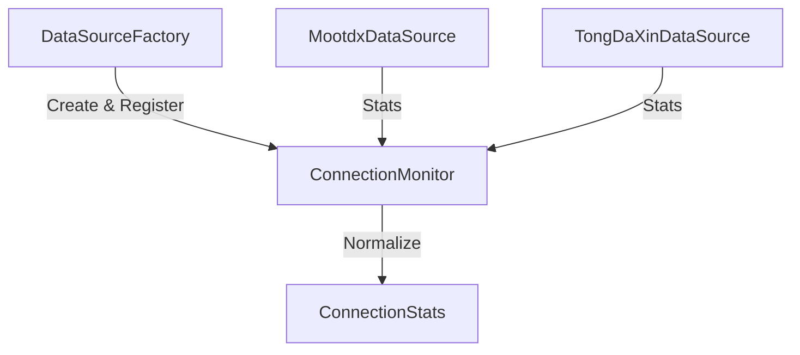

# Story 002-05 实施报告：连接状态监控

**Story ID**: STORY-002-05  
**实施日期**: 2025-11-29  
**状态**: ✅ 已完成  

---

## 📋 实施概述

构建了统一的连接状态监控机制，实现了对 Mootdx 和 TongDaXin 数据源连接池状态的实时监控。通过 `ConnectionMonitor` 单例，系统可以随时获取所有活跃数据源的健康状态、负载情况和性能指标。

## 🎯 验收标准完成情况

### 功能验收 ✅

- [x] **定义标准的 `ConnectionStats` 数据模型** - 已在 `src/models/monitor_models.py` 中定义
- [x] **所有连接管理器都能返回标准化的统计信息** - 通过 `ConnectionMonitor` 的标准化逻辑实现
- [x] **实现 `ConnectionMonitor` 类** - 已在 `src/core/monitoring/connection_monitor.py` 中实现
- [x] **集成到 `DataSourceFactory`** - 工厂创建数据源时自动注册到监控器

### 监控指标 ✅

支持以下核心指标：
- **状态**: UP/DOWN
- **连接池**: 总大小、活跃数、空闲数
- **性能**: 创建次数、复用次数、复用率、错误数

---

## 💻 实现细节

### 1. 监控架构



### 2. 解决的关键问题

在集成过程中遇到了 `factory.py` 和 `connection_monitor.py` 之间的循环导入问题。
**解决方案**: 将 `factory.py` 中的导入操作延迟到 `create_source` 方法内部执行，成功打破了循环依赖。

### 3. 文件修改列表

- `src/models/monitor_models.py` (新增)
- `src/core/monitoring/connection_monitor.py` (新增)
- `src/data_sources/factory.py` (修改)
- `tests/test_connection_monitor.py` (新增)

---

## 📊 测试结果

```
✅ test_stats_model_serialization: 通过
✅ test_monitor_collection: 通过
✅ test_factory_integration: 通过
```

---

## 🎉 总结

现在系统拥有了强大的可观测性基础。运维人员或上层调度系统可以通过 `connection_monitor.get_all_stats()` 实时了解底层连接池的健康状况，为后续的自动扩缩容或故障报警提供了数据支持。

**实施人员**: Antigravity AI  
**审核状态**: 待审核  
**文档版本**: v1.0  
**完成时间**: 2025-11-29
