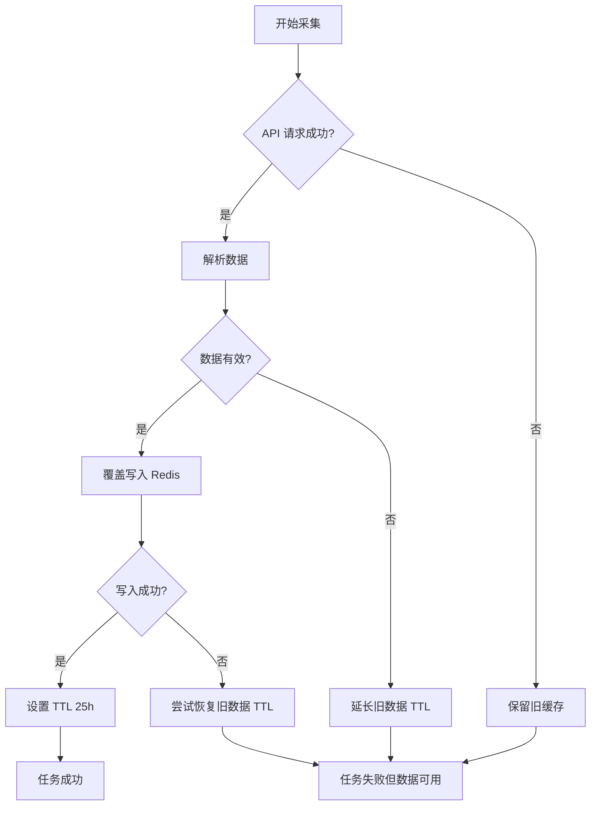

# 每日股票代码采集任务文档

> **任务名称**: `daily_stock_collection`  
> **版本**: 1.1  
> **更新日期**: 2026-01-17

---

## 📋 任务概述

从腾讯云 API 拉取全市场股票代码列表，缓存到本地 Redis Cluster，供 `gsd-worker` 各分片任务使用。

### 核心功能
1. ✅ 从云端 API 获取全量股票代码 (约 5500+ A股，总量 7300+)
   - 过滤条件: `security_type="stock"`, `is_listed="true"`, `is_active="true"`
2. ✅ 格式化为标准格式 (如 `000001.SZ`)
3. ✅ 缓存到 Redis Cluster (支持 3 节点集群)
4. ✅ 智能容错：下载失败时保留旧数据

---

## ⏰ 执行时间配置

### 推荐配置

| 任务 | 执行时间 | 时区 | 说明 |
|:-----|:---------|:-----|:-----|
| **云端采集** | 08:30 | Asia/Shanghai | 腾讯云服务器采集股票代码 |
| **本地同步** | **08:45** | Asia/Shanghai | 本地从云端拉取并缓存 |

**为什么配置为 08:45？**
- 确保在 09:00 开盘前元数据已就绪
- 避开 09:00 归档任务的 IO 高峰
- 云端任务在 08:30 左右完成数据刷新

### task-orchestrator 配置示例

```yaml
# services/task-orchestrator/config/tasks.yml
daily_stock_collection:
  task_id: daily_stock_collection
  schedule: "45 8 * * *"  # 每天 08:45
  timezone: Asia/Shanghai
  type: docker
  image: gsd-worker:latest
  command: jobs.daily_stock_collection
  network_mode: host
  environment:
    REDIS_HOST: 127.0.0.1
    REDIS_PORT: 6379
    REDIS_CLUSTER: "false"
    HTTP_PROXY: http://192.168.151.18:3128
    CLOUD_API_URL: http://124.221.80.250:8000/api/v1/stocks/all
```

---

## 🛡️ 容错机制

### TTL 策略 (25 小时)

**设计原理**:
- 正常情况：每天 09:05 更新，TTL 25h 确保覆盖到次日 10:05
- 失败情况：旧数据不会立即过期，给重试留足时间

### 失败保护流程



### 关键代码逻辑

```python
# 1. 检查旧数据
old_count = await redis.scard(REDIS_KEY_CODES)

# 2. 如果新数据解析失败，延长旧数据 TTL
if not stock_codes and old_count > 0:
    await redis.expire(REDIS_KEY_CODES, REDIS_TTL)
    logger.warning("⚠️  已延长旧数据 TTL")

# 3. 写入失败时，尝试恢复旧数据 TTL
except Exception as e:
    current_count = await redis.scard(REDIS_KEY_CODES)
    if current_count > 0:
        await redis.expire(REDIS_KEY_CODES, REDIS_TTL)
        logger.warning(f"⚠️  写入失败，但旧数据仍可用 ({current_count} 只)")
```

---

## 📊 Redis 数据结构

### Key 设计

| Key | 类型 | 说明 | 示例值 |
|:----|:-----|:-----|:-------|
| `metadata:stock_codes` | Set | 全量股票代码集合 | `000001.SZ`, `600519.SH` |
| `metadata:stock_codes:shard:0` | Set | 分片 0 股票代码 (Server 41) | `300750.SZ` |
| `metadata:stock_codes:shard:1` | Set | 分片 1 股票代码 (Server 58) | `000001.SZ` |
| `metadata:stock_codes:shard:2` | Set | 分片 2 股票代码 (Server 111) | `600519.SH` |
| `metadata:stock_info` | Hash | 股票元信息 | `{"name": "平安银行", "type": "stock"}` |

### 使用示例

```bash
# 获取总数
redis-cli -c SCARD metadata:stock_codes
# 输出: (integer) 7356

# 随机抽样
redis-cli -c SRANDMEMBER metadata:stock_codes 10

# 查看股票信息
redis-cli -c HGET metadata:stock_info "000001.SZ"
# 输出: {"name": "平安银行", "type": "stock"}

# 检查 TTL
redis-cli -c TTL metadata:stock_codes
# 输出: (integer) 89972  (约 25 小时)
```

---

## 🚀 手动执行

### Docker 方式 (推荐)

```bash
docker run --rm \
  --network host \
  -e REDIS_HOST=127.0.0.1 \
  -e REDIS_PORT=6379 \
  -e REDIS_CLUSTER=false \
  -e HTTP_PROXY=http://192.168.151.18:3128 \
  -e CLOUD_API_URL=http://124.221.80.250:8000/api/v1/stocks/all \
  gsd-worker:latest \
  jobs.daily_stock_collection
```

### 预期输出

```
✓ Redis Cluster 连接成功: 127.0.0.1:16379
🚀 开始从云端拉取股票列表: http://124.221.80.250:8000/api/v1/stocks/all
   使用代理: http://192.168.151.18:3128
✓ 获取成功: 7356 条记录 (Total: 7356)
📦 检测到现有缓存: 7353 只股票
📝 开始更新缓存: 7356 只股票
✅ Redis 缓存更新完成: 7356 只股票 (TTL: 25.0h)
✨ 任务成功完成，耗时: 1.34s
```

---

## 📈 性能指标

| 指标 | 数值 | 说明 |
|:-----|:-----|:-----|
| **API 响应时间** | ~1.2s | 包含代理转发 |
| **数据解析时间** | ~70ms | 7356 条记录 |
| **Redis 写入时间** | ~80ms | 批量写入 |
| **总执行时间** | ~1.4s | 端到端 |
| **数据量** | 7356 只 | 包含 SH/SZ/BJ 三市场 |

---

## 🔧 故障排查

### 常见问题

#### 1. API 连接失败
```
❌ 网络请求异常: Connection reset by peer
```
**解决方案**: 检查 HTTP_PROXY 配置是否正确

#### 2. Redis 集群错误
```
ERROR: Calling pipelined function rename is blocked in cluster mode
```
**解决方案**: 已修复，使用 DEL + SADD 替代 RENAME

#### 3. 数据为空
```
❌ 数据解析后为空，中止更新
⚠️  已延长旧数据 TTL
```
**说明**: 这是正常的容错行为，旧数据仍可用

---

## 📝 相关文档

- [腾讯云 API 文档](../../../docs/tencent_api/stock-code.md)
- [Redis 集群架构](../../../docs/architecture/infrastructure/redis-3shard-cluster.md)
- [Task Orchestrator 配置](../../task-orchestrator/config/tasks.yml)

---

**维护者**: AI Agent  
**最后更新**: 2026-01-09
