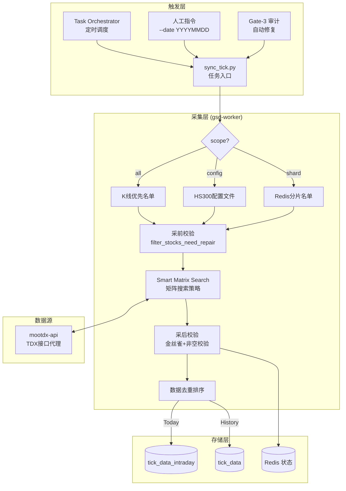

# 分笔数据采集开发规范 (当日 & 指定日期)

> **版本**: 1.2
> **更新日期**: 2026-01-17
> **状态**: 已生效

本文档详细定义了分笔数据采集的核心流程。系统复用同一套代码逻辑 (`sync_tick.py`)，根据输入参数的不同，自动适配 **每日盘后采集** 和 **指定日期补采** 两种业务场景。

---

## 1. 场景差异概览

系统通过 `trade_date` 参数与当前日期对比，自动分流执行逻辑：

| **每日盘后采集 (Daily)** | **指定日期补采 (Historical)** |
| :--- | :--- |
| 每日 15:30 例行采集、Gate-3 自动修复 | 历史数据回溯、特定日期手动修复 |
| 定时任务 / 门禁触发 | 人工指令 / `repair_tick` 任务 |
| **自动推断** (See "6 AM Rule") | **显式指定** (`--date YYYYMMDD`) |
| 实时接口 `/api/v1/tick/{code}` | 历史接口 `/api/v1/tick/{code}?date={d}` |
| `stock_data.tick_data_intraday` | `stock_data.tick_data` |
| 包含实时盘口信息 (Ask/Bid) | 仅成交明细 (Time/Price/Vol) |

---

## 2. 系统架构图



| **典型用途** | 每日 15:30 例行采集、Gate-3 自动修复 | 历史数据回溯、特定日期手动修复 |
| **触发方式** | 定时任务 / 门禁触发 | 人工指令 / `repair_tick` 任务 |
| **日期参数** | **自动推断** (See "6 AM Rule") | **显式指定** (`--date YYYYMMDD`) |
| **数据源 API** | 实时接口 `/api/v1/tick/{code}` | 历史接口 `/api/v1/tick/{code}?date={d}` |
| **写入目标表** | `stock_data.tick_data_intraday` | `stock_data.tick_data` |
| **数据特性** | 包含实时盘口信息 (Ask/Bid) | 仅成交明细 (Time/Price/Vol) |

---

## 2. 核心共用流程

无论哪种场景，核心采集策略均遵循 **Search Matrix** 算法。

### 2.1 任务入口与参数
*   **代码入口**: `services/gsd-worker/src/jobs/sync_tick.py`
*   **关键参数**:
    *   `--stock-codes`: 指定股票列表（即使是指定日期，也可只采部分股票）。
    *   `--distributed-role`: 同样支持 Producer/Consumer 分布式模式。

### 2.2 智能搜索矩阵 (Smart Search Matrix)
为确保 **09:25 集合竞价数据** 的完整性，系统执行以下矩阵搜索（适用于两个场景）：

| 优先级 | 起始 (Start) | 偏移 (Offset) | 说明 |
| :--- | :--- | :--- | :--- |
| **0** | **0** | **5000** | 基础全量 (保证午盘) |
| **1** | **3500-4500** | **500-800** | 精准靶向 (保证 09:25-09:30) |
| **2** | **3000/5000+** | **1000+** | 深度/广域搜索 (兜底) |

### 2.3 数据清洗规则
1.  **合并**: 合并矩阵搜索结果。
2.  **去重**: 基于 `(tick_time, price, volume)` 三元组去重。
3.  **排序**: 按时间升序。
4.  **校验**:
    *   **金丝雀校验**: 核心权重股不能为空。
    *   **IP 校验**: 若历史日期返回空（非停牌），判定为潜在 IP 封禁，触发重试。

---

## 3. 场景 A: 每日盘后采集流程 (Daily)

此流程用于获取“刚刚结束的交易日”的完整数据。

### 3.1 触发规则 (The 6 AM Rule)
当未指定 `--date` 参数时，系统根据当前时间自动判定：
*   **< 06:00**: 采集 **昨天** (T-1) 的数据（应对凌晨运行的情况）。
*   **>= 06:00**: 采集 **今天** (T) 的数据（应对盘后运行的情况）。

### 3.2 写入目标
*   数据写入 **`stock_data.tick_data_intraday`** (ClickHouse)。
*   **注意**: 该表通常在次日 09:00 由 `tick_data_migrate` 任务归档到历史表并清空。

---

## 4. 场景 B: 指定日期采集流程 (Historical)

此流程用于补录过去某一天的数据，或者在 Gate-3 发现历史数据缺失时触发。

### 4.1 触发指令示例
通过 `CommandPoller` 下发或命令行直接运行：
```bash
# 采集 2026-01-14 的所有股票数据
python -m jobs.sync_tick --date 20260114 --scope all

# 仅补采特定股票
python -m jobs.sync_tick --date 20260114 --stock-codes 000001.SZ,600519.SH
```

### 4.2 逻辑分叉细节
在 `TickSyncService.fetch_tick_data` 中：
1.  检测到 `date != today`。
2.  切换 API 调用模式，向 `mootdx-api` 发送带有 `date` 参数的请求。
    *   *注*: 历史接口的响应速度通常快于实时接口，但并发过高仍可能触发频控。

### 4.3 写入目标
*   数据直接写入 **`stock_data.tick_data`** (历史归档表)。
*   **幂等性**: 表结构采用 `ReplacingMergeTree`，重复写入相同 `(stock_code, trade_date, tick_time)` 的数据会自动去重。

---

## 5. 异常处理与状态反馈

### 5.1 状态记录
Redis Key: `tick_sync:status:{date}`
*   无论采集哪一天的数据，状态都会记录在对应日期的 Key 中。
*   Gate-3 审计时会根据审计日期的 Key 来判断完整性。

### 5.2 失败重试
*   **每日采集**: 依赖 `task-orchestrator` 的 Job Retry (默认 3 次)。
*   **历史补采**: 通常由人工或 `repair_tick` 任务触发，建议在命令中启用 `--concurrency` 控制并发以保障成功率。

---

## 6. 代码文件映射

| 模块 | 文件路径 | 说明 |
| :--- | :--- | :--- |
| **入口** | `src/jobs/sync_tick.py` | 处理 `--date` 参数解析与模式分发 |
| **服务** | `src/core/tick_sync_service.py` | 包含 `is_today` 判断逻辑与 API 路由选择 |
| **入库** | `src/core/clickhouse_client.py` | 管理 Intraday/History 表的连接 |

---

## 7. 分布式模式详解 (Redis Producer-Consumer)

### 7.1 架构概述
*   **Producer**: 负责生成股票列表并推送到 Redis 队列。
*   **Consumer**: 多节点竞争消费任务，实现水平扩展。

### 7.2 Redis 队列定义
| Key 名称 | 类型 | 用途 |
| :--- | :--- | :--- |
| `{gsd:tick}:tasks` | List | 待采集任务队列 |
| `{gsd:tick}:processing:{hostname}` | List | 各节点正在处理的任务 |

### 7.3 核心方法
*   `push_tasks_to_redis(stock_codes)`: Producer 推送任务。
*   `consume_task_from_redis()`: Consumer 使用 `BRPOPLPUSH` 原子抢占任务。
*   `ack_task_in_redis(stock_code)`: 任务完成后从 processing 队列移除。
*   `recover_processing_tasks()`: **断点续传** - 进程启动时恢复未完成任务。

---

## 8. 数据处理规范

### 8.1 数据去重
采集到的多轮数据需要合并去重：
*   **去重键**: `(tick_time, price, volume)` 三元组
*   **保留策略**: 首次出现的记录

### 8.2 买卖方向映射
原始数据 `buyorsell` 字段映射：
| 原始值 | 映射值 | 含义 |
| :--- | :--- | :--- |
| 0 | 0 | 买盘 (主动买入) |
| 1 | 1 | 卖盘 (主动卖出) |
| 其他 | 2 | 中性 |

### 8.3 请求节流 (Pacing)
为避免触发 TDX 频控：
*   **最小间隔**: `0.1s` (常量 `DEFAULT_MIN_PACING_INTERVAL`)
*   **动态调整**: 实际间隔 = `max(0, 0.1 - 本次请求耗时)`

---

## 9. 股票名单获取策略

### 9.1 分片模式 (`get_sharded_stocks`)
从 Redis 获取预分片的股票列表：
*   **Key**: `metadata:stock_codes:shard:{shard_index}`
*   **降级**: Redis 不可用时，读取本地缓存 `/app/data/cache/shard_{n}_latest.json`

### 9.2 配置文件模式 (`get_stock_pool`)
适用于 `--scope config` 场景：
*   **配置路径**: `/app/config/hs300_stocks.yaml`
*   **降级**: 配置不存在时，使用内置默认 HS300 成分股列表 (约 80 只)

### 9.3 K线优先模式 (`get_stocks_from_kline_or_fallback`)
适用于 `--scope all` 场景：
*   **优先**: 从 ClickHouse `kline_data_local` 获取当日有交易的股票
*   **降级**: 调用 `get_all_stocks()` 从 mootdx-api 获取全市场列表

