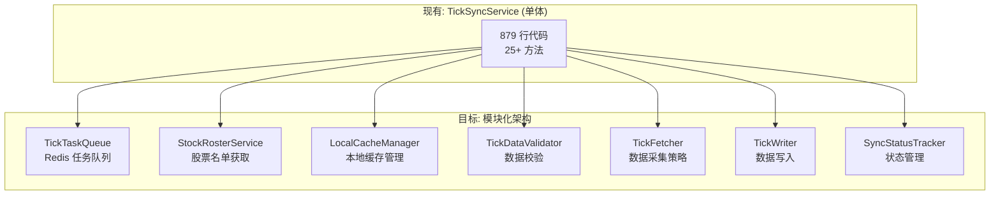

# TickSyncService 解耦重构计划

> **版本**: 1.0
> **创建日期**: 2026-01-17
> **状态**: 待实施

---

## 1. 背景与问题

### 1.1 当前状态
`tick_sync_service.py` 文件包含 **879 行代码**，`TickSyncService` 类拥有 **25+ 方法**，承担了过多职责。

### 1.2 违反的设计原则
*   **单一职责原则 (SRP)**: 一个类同时负责数据采集、队列管理、缓存、校验、写入等。
*   **开闭原则 (OCP)**: 新增功能需要修改核心类，风险高。
*   **代码复用困难**: `post_market_gate_service.py` 中存在类似的股票名单获取逻辑。

---

## 2. 目标架构



---

## 3. 模块拆分详情

### 3.1 TickTaskQueue (P0 - 高优先级)

**职责**: Redis 分布式任务队列管理

**迁移方法**:
| 原方法 | 新位置 |
| :--- | :--- |
| `push_tasks_to_redis()` | `TickTaskQueue.push()` |
| `consume_task_from_redis()` | `TickTaskQueue.consume()` |
| `ack_task_in_redis()` | `TickTaskQueue.ack()` |
| `recover_processing_tasks()` | `TickTaskQueue.recover()` |

**新文件**: `src/core/task_queue.py`

```python
class TickTaskQueue:
    QUEUE_NAME = "{gsd:tick}:tasks"
    PROCESSING_PREFIX = "{gsd:tick}:processing"
    
    def __init__(self, redis_client):
        self.redis = redis_client
    
    async def push(self, stock_codes: List[str]) -> int: ...
    async def consume(self, node_id: str = None) -> Optional[str]: ...
    async def ack(self, stock_code: str, node_id: str = None) -> bool: ...
    async def recover(self, node_id: str = None) -> List[str]: ...
```

---

### 3.2 StockRosterService (P0 - 高优先级)

**职责**: 统一的股票名单获取服务

**迁移方法**:
| 原方法 | 新位置 |
| :--- | :--- |
| `get_all_stocks()` | `StockRosterService.get_all()` |
| `get_sharded_stocks()` | `StockRosterService.get_by_shard()` |
| `get_stock_pool()` | `StockRosterService.get_from_config()` |
| `get_stocks_from_kline_or_fallback()` | `StockRosterService.get_from_kline()` |

**新文件**: `src/core/stock_roster_service.py`

**复用场景**:
*   `tick_sync_service.py`
*   `post_market_gate_service.py`
*   `supplement_engine.py`

---

### 3.3 LocalCacheManager (P2 - 低优先级)

**职责**: 本地文件缓存管理

**迁移方法**:
| 原方法 | 新位置 |
| :--- | :--- |
| `_save_local_cache()` | `LocalCacheManager.save()` |
| `_load_local_cache()` | `LocalCacheManager.load()` |
| `_write_json_cache()` | `LocalCacheManager._write_json()` |

**新文件**: `src/utils/local_cache.py`

---

### 3.4 TickDataValidator (P1 - 中优先级)

**职责**: 数据质量校验

**迁移方法**:
| 原方法 | 新位置 |
| :--- | :--- |
| `_validate_data()` | `TickDataValidator.validate_canary()` |
| `check_data_quality()` | `TickDataValidator.check_quality()` |
| `filter_stocks_need_repair()` | `TickDataValidator.filter_need_repair()` |

**新文件**: `src/core/tick_validator.py`

**配置外置**:
```yaml
# config/validation_rules.yaml
canary_stocks:
  - "600519"
  - "000001"
  - "601318"
quality_thresholds:
  min_tick_count: 2000
  min_time_boundary: "10:00:00"
  max_time_boundary: "14:30:00"
```

---

### 3.5 TickFetcher (P1 - 中优先级)

**职责**: 分笔数据采集策略

**迁移方法**:
| 原方法 | 新位置 |
| :--- | :--- |
| `fetch_tick_data()` | `TickFetcher.fetch()` |
| `SEARCH_MATRIX` | `TickFetcher.SEARCH_MATRIX` |

**新文件**: `src/core/tick_fetcher.py`

**策略模式扩展**:
```python
class TickFetcher:
    def __init__(self, http_session, api_url, strategy: FetchStrategy = None):
        self.strategy = strategy or SmartMatrixStrategy()
    
    async def fetch(self, stock_code: str, trade_date: str) -> List[Dict]:
        return await self.strategy.execute(stock_code, trade_date)
```

---

### 3.6 TickWriter (P1 - 中优先级)

**职责**: 数据转换与 ClickHouse 写入

**迁移方法**:
| 原方法 | 新位置 |
| :--- | :--- |
| `sync_stock()` (部分) | `TickWriter.write()` |
| `_map_direction()` | `TickWriter._map_direction()` |

**新文件**: `src/core/tick_writer.py`

---

### 3.7 SyncStatusTracker (P2 - 低优先级)

**职责**: Redis 状态跟踪

**迁移方法**:
| 原方法 | 新位置 |
| :--- | :--- |
| `_update_sync_status()` | `SyncStatusTracker.update()` |

**新文件**: `src/core/sync_status.py`

---

## 4. 重构后的 TickSyncService

```python
# src/core/tick_sync_service.py (重构后)
class TickSyncService:
    """分笔数据同步服务 (瘦身版 - 编排层)"""
    
    def __init__(self):
        self.task_queue = TickTaskQueue(redis_client)
        self.roster = StockRosterService(redis_client, clickhouse_pool, http_session)
        self.validator = TickDataValidator(clickhouse_pool)
        self.fetcher = TickFetcher(http_session, api_url)
        self.writer = TickWriter(clickhouse_pool)
        self.status_tracker = SyncStatusTracker(redis_client)
    
    async def sync_stock(self, stock_code: str, trade_date: str) -> int:
        """编排各模块完成单股同步"""
        # 1. 采前校验
        if await self.validator.check_quality(stock_code, trade_date):
            return -1  # Skip
        
        # 2. 采集
        data = await self.fetcher.fetch(stock_code, trade_date)
        
        # 3. 采后校验
        self.validator.validate_canary(stock_code, data, trade_date)
        
        # 4. 写入
        count = await self.writer.write(stock_code, trade_date, data)
        
        # 5. 状态更新
        await self.status_tracker.update(stock_code, trade_date, "completed", count)
        
        return count
```

---

## 5. 实施计划

| 阶段 | 任务 | 预计工时 | 依赖 |
| :--- | :--- | :--- | :--- |
| **Phase 1** | 拆分 `TickTaskQueue` | 2h | 无 |
| **Phase 1** | 拆分 `StockRosterService` | 3h | 无 |
| **Phase 2** | 拆分 `TickDataValidator` | 2h | Phase 1 |
| **Phase 2** | 拆分 `TickFetcher` | 2h | Phase 1 |
| **Phase 3** | 拆分 `TickWriter` | 2h | Phase 2 |
| **Phase 3** | 拆分 `SyncStatusTracker` | 1h | Phase 2 |
| **Phase 4** | 重构 `TickSyncService` 为编排层 | 2h | Phase 3 |
| **Phase 5** | 更新单元测试 | 3h | Phase 4 |

**总预计工时**: 17 小时

---

## 6. 风险与缓解

| 风险 | 缓解措施 |
| :--- | :--- |
| 拆分过程中引入 Bug | 保持现有测试通过，增量重构 |
| 循环依赖 | 严格遵循依赖方向：Service → Components |
| 性能退化 | 避免过度抽象，保持热路径内联 |

---

## 7. 验收标准

- [ ] 所有现有测试通过
- [ ] 代码覆盖率不降低
- [ ] `TickSyncService` 代码行数 < 200 行
- [ ] 各模块可独立测试
- [ ] `StockRosterService` 被 3+ 个服务复用
