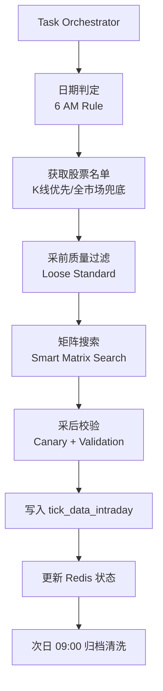

# 每日盘后分笔数据采集流程 (Daily Post-Market Tick Sync)

> **场景**: 每日收盘后 (15:30) 自动执行
> **目标**: 获取当日完整分笔数据
> **数据表**: `stock_data.tick_data_intraday` (当日表)

## 1. 触发机制
**The 6 AM Rule (自动判定)**
系统根据当前系统时间自动判断目标日期（逻辑见 `sync_tick.py`）：
*   **< 06:00**: 采集 **前一交易日** (T-1) (应对凌晨自动运行或补跑)
*   **>= 06:00**: 采集 **当日** (T) (正常盘后运行)



## 2. 执行流程
### 2.1 任务启动
Task Orchestrator 定时触发 `daily_tick_sync` 或通过 `distributed_tick_sync` 发射分片任务。

### 2.2 采前校验 (Pre-Collection Validation)
1.  **确定名单 (Golden Source)**: 
    *   优先从 ClickHouse 获取当日有 K 线记录的股票 (实际交易样本)。
    *   若 K 线为空，降级到 Redis `metadata:stock_codes` 全市场名单。
2.  **幂等筛选 (`filter_stocks_need_repair`)**: 排除已存在且符合 **宽松标准 (Loose Standards)** 的股票：
    *   `tick_count >= 2000`
    *   `min_time <= 10:00:00`
    *   `max_time >= 14:30:00`

### 2.3 核心采集：Smart Matrix Search
调用 `mootdx-api` 的 `/api/v1/tick/{code}` 接口，采用多轮偏移探测策略（见 `fetcher.py`）：
1.  **策略组**:
    *   `Full Base`: (Start: 0, Offset: 5000) 覆盖午盘到收盘。
    *   `Mid-Morning Gap`: (Start: 3500, Offset: 800) 靶向早盘尾声。
    *   `Late-Morning Gap`: (Start: 4000, Offset: 500) 靶向早盘。
    *   `Deep/Wide Probe`: 进行深度探测确保覆盖 09:25。
2.  **早停机制 (Smart Stop)**: 一旦探测到 `min_time <= 09:25` 的数据，立即停止后续搜索轮次，节省 IO。
3.  **清洗**: 对多轮结果进行 `(time, price, vol)` 三元组去重并按时间升序。

### 2.4 采后校验 (Post-Collection Validation)
1.  **金丝雀校验 (Canary)**: 对核心权重股（如 600519, 000001 等 10 只样本）进行非空核查。若为空，抛出 `CRITICAL` 异常，判定数据源单点崩溃。
2.  **时间戳记录**: 记录采集到的 `min_time` 和 `max_time` 到 Redis `tick_sync:status:{date}`。

### 2.5 写入与归档
1.  **写入**: 存入分布式表 `stock_data.tick_data_intraday`。
2.  **归档**: 次日 **09:00** 由 `tick_data_migrate` 定时任务执行 SQL：
    ```sql
    INSERT INTO stock_data.tick_data SELECT * FROM stock_data.tick_data_intraday;
    TRUNCATE TABLE stock_data.tick_data_intraday;
    ```

## 3. 命令行手动触发
```bash
# 自动推断日期，采集全市场 (常用)
docker run --rm --net=host \
  -e CLICKHOUSE_HOST=127.0.0.1 \
  -e CLICKHOUSE_USER=admin \
  -e CLICKHOUSE_PASSWORD=admin123 \
  -e REDIS_PASSWORD=redis123 \
  -e MOOTDX_API_URL=http://127.0.0.1:8003 \
  gsd-worker jobs.sync_tick --scope all --mode incremental

# 指定日期分片采集 (分布式节点执行)
docker run --rm --net=host \
  -e CLICKHOUSE_HOST=127.0.0.1 \
  -e CLICKHOUSE_USER=admin \
  -e CLICKHOUSE_PASSWORD=admin123 \
  -e REDIS_PASSWORD=redis123 \
  -e MOOTDX_API_URL=http://127.0.0.1:8003 \
  gsd-worker jobs.sync_tick --date 20260123 --scope all --shard-index 0 --shard-total 3

# 强制全量覆盖采集
docker run --rm --net=host \
  -e CLICKHOUSE_HOST=127.0.0.1 \
  -e CLICKHOUSE_USER=admin \
  -e CLICKHOUSE_PASSWORD=admin123 \
  -e REDIS_PASSWORD=redis123 \
  -e MOOTDX_API_URL=http://127.0.0.1:8003 \
  gsd-worker jobs.sync_tick --date 20260123 --mode full --concurrency 12
```

## 4. 关键服务对应
*   **采集服务**: `core/tick_sync_service.py` (Orchestrator)
*   **搜索逻辑**: `gsd_shared/tick/fetcher.py` (`TickFetcher`)
*   **校验标准**: `gsd_shared/validation/standards.py` (`TickStandards.Loose`)
*   **名单管理**: `gsd_shared/stock_universe.py` (`StockUniverseService`)
