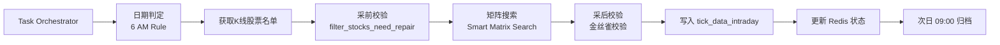

# 每日盘后分笔数据采集流程 (Daily Post-Market Tick Sync)

> **场景**: 每日收盘后 (15:30) 自动执行
> **目标**: 获取当日完整交易数据
> **数据表**: `stock_data.tick_data_intraday`

## 1. 触发机制
**The 6 AM Rule (自动判定)**
无需指定日期参数。系统根据当前系统时间自动判断：
*   **< 06:00**: 采集 **前一日** (T-1) (应对凌晨补跑)
*   **>= 06:00**: 采集 **当日** (T) (正常盘后运行)



## 2. 执行流程
1.  **启动**: Task Orchestrator 触发 `daily_tick_sync` 任务。
2.  **采前校验 (Pre-Collection Validation)**:
    *   获取当日 K 线不为空的股票列表 (Golden Source)。
    *   执行 `filter_stocks_need_repair()`，排除 `tick_data_intraday` 中已存在且质量达标的股票。
    *   **达标标准**: `tick_count >= 2000` 且 `min_time <= 10:00` 且 `max_time >= 14:30`。
3.  **采集**:
    *   调用实时接口 `/api/v1/tick/{code}`。
    *   执行 **Smart Matrix Search** 策略，通过多轮偏移量探测（见 `tick_sync_service.py`），确保突破 TDX 接口限制，完整获取 09:25 集合竞价数据。

    > **搜索策略概览**:
    > 1. **全量基础 (Offset 5000)**: 获取午盘及收盘数据。
    > 2. **精准靶向 (Offset 3500-4500)**: 专门命中早盘 09:25-09:30 数据。
    > 3. **早停机制**: 一旦获取到 09:25 数据，立即停止后续搜索，节省 IO。
4.  **采后校验 (Post-Collection Validation)**:
    *   **金丝雀校验**: 对核心权重股（如 600519, 000001），若采集结果为空，判定数据源异常，抛出 `CRITICAL` 异常。
    *   **时间范围校验**: 检查采集数据的 `min_time` 和 `max_time`，记录到 Redis 状态中。
5.  **入库**:
    *   写入 `tick_data_intraday` 表。
    *   更新 Redis 状态 `tick_sync:status:{today}`。
6.  **归档**: 次日 09:00 由迁移任务转入 History 表。

## 3. 命令行手动触发
```bash
# 模拟盘后自动采集 (自动推断日期)
python -m jobs.sync_tick \
  --scope all \
  --mode incremental

# 强制分布式执行 (Producer)
python -m jobs.sync_tick \
  --scope all \
  --distributed-role producer \
  --distributed-source redis
```
