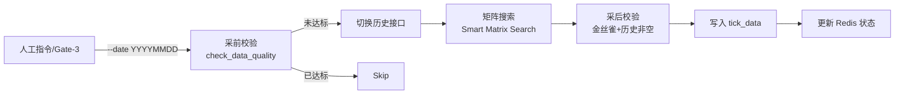

# 指定日期分笔数据补采流程 (Specified Date Tick Repair)

> **场景**: 历史数据回溯、Gate-3 修复、人工补录
> **目标**: 获取指定历史日期的完整数据
> **数据表**: `stock_data.tick_data` (历史表)

## 1. 触发机制
**Explicit Date Parameter (显式指定)**
必须通过 `--date` 参数明确指定目标日期。



## 2. 执行流程
1.  **启动**: 人工指令或 Gate-3 自动修复脚本触发。
2.  **采前校验 (Pre-Collection Validation)**:
    *   执行 `check_data_quality(stock_code, trade_date)`，检查目标日期的数据是否已达标。
    *   **达标标准**: `tick_count >= 2000` 且 `min_time <= 10:00` 且 `max_time >= 14:30`。
    *   若已达标，返回 `skipped` 状态，跳过采集。
3.  **路由**:
    *   检测到 `date != today`。
    *   切换至历史数据接口 `/api/v1/tick/{code}?date={YYYYMMDD}`。
4.  **采集**:
    *   同样执行 **Smart Matrix Search** (逻辑与每日采集一致)，确保历史数据的完整性。
    *   **搜索矩阵**:
        *   Priority 0: `Start=0, Offset=5000` (基础覆盖)
        *   Priority 1: `Start=3500/4000/4500` (精准靶向早盘)
        *   Priority 2: `Start=3000/5000+` (深度补漏)
5.  **采后校验 (Post-Collection Validation)**:
    *   **金丝雀校验**: 对核心权重股，若返回为空，抛出 `CRITICAL` 异常触发重试。
    *   **历史非空校验**: 若返回数据为空且非停牌，视为 IP 异常，抛出 `ValueError` 触发重试。
6.  **入库**:
    *   直接写入 `tick_data` (ReplacingMergeTree 引擎自动去重)。
    *   更新 Redis 状态 `tick_sync:status:{target_date}`。

## 3. 命令行手动触发
```bash
# 补采特定日期的全市场数据
python -m jobs.sync_tick \
  --date 20240115 \
  --scope all

# 补采特定股票的特定日期
python -m jobs.sync_tick \
  --date 20240115 \
  --stock-codes 600519.SH,000001.SZ

# 高并发补采 (调整并发数)
python -m jobs.sync_tick \
  --date 20240115 \
  --scope all \
  --concurrency 16
```

## 4. 注意事项
*   **接口限制**: 历史接口响应速度可能快于实时接口，但也受 TPS 限制，建议并发数不要过高 (>20)。
*   **幂等性**: 可重复执行，数据库引擎保证最终一致性。
