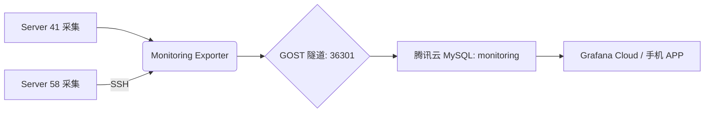

# 📊 Monitoring Exporter (监控导出服务)

> **版本**: 1.1.0  
> **状态**: Stable (运行中)  
> **目标**: 将本地基础设施指标同步至腾讯云 MySQL，供 Grafana Cloud 远程访问。

---

## 🏗️ 架构概览



- **数据源**: 
  - Server 41: Prometheus, ClickHouse, Redis, Docker, System (psutil)
  - Server 58: System (via SSH)
- **同步频率**: 每 5 分钟 (300秒)
- **存储方案**: 腾讯云 MySQL `monitoring` 数据库
- **可视化**: [Grafana Cloud](https://ac1626285367.grafana.net/)

---

## 📊 采集指标说明 (L0-L4 分级)

| 级别 | 指标类别 | 监控项 | 说明 |
| :--- | :--- | :--- | :--- |
| **L0** | GOST 隧道 | 存活状态 | 监控云端连接是否通畅 |
| **L1** | System (41) | CPU, MEM, Disk | Server 41 资源水位 |
| **L1** | System (58) | CPU, MEM, Disk | Server 58 资源水位 (SSH) |
| **L1** | Redis | 内存使用率, OPS | 4GB 内存限制监控 |
| **L2** | ClickHouse | 复制延迟, 队列大小, 只读状态 | 双主集群同步监控 |
| **L3** | 微服务健康 | get-stockdata, quant-strategy, task-orchestrator, mootdx-api | HTTP 健康检查 |
| **L3** | Docker | 容器状态 | 容器运行状态监控 |
| **L4** | 业务指标 | K线同步量, 快照数据量, 股票覆盖数 | ClickHouse 业务数据 |

---

## 🚀 快速开始

### 1. 环境准备
服务已部署在 `/home/bxgh/microservice-stock/services/monitoring-exporter`。

```bash
cd services/monitoring-exporter
source .venv/bin/activate
```

### 2. 初始化数据库 (已执行)
```bash
python init_db_py.py
python create_monitoring_tables.py  # 扩展表
```

### 3. 服务管理
```bash
# 查看状态
sudo systemctl status monitoring-exporter

# 重启服务
sudo systemctl restart monitoring-exporter

# 查看日志
tail -f exporter.log
```

---

## ⚙️ 核心配置

- **GOST 隧道**: `127.0.0.1:36301` → 腾讯云 MySQL
- **MySQL 账号**: `root` / `alwaysup@888`
- **Grafana 只读账号**: `grafana_readonly` / `alwaysup@monitoring`
- **保留策略**: 自动保留最近 **30 天** 数据

---

## 📝 迭代记录
- **2026-01-06**: v1.1.0 - 新增 Server 58 SSH 采集、微服务健康检查、Docker 状态、ClickHouse 业务指标
- **2026-01-05**: v1.0.0 - 初始化发布，支持基础资源与核心组件监控

---
*Created by AI Agent*
