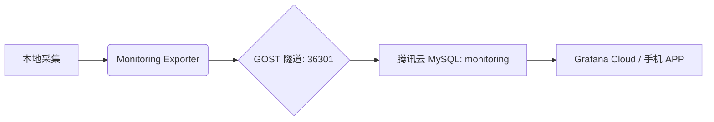

# 📊 Monitoring Exporter (监控导出服务)

> **版本**: 1.0.0  
> **状态**: Stable (运行中)  
> **目标**: 将本地基础设施指标同步至腾讯云 MySQL，供 Grafana Cloud 远程访问。

---

## 🏗️ 架构概览



- **数据源**: Prometheus (9091), ClickHouse (9000), Redis (6379), System (psutil)
- **同步频率**: 每 5 分钟 (300秒)
- **存储方案**: 腾讯云 MySQL `monitoring` 数据库
- **可视化**: [Grafana Cloud](https://ac1626285367.grafana.net/)

---

## 🚀 快速开始

### 1. 环境准备
服务已部署在 `/home/bxgh/microservice-stock/services/monitoring-exporter`。

```bash
cd services/monitoring-exporter
# 激活环境
source .venv/bin/activate
```

### 2. 初始化数据库 (已执行)
如果需要在新环境部署，运行：
```bash
python init_db_py.py
```

### 3. 安装为系统服务 (推荐)
为了确保服务器重启后自动同步，请执行：
```bash
sudo bash setup_service.sh
```

---

## 🛠️ 日常维护

### 查看服务状态
```bash
sudo systemctl status monitoring-exporter
```

### 查看同步日志
```bash
# 查看实时日志
tail -f exporter.log

# 或使用系统日志
journalctl -u monitoring-exporter -f
```

### 重启同步任务
如果您修改了 `exporter.py`，请重启生效：
```bash
sudo systemctl restart monitoring-exporter
```

---

## 📊 采集指标说明

| 指标类别 | 监控项 | 说明 |
| :--- | :--- | :--- |
| **ClickHouse** | 复制延迟, 队列大小, 只读状态 | 监控双主集群同步是否正常 |
| **Redis** | 内存使用率, 活跃客户端, OPS | 监控 4GB 内存限制触发情况 |
| **System** | CPU (%), Memory (GB), Disk (%) | 基础资源水位监控 |
| **Gost** | 隧道服务存活状态 | 监控云端连接是否通畅 |

---

## ⚙️ 核心配置说明

- **Host**: `127.0.0.1:36301` (由 GOST 映射到腾讯云 MySQL)
- **MySQL 账号**: `root` / `alwaysup@888`
- **Grafana 只读账号**: `grafana_readonly` / `alwaysup@monitoring`
- **保留策略**: 数据库内置了事件 `cleanup_old_metrics`，自动保留最近 **30 天** 数据。

---

## 📝 迭代记录
- **2026-01-05**: 初始化发布，支持基础资源与核心组件监控。

---
*Created by AI Agent*
