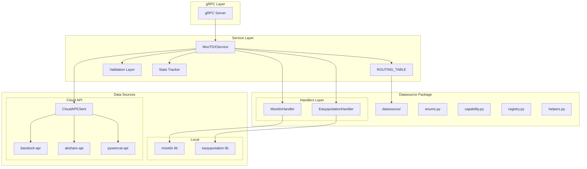

# MooTDX-Source 数据源架构

## 概述

`mootdx-source` 是一个统一数据源服务，整合本地数据源（mootdx, easyquotation）和云端 API（baostock, akshare, pywencai）。

## 架构图



## 模块结构

```
src/
├── main.py              # 入口点, gRPC 服务器
├── service.py           # MooTDXService 核心逻辑
├── config.py            # 配置常量 (重导出 DataSource)
├── cloud_client.py      # 云端 API 客户端
│
└── datasource/          # 数据源能力模块
    ├── __init__.py      # 统一导出
    ├── enums.py         # DataSource, DataType 枚举
    ├── capability.py    # DataSourceCapability 数据类
    ├── registry.py      # CAPABILITIES, FALLBACK_CHAINS
    └── helpers.py       # 辅助函数
```

## 数据流

1. **gRPC 请求** → `MooTDXService.FetchData()`
2. **路由查找** → `ROUTING_TABLE[data_type]` 获取处理器配置
3. **执行处理器** → 调用对应数据源方法
4. **数据验证** → `_validate_data()` 检查结果
5. **降级处理** → 失败时尝试 `fallback_handler`
6. **统计记录** → `_record_stats()` 更新可观测性数据
7. **返回响应** → gRPC DataResponse

## 降级策略

| 数据类型 | 主数据源 | 降级数据源 |
|----------|----------|------------|
| QUOTES | mootdx | easyquotation |
| TICK | mootdx | - |
| HISTORY | baostock | mootdx |
| FINANCE | akshare | baostock |
| INDUSTRY | baostock | akshare |
| RANKING | akshare | - |
| DRAGON_TIGER | akshare | - |

## 关键接口

### DataSource 枚举

```python
from datasource import DataSource

DataSource.MOOTDX          # 通达信直连
DataSource.EASYQUOTATION   # 新浪/腾讯行情
DataSource.BAOSTOCK_API    # 证券宝
DataSource.AKSHARE_API     # AkShare
DataSource.PYWENCAI_API    # 同花顺问财
```

### 能力查询

```python
from datasource import (
    get_primary_source,
    get_fallback_source,
    recommend_source,
    DataType
)

# 获取主数据源
get_primary_source(DataType.QUOTES)  # -> DataSource.MOOTDX

# 获取降级数据源
get_fallback_source(DataType.QUOTES)  # -> DataSource.EASYQUOTATION

# 智能推荐
recommend_source(DataType.FINANCE, prefer_local=True)
```

## 可观测性

### 统计指标

```python
stats = service.get_stats()
# {
#   "mootdx": {
#     "success_count": 100,
#     "failure_count": 2,
#     "success_rate": "98.04%",
#     "avg_latency_ms": "45.2"
#   }
# }
```

## 扩展指南

### 添加新数据源

1. 在 `datasource/enums.py` 添加枚举值
2. 在 `datasource/registry.py` 添加 `CAPABILITIES` 条目
3. 在 `datasource/registry.py` 更新 `FALLBACK_CHAINS`
4. 在 `service.py` 添加处理器方法
5. 在 `ROUTING_TABLE` 添加路由配置
