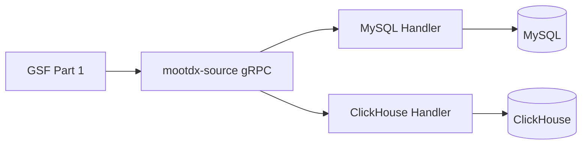

# EPIC-MDS: mootdx-source 数据网关扩展

**版本**: v1.0  
**状态**: 📝 规划中  
**创建日期**: 2026-02-08  
**负责服务**: mootdx-source

---

## 1. 背景与目标

### 1.1 背景
用户决策采用**集中式数据架构 (方案 A)**：所有策略框架 (`quant-strategy`) 的数据获取统一通过 `mootdx-source` 微服务的 gRPC 接口完成，不直接访问 MySQL 或 ClickHouse。

### 1.2 目标
扩展 `mootdx-source` 的能力边界，新增以下数据类型支持：
1. **发行价 (Issue Price)**: 从本地 MySQL 获取
2. **申万行业 (SW Industry)**: 从本地 MySQL 获取
3. **特征矩阵 (Features)**: 从 ClickHouse FeatureStore 获取

---

## 2. 新增 DataType 定义

### 2.1 Protobuf 扩展

```protobuf
// 在 data_source.proto 中新增
enum DataType {
    // 现有类型 (1-10)
    DATA_TYPE_QUOTES = 1;
    DATA_TYPE_TICK = 2;
    DATA_TYPE_HISTORY = 3;
    // ...
    
    // 新增类型 (11-15)
    DATA_TYPE_ISSUE_PRICE = 11;    // 发行价
    DATA_TYPE_SW_INDUSTRY = 12;    // 申万行业分类
    DATA_TYPE_FEATURES = 13;       // 特征矩阵
}
```

### 2.2 路由配置扩展

```python
# 在 MooTDXService.ROUTING_TABLE 中新增
ROUTING_TABLE = {
    # 现有路由...
    
    # 新增路由
    data_source_pb2.DATA_TYPE_ISSUE_PRICE: RouteConfig(
        handler="_fetch_issue_price_mysql",
        source_name=DataSource.MYSQL
    ),
    data_source_pb2.DATA_TYPE_SW_INDUSTRY: RouteConfig(
        handler="_fetch_sw_industry_mysql",
        source_name=DataSource.MYSQL
    ),
    data_source_pb2.DATA_TYPE_FEATURES: RouteConfig(
        handler="_fetch_features_clickhouse",
        source_name=DataSource.CLICKHOUSE
    ),
}
```

---

## 3. User Stories

### Story MDS-1: DATA_TYPE_ISSUE_PRICE
- **描述**: 通过 gRPC 获取股票发行价
- **请求参数**: `codes: List[str]`
- **返回数据**: `[{code, issue_price}]`
- **数据源**: MySQL `alwaysup.stock_basic_info.issue_price`
- **验收标准**: 能获取 688802 的 issue_price = 实际招股书值

### Story MDS-2: DATA_TYPE_SW_INDUSTRY
- **描述**: 通过 gRPC 获取申万行业分类
- **请求参数**: `codes: List[str]`, `params: {level: 1|2|3}`
- **返回数据**: `[{code, l1_code, l1_name, l2_code, l2_name, l3_code, l3_name}]`
- **数据源**: MySQL `alwaysup.stock_industry_sw`
- **验收标准**: 能获取 000001.SZ 的三级行业

### Story MDS-3: DATA_TYPE_FEATURES
- **描述**: 通过 gRPC 获取 Tick 策略特征矩阵
- **请求参数**: `codes: List[str]`, `params: {date: YYYY-MM-DD}`
- **返回数据**: `[{code, feature_vector: [9 floats]}]`
- **数据源**: ClickHouse `stock_data.features`
- **验收标准**: 能获取特征矩阵（未来 Part 4 验证）

### Story MDS-4: MySQL Handler 实现
- **描述**: 新增 MySQLHandler 类，封装本地 MySQL 连接
- **依赖**: aiomysql 连接池
- **验收标准**: 连接池可复用，资源正确清理

### Story MDS-5: ClickHouse Handler 实现
- **描述**: 新增 ClickHouseHandler 类，封装 ClickHouse 连接
- **依赖**: clickhouse-driver 异步客户端
- **验收标准**: 能查询 FeatureStore 表

---

## 4. 技术规范

### 4.1 文件结构变更

```
mootdx-source/src/
├── ds_registry/
│   └── handlers/
│       ├── mysql_handler.py      # [NEW]
│       ├── clickhouse_handler.py # [NEW]
│       └── ...
├── service.py                    # [MODIFY] 增加路由
└── config.py                     # [MODIFY] 增加连接配置
```

### 4.2 配置变更

```python
# config.py 新增
@dataclass
class MySQLConfig:
    host: str = os.getenv("GSD_DB_HOST", "localhost")
    port: int = int(os.getenv("GSD_DB_PORT", 36301))
    user: str = os.getenv("GSD_DB_USER", "root")
    password: str = os.getenv("GSD_DB_PASSWORD", "")
    database: str = os.getenv("GSD_DB_NAME", "alwaysup")

@dataclass
class ClickHouseConfig:
    host: str = os.getenv("CLICKHOUSE_HOST", "localhost")
    port: int = int(os.getenv("CLICKHOUSE_PORT", 9000))
    database: str = os.getenv("CLICKHOUSE_DATABASE", "stock_data")
```

---

## 5. 验收标准

| Story | 验收测试 |
|:---|:---|
| MDS-1 | `FetchData(DATA_TYPE_ISSUE_PRICE, codes=["688802"])` 返回正确发行价 |
| MDS-2 | `FetchData(DATA_TYPE_SW_INDUSTRY, codes=["000001.SZ"], params={level:3})` 返回三级行业 |
| MDS-3 | `FetchData(DATA_TYPE_FEATURES, ...)` 返回 9 维向量 |
| MDS-4 | 并发 100 请求无连接泄漏 |
| MDS-5 | ClickHouse 查询延迟 < 100ms |

---

## 6. 依赖关系



---

## 7. 相关文档

- [GSF EPIC Master](file:///home/bxgh/microservice-stock/services/quant-strategy/docs/plans/epic_gsf_master.md)
- [GSF Part 1: DAO Layer](file:///home/bxgh/microservice-stock/services/quant-strategy/docs/plans/epic_gsf_part_1_dao.md)
