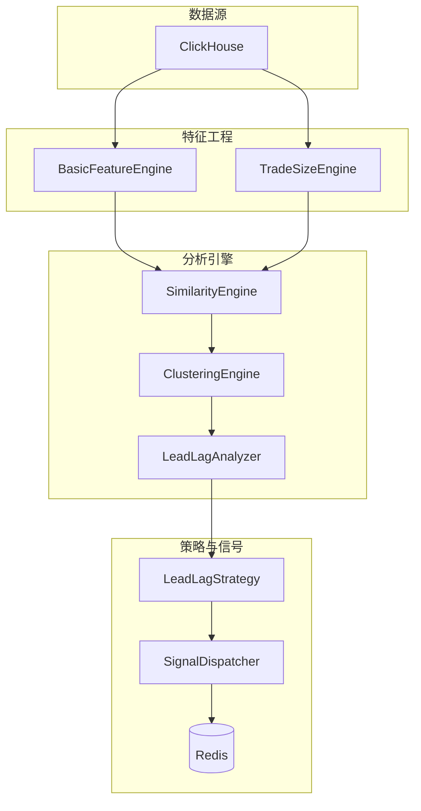

# quant-strategy 架构说明

## 1. 服务定位
`quant-strategy` 是量化策略执行与分析微服务，负责从 `get-stockdata` 采集的原始行情中提取特征、执行聚类分析、识别联动关系，并产出交易信号。

## 2. 核心模块

### 2.1 数据层 (`adapters/`)
*   `ClickHouseLoader`: 从 ClickHouse 加载 Tick/Snapshot 数据。
*   `StockDataProvider`: 对外 gRPC/HTTP 数据适配器。

### 2.2 特征层 (`core/features/`)
*   `BasicFeatureEngine`: 计算 Vector A (主动强度), B (OBI), C (收益率)。
*   `TradeSizeEngine`: 计算 LOR, NLB, RID 等资金流特征。

### 2.3 分析层 (`core/analysis/`)
*   `SimilarityEngine`: DTW 动态时间规整相似度计算。
*   `ClusteringEngine`: Leiden/Louvain 社区发现算法。
*   `LeadLagAnalyzer`: TLCC 时滞互相关、PageRank 龙头识别、分歧度计算。
*   `AnalysisService`: 市场分析主编排器。

### 2.4 策略层 (`strategies/`)
*   `BaseStrategy`: 策略抽象基类。
*   `StrategyRegistry`: 策略注册中心。
*   `LeadLagStrategy`: 领先-滞后联动策略 (EPIC-005 实现)。

### 2.5 信号层 (`core/analysis/`, `core/reporting/`)
*   `SignalDispatcher`: 事件驱动信号分发器。
*   `ClusterReporter`: 自动化 Markdown 报告生成。

### 2.6 缓存层 (`cache/`)
*   `RedisClient`: 异步 Redis 客户端。
*   `FeatureStore`: 特征矩阵持久化。

## 3. 数据流向

## 4. 关键技术规范
*   **异步优先**: 所有 I/O 操作使用 `async/await`。
*   **时区标准**: 强制 `Asia/Shanghai` (CST)。
*   **代码格式**: 使用 Ruff 保持风格统一。
*   **类型安全**: 入库前清洗 NumPy 类型。

## 5. 相关 Knowledge
*   [量化策略通用框架](/.gemini/antigravity/knowledge/quant_strategy_framework/)
*   [分笔量化策略分析管线](/.gemini/antigravity/knowledge/tick_quant_strategy_pipeline/)
