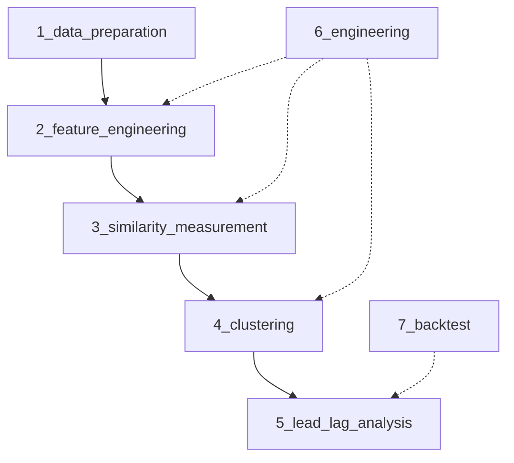

# 行为指纹聚类与时序因果推演策略 - 总览

## 1. 策略目标

基于TDX Level-1数据（五档快照 + 3秒分笔切片），通过资金运作的波形和节奏，发现市场中的**隐性关联**：
- **识别"隐形一致行动人"**：无视股票代码和行业标签，找出资金操作模式高度相似的股票群
- **确定"带头大哥"**：在关联股票群中识别领涨龙头
- **预判趋势转折**：监控群体分歧度，捕捉合力期与瓦解期

---

## 2. 核心假设

| 假设 | 依据 |
|------|------|
| 同一主力/量化策略操控的股票具有相似的资金波形 | 资金有限性导致操作节奏趋同 |
| 领涨股的资金行为领先于跟随股 | 主力先建仓标的先启动 |
| 群体分歧度上升预示趋势终结 | 获利盘分歧导致资金分流 |

---

## 3. 系统架构

```
┌─────────────────────────────────────────────────────────────────┐
│                        数据层 (get-stockdata)                    │
│  ┌──────────────┐  ┌──────────────┐  ┌──────────────┐          │
│  │ TDX L1 分笔   │  │ 五档快照     │  │ K线基准      │          │
│  └──────────────┘  └──────────────┘  └──────────────┘          │
└─────────────────────────────────────────────────────────────────┘
                              │
                              ▼
┌─────────────────────────────────────────────────────────────────┐
│                     特征工程层 (quant-strategy)                  │
│  ┌──────────────┐  ┌──────────────┐  ┌──────────────┐          │
│  │ 主动买入强度A │  │ 盘口失衡度B  │  │ 累积收益率C  │          │
│  └──────────────┘  └──────────────┘  └──────────────┘          │
└─────────────────────────────────────────────────────────────────┘
                              │
                              ▼
┌─────────────────────────────────────────────────────────────────┐
│                       相似度计算层                               │
│  ┌──────────────────────────────────────────────────────────┐  │
│  │ 两阶段筛选：Euclidean预筛 → DTW精算                       │  │
│  │ 输出：5000×5000 稀疏距离矩阵                              │  │
│  └──────────────────────────────────────────────────────────┘  │
└─────────────────────────────────────────────────────────────────┘
                              │
                              ▼
┌─────────────────────────────────────────────────────────────────┐
│                        聚类分析层                                │
│  ┌──────────────────────────────────────────────────────────┐  │
│  │ Louvain/Leiden 社区发现 → 强共振Cluster识别               │  │
│  │ 噪音过滤：剔除大盘普涨、低换手、小样本                     │  │
│  └──────────────────────────────────────────────────────────┘  │
└─────────────────────────────────────────────────────────────────┘
                              │
                              ▼
┌─────────────────────────────────────────────────────────────────┐
│                       龙头识别层                                 │
│  ┌──────────────────────────────────────────────────────────┐  │
│  │ TLCC时滞相关 → PageRank排序 → 输出龙头+跟随者              │  │
│  │ 分歧度监控 → 趋势阶段判定（合力期/瓦解期）                 │  │
│  └──────────────────────────────────────────────────────────┘  │
└─────────────────────────────────────────────────────────────────┘
                              │
                              ▼
┌─────────────────────────────────────────────────────────────────┐
│                        输出层                                    │
│  ┌──────────────┐  ┌──────────────┐  ┌──────────────┐          │
│  │ Cluster报告  │  │ 龙头清单     │  │ 趋势信号     │          │
│  └──────────────┘  └──────────────┘  └──────────────┘          │
└─────────────────────────────────────────────────────────────────┘
```

---

## 4. 模块依赖关系



| 模块 | 输入 | 输出 |
|------|------|------|
| 数据准备 | 原始L1分笔、五档快照 | 清洗后的标准化序列 |
| 特征工程 | 标准化序列 | 向量A/B/C |
| 相似度计算 | 向量A/B/C | 稀疏距离矩阵 |
| 聚类分析 | 距离矩阵 | Cluster列表 |
| 龙头识别 | Cluster列表 | 龙头、跟随者、趋势信号 |
| 工程优化 | - | 性能加速方案 |
| 回测验证 | 历史信号 | 收益度量、参数敏感性 |

---

## 5. 与现有服务集成

### 5.1 数据来源 (get-stockdata)

| 数据类型 | 来源 | 更新频率 |
|----------|------|----------|
| L1分笔 | ClickHouse `tick_data` | 盘后批量 |
| 五档快照 | ClickHouse `order_book` | 盘后批量 |
| K线基准 | ClickHouse `kline_daily` | 盘后批量 |
| 股票清单 | Redis `stock_list` | 每日9:00 |

### 5.2 策略服务 (quant-strategy)

本策略作为 `quant-strategy` 服务的一个模块实现，复用现有基础设施：
- **配置管理**：通过 YAML 配置策略参数
- **信号输出**：遵循现有信号结构（stock_code, direction, strength, price, timestamp, reason）
- **调度执行**：通过 `AcquisitionScheduler` 控制盘后执行时间

---

## 6. 执行时机

| 时间点 | 任务 |
|--------|------|
| 盘后 15:30 | 触发数据准备，等待分笔数据入库完成 |
| 盘后 16:00 | 执行特征工程 + 相似度计算 |
| 盘后 17:00 | 执行聚类分析 + 龙头识别 |
| 盘后 17:30 | 输出报告，持久化结果 |

---

## 7. 文档索引

### 7.1 核心模块

| 文档 | 内容 |
|------|------|
| [1_data_preparation.md](./1_data_preparation.md) | 数据准备与边界条件处理 |
| [2_feature_engineering.md](./2_feature_engineering.md) | 特征工程与序列构建 |
| [3_similarity_measurement.md](./3_similarity_measurement.md) | 相似度度量与DTW优化 |
| [4_clustering.md](./4_clustering.md) | 社群发现与聚类算法 |
| [5_lead_lag_analysis.md](./5_lead_lag_analysis.md) | 龙头识别与趋势推演 |
| [6_engineering.md](./6_engineering.md) | 工程实现与性能优化 |
| [7_backtest.md](./7_backtest.md) | 回测验证框架 |

### 7.2 补充假设与策略（按优先级排序）

| 优先级 | 文档 | 内容 | 理论来源 |
|--------|------|------|----------|
| P0 | [A1_trade_size_clustering.md](./A1_trade_size_clustering.md) | 交易规模聚类与投资者识别 | UPenn Wharton, NYU Stern |
| P1 | [A2_vpin.md](./A2_vpin.md) | VPIN知情交易概率与流动性预警 | O'Hara & Easley (Cornell) |
| P1 | [A3_intraday_momentum.md](./A3_intraday_momentum.md) | 日内动量与隔夜跳空策略 | Alpha Architect |
| P2 | [A4_kyle_lambda.md](./A4_kyle_lambda.md) | Kyle's Lambda价格冲击系数 | Kyle (1985), NBER |
| P2 | [A5_obi_momentum.md](./A5_obi_momentum.md) | OBI动量（盘口失衡变化率） | 原OBI增强版 |
| P3 | [A6_minute_illiq.md](./A6_minute_illiq.md) | 分钟级非流动性指标 | Amihud (2002) |

### 7.3 实施方案 (Epic)

| 阶段 | 文档 | 核心内容 |
|------|------|----------|
| 第一阶段 | [epic_part_1_foundation.md](./epic_part_1_foundation.md) | 数据基石、特征工厂、交易规模识别 |
| 第二阶段 | [epic_part_2_core_analysis.md](./epic_part_2_core_analysis.md) | 相似度精算、自动聚类、龙头因果推演 |
| 第三阶段 | [epic_part_3_validation_and_enhancement.md](./epic_part_3_validation_and_enhancement.md) | 回测框架、性能调优、日内动量增强 |

### 7.4 历史参考

| 文档 | 说明 |
|------|------|
| [1.md](./1.md) | 原始策略构想（保留作为历史参考） |
