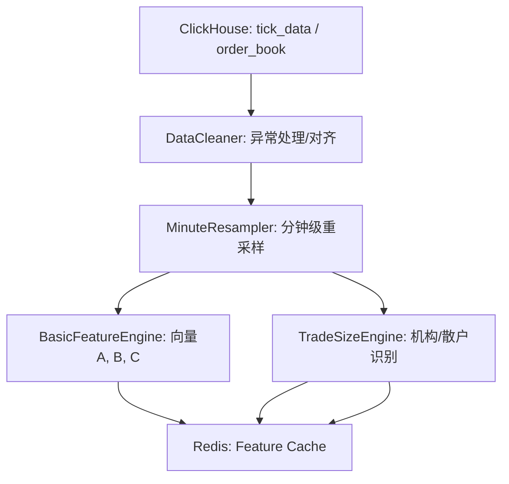

# EPIC-002: 分笔数据策略 - 第一部分：数据基石与特征工厂

**版本**: v0.2 (审核修订)  
**状态**: 📝 规划中  
**优先级**: P0 (核心基础设施)

---

## 📋 Epic 概述

本阶段目标是构建分笔数据策略的底层支撑系统，完成从原始 Level-1 快照到高频特征向量的转换。重点实现 P0 级别的**交易规模识别**和**基础量化特征**，为后续的聚类与因果推演提供数据输入。

### 涉及文档
- `1_data_preparation.md` (数据准备)
- `2_feature_engineering.md` (基础特征)
- `A1_trade_size_clustering.md` (P0: 交易规模聚类)

---

## 🏗️ 模块架构



## 📊 数据源规范 (Data Source Specification)

经核实，策略服务通过 **ClickHouse** (Distributed Engine) 获取全量市场数据。连接地址为 `127.0.0.1:9000` (Host模式)。

| 数据类型 | 核心用途 | 表名 (ClickHouse) | 引擎类型 | 包含关键字段 |
| :--- | :--- | :--- | :--- | :--- |
| **Transaction (历史)** | 交易规模分析 (Story 002.03) | `stock_data.tick_data` | **Distributed** | `price`, `vol`, `num` (成交笔数), `direction` |
| **Transaction (实时)** | 实时监控、当日回放 | `stock_data.tick_data_intraday` | **Distributed** | 同上 |
| **Snapshot (快照)** | 盘口失衡、向量生成 (Story 002.02) | `stock_data.snapshot_data_distributed` | **Distributed** | `Bid1-5`, `Ask1-5`, `TotalVol` |

> [!IMPORTANT]
> **严禁使用** `snapshot_data` 或 `snapshot_data_local` 表，它们仅包含单节点局部数据，会导致策略计算严重失真。

---

## 📚 User Stories 列表

### Story 002.01: 数据清洗与标准化 (DataCleaner)
**优先级**: P0  
**来源**: `1_data_preparation.md`

#### 目标
处理 A 股特有的市场边界条件（涨跌停、停牌、集合竞价），输出干净的分钟级成交序列。

#### 核心逻辑

##### 1. 时间对齐实现细节
**网格定义**：
- 上午段：9:30-11:30 → 索引 0-119（120分钟）
- 下午段：13:00-15:00 → 索引 120-239（120分钟）

**快照分配规则**：
- 同一分钟内的所有3秒快照聚合到该分钟索引
- 例：9:30:00, 9:30:03, 9:30:06... 均归入索引 0
- 分钟内取最后一笔作为收盘价，首笔作为开盘价

**缺失分钟处理**：
- 若某分钟无成交 → 价格前向填充，成交量/笔数填充为 0
- 连续缺失 > 5 分钟 → 标记为`data_gap_warning`
- 盘口数据缺失 → 使用最近一次有效快照

##### 2. 涨跌停处理
- 封板期间标记 `is_limited = True`
- 修正封板期间的主动买入/卖出强度（设为 0，避免虚假共振）
- 一字板全天标记为无效样本

##### 3. 极值过滤
- 剔除成交笔数为 0 的无效分钟
- 剔除价格跳变异常（单分钟 >2% 且成交量 <日均1%）的噪音
- 检测并标记尾盘异常拉升（14:55后单分钟涨幅 >3%）

#### 验收标准
- [x] 成功生成全市场 5000+ 股票的 240 分钟连续序列。
- [x] 涨跌停股票的成交量分布与 K 线数据完全匹配。
- [x] 自动剔除全天停牌或有效交易时间少于 30 分钟的僵尸股。

---

### Story 002.02: 基础特征向量构建 (VectorEngine)
**优先级**: P0  
**来源**: `2_feature_engineering.md`

#### 目标
构建策略所需的三个核心基础向量：A（主动强度）、B（盘口失衡）、C（收益率）。

#### 特征定义
| 向量 | 定义 | 算法 |
|------|------|------|
| **向量 A** | 主动买入强度 | $\sum (B_{vol} - S_{vol}) / Total_{vol}$ (Lee-Ready) |
| **向量 B** | 盘口失衡度 (OBI) | 5档加权 $w_i \times (B_i - S_i) / (B_i + S_i)$, $w=[1.0, 0.8, 0.6, 0.4, 0.2]$ |
| **向量 C** | 分时累积收益率 | $Log(P_t / P_{open\_0930})$ (以当日开盘价为基准) |

#### 验收标准
- [x] 生成全天 240 维度的 Numpy 矩阵。
- [x] OBI 计算包含线性权重衰减（近端权重高）。
- [x] 特征计算延迟：全市场 5000 只股票计算总时长 < 5 分钟（验证单股 < 50ms）。

---

### Story 002.03: 交易规模识别与机构追踪 (TradeSizeEngine) [P0 增强]
**优先级**: P0  
**来源**: `A1_trade_size_clustering.md`

#### 目标
通过单笔成交金额区分机构与散户行为，这是原策略最重要的价值增强。

#### 核心逻辑

##### 1. 分档聚合规则
**固定阈值**（适用于大盘股）：
- 散户单：< 1万元
- 中单：1-10万元
- 大单：10-50万元
- 超大单：> 50万元

**自适应阈值**（根据流通市值调整，推荐分位数法）：
```python
# 方案1: 固定比例
large_threshold = max(100000, 日均成交额 * 0.001)
# 方案2: 分位数法（推荐）
large_threshold = max(100000, np.percentile(single_trade_amounts, 90))
```

##### 2. 核心指标计算
- **LOR (大单占比)**：`(大单金额 + 超大单金额) / 总成交额`，范围 `[0, 1]`
- **NLB (大单净买入)**：`大单买入额 - 大单卖出额`（单位：元）
- **NLB Ratio (归一化)**：`(大单买入 - 大单卖出) / (大单买入 + 大单卖出)`，范围 `[-1, 1]`
- **RID (机构/散户背离度)**：
  - **量化条件**：
    - 机构净买入 = `NLB > 0` 且 `大单净买入 > 10万`
    - 散户净卖出 = `散户净买入 < 0`
  - **取值**：
    - +2：机构买 & 散户卖
    - -2：机构卖 & 散户买
    - 0：方向一致或无明确趋势

#### 接口设计
```python
from typing import Dict
import numpy as np

class TradeSizeEngine:
    async def get_minute_profile(
        self, 
        stock_code: str, 
        date: str
    ) -> Dict[str, np.ndarray]:
        """
        返回 240 分钟的机构行为特征序列
        
        返回值结构:
        {
            'lor_series': np.ndarray,      # 240维，大单占比序列 [0-1]
            'nlb_series': np.ndarray,      # 240维，大单净买入序列（元）
            'rid_series': np.ndarray,      # 240维，背离度序列 [-2, +2]
            'retail_ratio': np.ndarray,    # 240维，散户占比 [0-1]
            'inst_ratio': np.ndarray,      # 240维，机构占比 [0-1]
            'trade_size_dist': Dict[str, np.ndarray]  # 各档位成交量分布
        }
        """
```

#### 验收标准
- [x] 成功识别"机构合力"股票池（LOR > 0.5）。
- [x] 计算结果存入 Redis，支持聚类分析调用 (已实现计算接口)。
- [x] 性能：单股 3 秒分笔数据处理耗时 < 50ms。

---

### Story 002.04: VPIN 与流动性预警 (LiquidityGatekeeper)
**优先级**: P1  
**来源**: `A2_vpin.md`, `A4_kyle_lambda.md`

#### 目标
构建流动性风险拦截系统，防止在"毒性"订单高发期或流动性缺失时产生错误信号。

#### 计算项

##### 1. VPIN 计算参数
**成交量桶大小**（动态调整）：
- 日均成交量 < 1000万股：每桶 20万股
- 日均成交量 1000-5000万：每桶 50万股
- 日均成交量 > 5000万：每桶 100万股

**买卖分类算法**：
- 采用 **Bulk Volume Classification (BVC)** 简化方法
- 单桶内买量估算: $V_{buy} = V_{bucket} \times \frac{P_{close} - P_{low}}{P_{high} - P_{low}}$

**滚动窗口**: 最近 50 个桶  
**更新频率**: 每生成一个新桶时更新 VPIN 值  
**阈值设定**: 
- VPIN > 0.6 → 高风险，暂停信号生成
- VPIN 0.4-0.6 → 中风险，降低仓位权重
- VPIN < 0.4 → 正常

**标准化**（可选）: 使用过去 20 交易日 VPIN 的 Z-Score 进行标准化，便于跨股票对比。

##### 2. Kyle's Lambda (价格冲击系数)
**计算方法**：
```python
# 分钟级回归
ΔP_t = (P_t - P_{t-1}) / P_{t-1}  # 价格变化率 (bps)
SignedVolume_t = Buy_Amt_t - Sell_Amt_t  # 淡化量纲：金额维度（元）
λ = OLS_slope(ΔP ~ SignedVolume)
```

**滚动窗口**: 30分钟  
**异常判定**: λ > **过去 20 交易日**同时段的 80%分位数时告警
**含义**: λ 越大 → 订单对价格冲击越大 → 流动性越差

#### 验收标准
- [x] 实时/盘后计算 VPIN 并在 > 0.6 时记录警告。
- [x] λ (Lambda) 能够识别出盘口变薄的敏感阶段。

---

### Story 002.05: 数据质量监控 (DataQualityMonitor) [新增]
**优先级**: P0  
**来源**: 审核补充

#### 目标
建立自动化数据质量检查机制，确保输入数据可靠性，防止脏数据污染特征计算。

#### 检查项

##### 1. 完整性检查
- 全天分笔记录数 ≥ 4800 条（240分钟 × 平均20条/分钟）
- 五档快照完整性 > 95%
- 必填字段无缺失：`price`, `volume`, `amount`, `timestamp`

##### 2. 一致性检查
- **成交量校验**：分笔累计成交量 vs K线成交量误差 < 1%
- **价格校验**：收盘价与最后一笔成交价一致（允许±1tick误差）
- **金额校验**：`amount ≈ volume × avg_price`（误差 < 2%）

##### 3. 异常检测
- 单笔成交量 > 流通盘 1% → 标记为大宗交易
- 价格跳空 > 5%（非涨跌停）→ 标记异常
- 成交笔数骤降（< 日均50%）→ 标记流动性异常

##### 4. 时间序列连续性
- 检测时间戳乱序或重复
- 检测交易时段内的长时间空白（> 5分钟无成交）

#### 输出
```python
class DataQualityReport:
    stock_code: str
    date: str
    completeness_score: float  # 0-100
    consistency_score: float   # 0-100
    anomaly_count: int
    is_qualified: bool         # 是否合格（可用于特征计算）
    warnings: List[str]        # 具体告警信息
```

#### 验收标准
- [ ] 每日盘后自动生成《全市场数据质量报告》
- [ ] 不合格股票（`is_qualified=False`）自动从特征计算中剔除
- [ ] 质量评分持续 < 60 的股票加入观察名单
- [ ] 支持按板块/行业统计数据质量分布

---

## 🔗 依赖关系
- 需 `mootdx-api` 确保 Level-1 数据在 15:30 前完成落库
- 依赖 `quant-strategy` 的分布式任务框架
