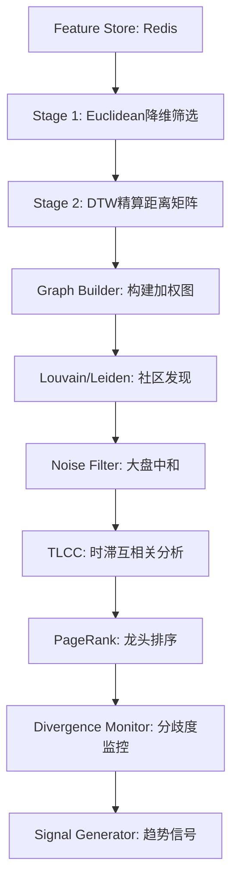

# EPIC-003: 分笔数据策略 - 第二部分：关联发现与因果推演

**版本**: v0.2 (审核修订)  
**状态**: 📝 规划中  
**优先级**: P0 (核心算法层)

---

## 📋 Epic 概述

本阶段是策略的"大脑"，实现最核心的相关性聚类与龙头识别逻辑。通过 DTW 算法克服时间轴上的领先/滞后偏移，并利用图论算法自动划分子市场（Cluster）。

### 涉及文档
- `3_similarity_measurement.md` (相似度)
- `4_clustering.md` (聚类)
- `5_lead_lag_analysis.md` (龙头分析)
- `A5_obi_momentum.md` (P2: OBI动量增强)

---

## 🏗️ 核心逻辑流



---

## 📚 User Stories 列表

### Story 003.01: 两阶段相似度计算引擎 (SimilarityEngine)
**优先级**: P0  
**来源**: `3_similarity_measurement.md`

#### 目标
在可接受的时间内完成全市场股票配对相似度计算，解决计算复杂度爆炸问题（5000股 × 5000股 = 2500万次比较）。

#### 核心算法

##### 阶段一：Euclidean 粗筛（降维）
**目的**：快速剔除明显不相关的股票对，将计算量降低至30%。

**实现逻辑**：
```python
def euclidean_prefilter(
    features: Dict[str, np.ndarray],  # {stock_code: 240维向量}
    top_k_percent: float = 0.3
) -> Set[Tuple[str, str]]:
    """
    第一阶段：Euclidean距离预筛选
    
    计算方式：
    - 对向量A/B/C分别计算欧式距离
    - 加权融合：D_euclidean = 0.4*D_A + 0.3*D_B + 0.3*D_C
    - 保留距离最小的前30%股票对进入DTW精算
    
    复杂度：O(N²) 但计算极快（纯向量运算）
    """
```

**优化技巧**：
- 使用 `scipy.spatial.distance.pdist` 批量计算
- 利用对称性只计算上三角矩阵
- 缓存中间结果到 Redis

##### 阶段二：DTW 精算（高精度）
**目的**：对候选股票对进行时间弹性匹配，识别领先/滞后关系。

**Sakoe-Chiba 窗口约束**：
```python
def dtw_with_window(
    series_a: np.ndarray,  # 240维
    series_b: np.ndarray,
    window_size: int = 30   # 允许±30分钟时移
) -> float:
    """
    DTW动态规划实现（含窗口约束）
    
    窗口意义：
    - 限制时间扭曲范围在±30分钟内
    - 避免9:30的走势与14:30的走势错配
    - 大幅降低计算量（从O(240²)降至O(240×60)）
    
    返回：归一化DTW距离 [0, 1]
    """
```

**Numba加速**：
```python
from numba import jit

@jit(nopython=True)
def _dtw_core(a, b, window):
    # 核心DP循环，编译为机器码
    ...
```

**并行策略**：
- 使用 `multiprocessing.Pool` 分配股票对到多核
- 每个进程处理 ~10万个股票对
- 48核服务器预计耗时：约30-45分钟

#### 多特征融合策略
```python
def compute_final_distance(
    dtw_a: float,  # 向量A的DTW距离
    dtw_b: float,  # 向量B的DTW距离
    dtw_c: float,  # 向量C的DTW距离
    weights: Tuple[float, float, float] = (0.4, 0.3, 0.3)
) -> float:
    """
    最终距离 = 加权平均
    
    权重建议：
    - 向量A（主动买入强度）：0.4（核心信号）
    - 向量B（盘口失衡）：0.3
    - 向量C（收益率）：0.3
    
    可通过回测调整权重
    """
    return weights[0]*dtw_a + weights[1]*dtw_b + weights[2]*dtw_c
```

#### 输出格式
```python
class SimilarityMatrix:
    """稀疏距离矩阵"""
    stock_pairs: List[Tuple[str, str]]  # 仅存储相似的股票对
    distances: np.ndarray               # 对应的距离值 [0, 1]
    
    def to_adjacency_matrix(self, threshold: float = 0.3):
        """转换为邻接矩阵供图算法使用"""
```

#### 验收标准
- [ ] 全市场计算完成时间 < 60 分钟（48核服务器）
- [ ] 成功识别出时间平移3-10分钟但形态一致的股票对
- [ ] 距离矩阵稀疏度 > 70%（仅保留top 30%相似对）
- [ ] 支持增量计算（仅重算行为变化的股票）

---

### Story 003.02: 社区发现与噪音过滤 (ClusteringEngine)
**优先级**: P0  
**来源**: `4_clustering.md`

#### 目标
将相似股票聚类为"资金团"，并通过多重过滤机制剔除虚假共振。

#### 核心算法

##### 1. 图构建
**节点**：股票代码  
**边权重**：相似度 = `1 - DTW_distance`  
**稀疏化**：仅保留距离 < 0.3 的边（相似度 > 0.7）

```python
import networkx as nx

def build_similarity_graph(
    similarity_matrix: SimilarityMatrix,
    edge_threshold: float = 0.7  # 相似度阈值
) -> nx.Graph:
    """
    构建无向加权图
    
    Graph属性：
    - nodes: 股票代码
    - edges: (stock_a, stock_b, weight=similarity)
    """
    G = nx.Graph()
    for (a, b), dist in zip(similarity_matrix.stock_pairs, 
                            similarity_matrix.distances):
        similarity = 1 - dist
        if similarity >= edge_threshold:
            G.add_edge(a, b, weight=similarity)
    return G
```

##### 2. 社区检测算法选择

| 算法 | 优点 | 缺点 | 推荐场景 |
|------|------|------|----------|
| **Louvain** | 速度快，modularity优化好 | 确定性差（随机初始化） | 初步探索 |
| **Leiden** | 更准确，社区质量高 | 稍慢 | 生产环境 |

**实现**：
```python
import community  # python-louvain
# 或
from leidenalg import find_partition
import igraph as ig

def detect_communities_louvain(G: nx.Graph) -> Dict[str, int]:
    """
    Louvain算法实现
    
    返回：{stock_code: cluster_id}
    """
    partition = community.best_partition(G, weight='weight')
    return partition

def detect_communities_leiden(G: nx.Graph, resolution: float = 1.0):
    """
    Leiden算法（更稳定）
    
    resolution参数：
    - > 1.0：更多小簇
    - < 1.0：更少大簇
    - 建议初始值：1.0
    """
    # 转换为igraph格式
    ig_graph = ig.Graph.from_networkx(G)
    partition = find_partition(
        ig_graph, 
        leidenalg.ModularityVertexPartition,
        weights='weight',
        resolution_parameter=resolution
    )
    return {node: cluster_id for node, cluster_id in enumerate(partition)}
```

##### 3. 噪音过滤规则

###### 规则1: 小簇过滤
```python
def filter_small_clusters(
    clusters: Dict[str, int],
    min_size: int = 3
) -> Dict[str, int]:
    """
    剔除成员数 < 3 的孤立簇
    
    理由：
    - 2只股票的"共振"可能是随机巧合
    - 至少3只才能形成"资金团"的统计显著性
    """
```

###### 规则2: 大盘β中和
```python
def filter_market_beta_clusters(
    clusters: Dict[str, int],
    returns: Dict[str, np.ndarray],  # 各股收益率序列
    benchmark_return: np.ndarray,     # HS300/CSI500收益率
    correlation_threshold: float = 0.9
) -> Dict[str, int]:
    """
    剔除纯大盘β簇
    
    判定逻辑：
    1. 计算Cluster平均收益率与基准指数的Pearson相关系数
    2. 若相关性 > 0.9 → 标记为"大盘共振"而非"资金团共振"
    3. 从有效簇中移除
    """
```

###### 规则3: 行业同质化过滤
```python
def filter_industry_homogeneity(
    clusters: Dict[str, int],
    stock_industry: Dict[str, str],  # 股票行业映射
    same_industry_ratio_threshold: float = 0.8
):
    """
    标记行业同质化过高的簇
    
    判定：
    - 若簇内80%以上股票属于同一行业 → 标记为"行业轮动"
    - 这类簇可能不是资金共振，而是板块效应
    
    处理方式：
    - 不直接删除，但在信号生成时降权
    - 或单独归类为"行业Cluster"
    """
```

###### 规则4: 换手率过滤
```python
def filter_low_turnover_clusters(
    clusters: Dict[str, int],
    turnover_data: Dict[str, float],  # 日均换手率
    min_avg_turnover: float = 0.02  # 2%
):
    """
    剔除低换手率簇
    
    理由：
    - 换手率过低说明交易不活跃
    - 可能是僵尸股或停牌股的误聚类
    """
```

#### 稳定性评估
```python
def evaluate_cluster_stability(
    clusters_today: Dict[str, int],
    clusters_yesterday: Dict[str, int]
) -> float:
    """
    Jaccard相似度计算跨日稳定性
    
    Jaccard(A, B) = |A ∩ B| / |A ∪ B|
    
    稳定性指标：
    - > 0.7：高度稳定
    - 0.4-0.7：中度稳定
    - < 0.4：不稳定（需警惕）
    """
```

#### 验收标准
- [ ] 识别出的Cluster具有业务直觉（如游资概念、财报预增等）
- [ ] 大盘β过滤有效（Cluster与HS300相关性 < 0.8）
- [ ] 跨日稳定性 Jaccard > 0.5
- [ ] 单日有效Cluster数量：5-20个（过多或过少都需调参）

---

### Story 003.03: 龙头识别与趋势判定 (LeadLagAnalyzer)
**优先级**: P0  
**来源**: `5_lead_lag_analysis.md`, `A5_obi_momentum.md`

#### 目标
在每个Cluster中识别"领涨龙头"，并通过分歧度监控判定趋势阶段。

#### 核心算法

##### 1. 时滞互相关 (TLCC)
**目的**：找出股票A领先股票B的最佳时间偏移量。

```python
from scipy.signal import correlate

def compute_tlcc(
    series_a: np.ndarray,  # 240维收益率序列
    series_b: np.ndarray,
    max_lag: int = 30      # 最大时滞±30分钟
) -> Tuple[int, float]:
    """
    时滞互相关计算
    
    返回：
    - best_lag: 最佳时滞（正值表示A领先B）
    - max_corr: 最大相关系数
    
    示例：
    - best_lag = +5 → A领先B 5分钟
    - best_lag = -3 → B领先A 3分钟
    """
    lags = range(-max_lag, max_lag + 1)
    correlations = []
    
    for lag in lags:
        if lag > 0:
            corr = np.corrcoef(series_a[:-lag], series_b[lag:])[0, 1]
        elif lag < 0:
            corr = np.corrcoef(series_a[-lag:], series_b[:lag])[0, 1]
        else:
            corr = np.corrcoef(series_a, series_b)[0, 1]
        correlations.append(corr)
    
    max_idx = np.argmax(correlations)
    return lags[max_idx], correlations[max_idx]
```

**过滤条件**：
- 仅保留 `max_corr > 0.5` 的显著lead-lag关系
- 剔除 `|best_lag| < 2` 的近似同步股票（无明确leader）

##### 2. PageRank 龙头排序
**构建有向图**：
```python
def build_lead_lag_graph(
    cluster_stocks: List[str],
    tlcc_results: Dict[Tuple[str, str], Tuple[int, float]]
) -> nx.DiGraph:
    """
    构建Cluster内的领先-跟随有向图
    
    边的方向：leader → follower
    边的权重：相关系数 max_corr
    
    示例：
    - (A, B, lag=+5, corr=0.8) → 添加边 A → B，权重0.8
    """
    G = nx.DiGraph()
    for (stock_a, stock_b), (lag, corr) in tlcc_results.items():
        if corr > 0.5 and abs(lag) >= 2:
            if lag > 0:  # A领先B
                G.add_edge(stock_a, stock_b, weight=corr)
            else:  # B领先A
                G.add_edge(stock_b, stock_a, weight=corr)
    return G
```

**PageRank计算**：
```python
def identify_leader(G: nx.DiGraph) -> List[Tuple[str, float]]:
    """
    PageRank排序识别龙头
    
    参数设置：
    - alpha=0.85（阻尼系数，标准值）
    - max_iter=100
    
    返回：
    - [(stock_code, pagerank_score), ...] 按分数降序
    """
    pagerank = nx.pagerank(G, alpha=0.85, weight='weight')
    return sorted(pagerank.items(), key=lambda x: x[1], reverse=True)
```

**备选方案**（小簇）：
```python
def identify_leader_by_indegree(G: nx.DiGraph):
    """
    当Cluster规模 < 5 时，PageRank可能不稳定
    
    使用加权入度替代：
    - 入度越高，说明越多股票跟随它
    """
    weighted_indegree = {
        node: sum(data['weight'] for _, _, data in G.in_edges(node, data=True))
        for node in G.nodes()
    }
    return max(weighted_indegree.items(), key=lambda x: x[1])
```

##### 3. 分歧度监控
**计算公式**：
```python
def compute_divergence(
    cluster_stocks: List[str],
    returns: Dict[str, np.ndarray],  # 各股分钟收益率
    window: int = 30  # 滚动窗口30分钟
) -> np.ndarray:
    """
    分歧度 = Cluster内收益率的滚动标准差
    
    趋势判定：
    - 分歧度上升 → 资金分化，合力瓦解
    - 分歧度下降 → 资金聚合，趋势形成
    """
    cluster_returns = np.array([returns[s] for s in cluster_stocks])
    rolling_std = pd.DataFrame(cluster_returns.T).rolling(window).std().mean(axis=1)
    return rolling_std.values
```

**趋势阶段判定**：
```python
class TrendPhase(Enum):
    FORMATION = "合力形成期"      # 分歧度 < 历史20%分位数
    STEADY = "稳定运行期"         # 分歧度处于中位数附近
    DISSOLUTION = "瓦解期"        # 分歧度 > 历史80%分位数

def classify_trend_phase(divergence_current: float, 
                         divergence_history: np.ndarray) -> TrendPhase:
    p20 = np.percentile(divergence_history, 20)
    p80 = np.percentile(divergence_history, 80)
    
    if divergence_current < p20:
        return TrendPhase.FORMATION
    elif divergence_current > p80:
        return TrendPhase.DISSOLUTION
    else:
        return TrendPhase.STEADY
```

##### 4. OBI动量增强 (可选)
```python
def enhance_with_obi_momentum(
    leader_candidates: List[str],
    obi_momentum: Dict[str, np.ndarray]
) -> str:
    """
    在多个候选龙头中，选择OBI动量最强的
    
    OBI动量 = OBI变化率（盘口买压加速度）
    
    逻辑：
    - PageRank分数前3名
    - 选择最近5分钟OBI动量最正的作为最终龙头
    """
```

#### 验收标准
- [ ] 龙头股的TLCC领先时滞平均 > 3分钟
- [ ] 回测验证：龙头股涨幅 > Cluster平均涨幅（t检验 p<0.05）
- [ ] 分歧度能够提前1-2天预警趋势反转
- [ ] Formation阶段买入信号的后续胜率 > 60%

---

## � 依赖关系与资源需求

### 上游依赖
- Epic 第一部分生成的特征矩阵（向量A/B/C）
- 数据质量监控确保输入数据合格

### 计算资源需求
| 资源类型 | 最低配置 | 推荐配置 |
|----------|----------|----------|
| CPU | 32核 | 48-64核 |
| 内存 | 64GB | 128GB |
| 存储 | SSD 100GB可用 | NVMe SSD 200GB |
| 执行时间 | 盘后 90分钟 | 盘后 60分钟 |

### 中间结果存储
- **Redis**: 距离矩阵缓存（稀疏格式，约2GB）
- **ClickHouse**: Cluster结果历史记录（用于稳定性分析）

---

## 🎯 关键成功指标

1. **计算性能**：全流程 < 60分钟
2. **准确性**：识别出的Cluster具有业务直觉（专家验证 > 70%）
3. **稳定性**：跨日Jaccard相似度 > 0.5
4. **预测力**：龙头股领先性t统计量 > 2.0
