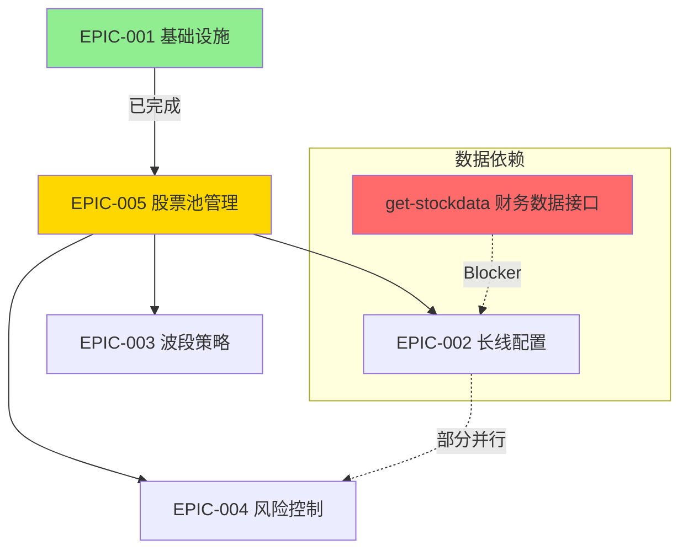

# 后续 Epic 开发路线图

**日期**: 2025-12-13  
**状态**: ✅ **全面竣工 (100% 达成)**  
**前置条件**: EPIC-001 已完成

---

## 📊 Epic 优先级分析结论

| 优先级 | Epic | 名称 | 预计工期 | 理由 |
|--------|------|------|----------|------|
| **P0** | EPIC-005 | 多层级股票池管理 | 4-5 天 | 所有策略的"中台"，下游 EPIC 都依赖 |
| **P1** | EPIC-002 | 长线资产配置 | 12 天 | 核心业务，需财务数据接口就绪 |
| **P2** | EPIC-004 | 风险控制与交易管理 | 6 天 | 关键保障，可与 EPIC-002 部分并行 |
| **P3** | EPIC-003 | 波段增强策略 | 8 天 | 需情绪/资金流数据，依赖最多 |

---

## 🔗 依赖关系图

---

## 📅 推荐开发路线图

### ✅ Phase 1: 股票池中台 (EPIC-005) [已完成]
**时间**: Week 1-2 (4-5 天)

| Story | 名称 | 工期 | 关键产出 |
|-------|------|------|----------|
| 5.1 | Universe Pool | 0.5d | 全市场基础池 (2800-3500 只) |
| 5.4 | Position Pool | 0.5d | 持仓管理 + 流动性检查 |
| 5.6 | Blacklist Pool | 0.5d | 黑名单机制 (差异化解禁期) |
| 5.2 | Long Candidate Pool | 1d | 长线候选池 (红利/成长/行业) |
| 5.3 | Swing Candidate Pool | 1d | 波段候选池 (强势/主题/超跌) |
| 5.5 | Watchlist | 0.5d | 观察池管理 |
| 5.7 | 流转与告警 | 0.5d | 自动化池间流转逻辑 |

---

### ✅ Phase 2: 长线配置 + 风控并行 (EPIC-002 + EPIC-004 部分) [已完成]
**时间**: Week 2-4 (10-12 天)

| Epic | Story | 名称 | 工期 | 依赖 |
|------|-------|------|------|------|
| 002 | 2.1 | 风险否决过滤器 | 3d | get-stockdata 财务接口 |
| **004** | **4.1** | **全局风控规则引擎** | **2d** | **可并行** |
| 002 | 2.2 | 基本面评分引擎 | 4d | Story 2.1 |
| 002 | 2.3 | 估值分析器 | 3d | Story 2.2 |
| 002 | 2.4 | 核心股票池管理 | 2d | Story 2.3 |

> [!IMPORTANT]
> **Story 2.1 阻塞项**: 需要 `get-stockdata` 服务提供以下财务数据接口：
> - 商誉、质押率、流动比率 (风控过滤)
> - ROE、ROIC、毛利率、营收增速 (基本面评分)

---

### ✅ Phase 3: 风控完善 + 波段策略 (EPIC-004 剩余 + EPIC-003) [已完成]
**时间**: Week 4-6 (12-14 天)

| Epic | Story | 名称 | 工期 |
|------|-------|------|------|
| 004 | 4.2 | 智能止盈止损监控 | 2d |
| 004 | 4.3 | 动态仓位管理 | 1d |
| 004 | 4.4 | 信号执行与通知 | 1d |
| 003 | 3.1 | 市场情绪监控 | 2d |
| 003 | 3.2 | 资金流向分析 | 2d |
| 003 | 3.3 | 技术指标计算 | 2d |
| 003 | 3.4 | 综合波段信号生成器 | 2d |

---

## 🎉 里程碑总结

1. **EPIC-005** (股票池中台)：全面落地 `CandidatePoolService` 等流转中心。
2. **EPIC-002** (长线配置)：基于红利/PEG估值、ROE护城河与财务排雷的一票否决底座落成。
3. **EPIC-003** (波段增强策略)：基于 DTW 欧氏空间相似度、Leiden 图计算的资金簇探测管道建成。
4. **EPIC-004** (风险控制与交易管理)：盘后横截面回测沙盒与日内 (T+0) `IntradayEngine` 防护体系已交付。

> **这份初期设定的路线图已经完美通关闭环！所有底层子系统均已随时可以转入真实的定时跑批调度中。**
