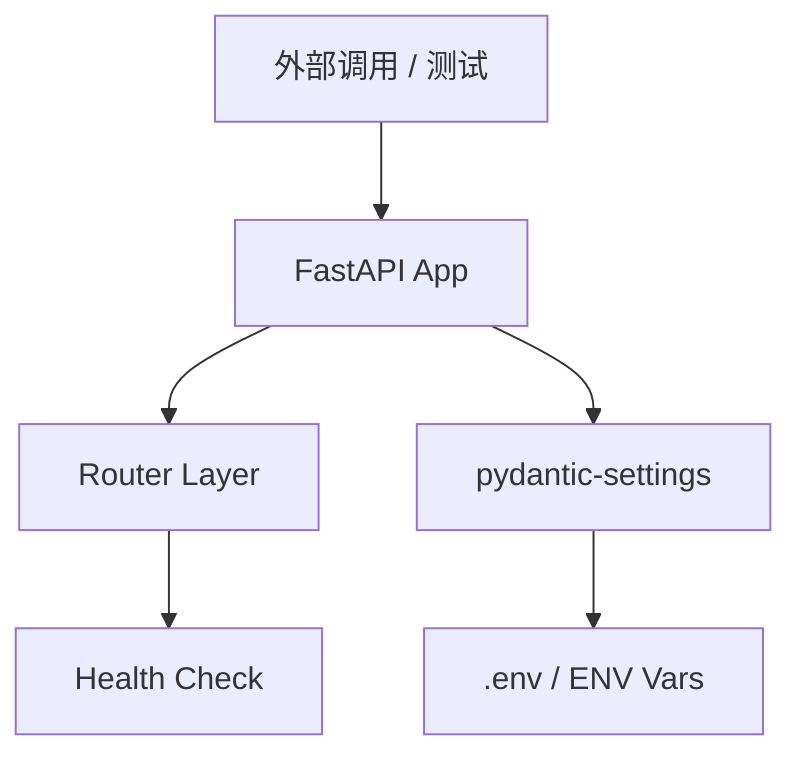

# Story Implementation Plan

**Story ID**: 17.1  
**Story Name**: altdata-source 服务骨架搭建  
**开始日期**: 2026-02-28  
**预期完成**: 2026-02-28  
**负责人**: AI Assistant  
**AI模型**: DeepSeek-V3 (模拟)

---

## 📋 Story概述

### 目标
创建 `altdata-source` 微服务的基础骨架，使其能够作为独立的服务节点注册到 Nacos，并提供标准的健康检查 API。这是后续拉取 GitHub 另类数据的基础底座。该服务将采用 FastAPI，并跟随整个项目的 Docker Compose 部署规范。

### 验收标准
- [ ] 服务目录结构 `services/altdata-source/` 创建完成。
- [ ] FastAPI 应用对象可成功启动。
- [ ] 包含了通用的中间件（如全避错误处理、CORS、Request ID记录）。
- [ ] `.env.example` 和基础 `config.py` 配置就绪（包含 `GITHUB_TOKENS` 占位和数据库预留配置）。
- [ ] `docker-compose.yml` (或更新现有) 和 `Dockerfile` 配置就绪，能够通过 Docker 启动。
- [ ] `/health` 端点返回 200 OK 且服务成功注册至本地 Nacos（如果适用，或至少 Nacos Client 预留完整）。

### 依赖关系
- **依赖Story**: 先决条件：EPIC-017 全盘设计已通过。
- **外部依赖**: Docker, Nacos (127.0.0.1:8848 假设已在运行)。

---

## 🎯 需求分析

### 功能需求
1. 提供标准化 FastAPI 工程结构（同项目内其他服务如 `mootdx-source` 保持一致风格）。
2. 提供 `/health` 心跳接口。
3. 加载环境变量，实现 `Settings` 单例。

### 非功能需求
- **规范要求**: 代码必须符合 `python-coding-standards.md` 的 Async First、全中文注释等要求。
- **配置隔离**: 敏感信息（Token）必须通过 `.env` 加载，禁止硬编码。

---

## 🏗️ 技术设计

### 架构设计



### 核心组件

#### 组件1: Settings (配置管理)
**职责**: 使用 Pydantic 的 `BaseSettings` 管理所有环境变量。

**接口设计**:
```python
from pydantic_settings import BaseSettings

class Settings(BaseSettings):
    PROJECT_NAME: str = "altdata-source"
    VERSION: str = "1.0.0"
    PORT: int = 8011  # 预分配端口
    
    # Nacos 配置
    NACOS_HOST: str = "127.0.0.1"
    NACOS_PORT: int = 8848
    
    # 业务预留
    GITHUB_TOKENS: str = ""
    CLICKHOUSE_HOST: str = "localhost"

    class Config:
        env_file = ".env"
```

#### 组件2: API 骨架
**职责**: 初始化 FastAPI 实例，注册路由和中间件。

---

## 📁 文件变更

### 新增文件
- [ ] `services/altdata-source/src/main.py` - FastAPI 应用级入口和生命周期
- [ ] `services/altdata-source/src/core/config.py` - 环境配置单例
- [ ] `services/altdata-source/src/api/health.py` - 健康检查端点
- [ ] `services/altdata-source/requirements.txt` - Python 依赖清单
- [ ] `services/altdata-source/Dockerfile` - 容器构建配方
- [ ] `services/altdata-source/.env.example` - 环境模板

---

## 🔄 实现计划

### Phase 1: 项目脚手架与配置
**预期时间**: 2 小时

- [ ] 创建目录结构。
- [ ] 编写 `requirements.txt`、`.env.example` 和 `config.py`。
- [ ] 实现基础 FastAPI 初始化（`main.py`）。

### Phase 2: 健康检查与路由
**预期时间**: 1 小时

- [ ] 实现 `health.py` 并注册到主路由。
- [ ] 实现优雅关机（Lifespan context manager）框架。

### Phase 3: 容器化布置与测试
**预期时间**: 1 小时

- [ ] 编写 `Dockerfile`。
- [ ] 写一段自动化脚本或手动 `docker build` 验证启动。

---

## 🧪 测试策略

### 单元测试与手动测试
- [ ] **执行命令测试**: 运行 `uvicorn src.main:app --port 8011` 查看终端是否无报错。
- [ ] **接口拨测**: `curl http://localhost:8011/health` 应返回包含状态信息的 JSON，如 `{"status": "UP", "service": "altdata-source"}`。

---

## ✅ 完成检查清单

### 代码质量
- [ ] 全程使用中文注释。
- [ ] 遵循 Async First 原则（即使是简单的 API 也标记为 `async def`）。
- [ ] Mypy/类型提示完整。

### 文档完整性
- [ ] README.md 提供启动说明。
