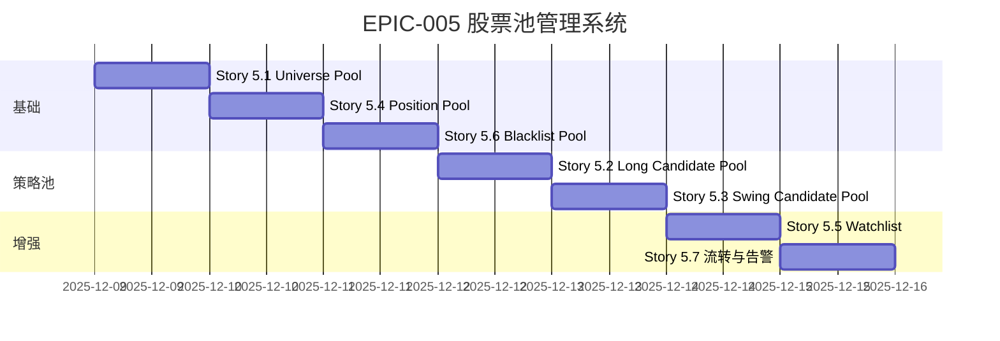

# EPIC-005: 多层级股票池管理系统

**版本**: v1.1 (基于专家评审优化)  
**状态**: 📋 规划中  
**优先级**: P0（基础设施，所有策略依赖）  
**预估工期**: 4-5 天  
**依赖**: EPIC-001 (基础设施)

> [!NOTE]
> **专家评审总评**: 7.5/10  
> 本版本基于金融专家和高级操盘手的评审意见进行了优化，重点改进：准入标准、流动性管理、黑名单机制。

---

## 📋 概述

构建分层、动态、可追溯的股票池管理系统，为长线配置和波段交易提供标准化的候选股票筛选、流转和风控机制。

### 核心价值
- **清晰的职责分离**: Universe → Candidate → Position → Blacklist，避免混乱
- **自动化流转**: 评分变化自动触发池间晋升/降级
- **风险隔离**: 黑名单机制防止踩同一个坑两次
- **可审计**: 每次进出池都有记录，便于复盘和优化

---

## 🏗️ 四层架构设计

```
┌──────────────────────────────────────────────────────────────────┐
│                    第一层: 基础过滤层                              │
│  ┌────────────────────────────────────────────────────────────┐  │
│  │  Universe Pool (全市场基础池) - 约 5000 只                  │  │
│  │  准入: 上市满12月 + 日均成交额>1000万 + 非ST                │  │
│  │  更新: 每周一次                                             │  │
│  └────────────────────────────────────────────────────────────┘  │
└──────────────────────────────────────────────────────────────────┘
                               ▼
┌──────────────────────────────────────────────────────────────────┐
│                    第二层: 策略分池层                              │
│  ┌──────────────────┐         ┌────────────────────┐            │
│  │ Long Candidate   │         │ Swing Candidate    │            │
│  │ 长线候选池        │         │ 波段候选池          │            │
│  │ 200-300只        │         │ 100-150只          │            │
│  ├──────────────────┤         ├────────────────────┤            │
│  │ • 红利池 (80)    │         │ • 强势池 (50)      │            │
│  │ • 成长池 (120)   │         │ • 主题池 (50)      │            │
│  │ • 行业池 (100)   │         │ • 超跌池 (50)      │            │
│  └──────────────────┘         └────────────────────┘            │
└──────────────────────────────────────────────────────────────────┘
                               ▼
┌──────────────────────────────────────────────────────────────────┐
│                    第三层: 执行层                                  │
│  ┌──────────────────┐         ┌────────────────────┐            │
│  │ Position Pool    │         │ Watchlist          │            │
│  │ 持仓池 (8-15只)  │         │ 观察池 (50只)       │            │
│  │ 实时更新         │         │ 每周更新            │            │
│  └──────────────────┘         └────────────────────┘            │
└──────────────────────────────────────────────────────────────────┘
                               ▼
┌──────────────────────────────────────────────────────────────────┐
│                    第四层: 风控层                                  │
│  ┌────────────────────────────────────────────────────────────┐  │
│  │  Blacklist Pool (黑名单池)                                 │  │
│  │  永久黑名单: ST、退市、造假                                 │  │
│  │  临时黑名单: 踩雷股 (6个月禁入)                             │  │
│  └────────────────────────────────────────────────────────────┘  │
└──────────────────────────────────────────────────────────────────┘
```

---

## 📚 User Stories

### Story 5.1: Universe Pool - 全市场基础池
**工期**: 0.5 天  
**优先级**: P0

**目标**: 构建全市场股票的基础筛选池，过滤掉明显不合格的标的。

**准入规则** (已优化):
- 上市时间 ≥ 12 个月
- **日均成交额 ≥ 3000 万**（过去 20 个交易日均值）⚡ *专家建议调整*
- **市值 ≥ 30 亿**（平衡大中小盘）⚡ *新增标准*
- **20日平均换手率 ≥ 0.3%**（确保流动性）⚡ *新增标准*
- 股票状态非 ST/*ST

**调整说明**:
```
原标准 → 优化后标准 → 调整原因
━━━━━━━━━━━━━━━━━━━━━━━━━━━━━━━━━━━━━━━━━━━━━━━━━
成交额 1000万 → 3000万   | 降低流动性风险，避免滑点过大
无市值限制 → 30亿        | 覆盖优质中小盘，排除微盘股
无换手率   → 0.3%        | 确保活跃交易，防止"僵尸股"
```

**数据模型** (已扩展):
```python
class UniverseStock(BaseModel):
    code: str
    name: str
    list_date: date
    
    # 流动性指标 (核心)
    avg_turnover_20d: float      # 日均成交额（万元）
    market_cap: float             # 总市值（亿元）⚡ 新增
    turnover_ratio_20d: float     # 20日换手率 ⚡ 新增
    
    # 筛选结果
    is_qualified: bool
    disqualify_reason: Optional[str]  # 如不合格，说明原因
    updated_at: datetime
```

**验收标准**:
- [ ] 能从 get-stockdata 获取全市场股票基本信息
- [ ] 自动剔除 ST 股票
- [ ] 准入标准严格执行（成交额、市值、换手率）
- [ ] 每周日 22:00 自动更新
- [ ] **Universe Pool 数量稳定在 2800-3500 只** ⚡ *调整预期*

---

### Story 5.2: 长线候选池 (Long-term Candidate Pool)
**工期**: 1 天  
**优先级**: P0

**目标**: 基于 EPIC-002 的 Alpha 4D Scoring，筛选出长线投资候选股。

**筛选流程**:
```
Universe Pool (5000只)
  → Risk Veto Filter (Story 2.1)
  → Alpha 4D Scoring (Story 2.2-2.4)
  → Top 300 → Long Candidate Pool
```

**子池分类** (已优化权重):
- **红利池** (Dividend Sub-pool): `股息率 > 3%` 且 `现金流健康` 的约 **70 只** ⚡ *从80调整*
- **成长池** (Growth Sub-pool): `PEG < 1.5` 且 `ROE > 15%` 的约 **130 只** ⚡ *从120调整*
- **行业池** (Sector Sub-pool): 按申万一级行业分组的约 100 只

**权重调整说明**:
```
池类型   | 原权重  | 新权重  | 调整理由
━━━━━━━━━━━━━━━━━━━━━━━━━━━━━━━━━━━━━━━
红利池   | 26.7%  | 23.3%  | 当前利率环境下吸引力下降
成长池   | 40.0%  | 43.3%  | 符合中国经济转型趋势，Alpha来源
行业池   | 33.3%  | 33.3%  | 保持不变
```

**数据模型**:
```python
class CandidateStock(BaseModel):
    code: str
    pool_type: str  # 'long_candidate' | 'swing_candidate'
    sub_pool: Optional[str]  # 'dividend' | 'growth' | 'sector_xxx'
    score: float
    rank: int
    entry_date: date
    entry_reason: str
    status: str  # 'active' | 'removed'
```

**验收标准**:
- [ ] 能自动运行评分逻辑并生成候选池
- [ ] 子池分类准确（红利/成长/行业）
- [ ] 每月初（或季报后）自动刷新
- [ ] 提供排名变化趋势（如某股从 350 名升至 250 名）

---

### Story 5.3: 波段候选池 (Swing Candidate Pool)
**工期**: 1 天  
**优先级**: P1

**目标**: 基于市场情绪和资金流向，筛选短期交易机会。

**筛选流程**:
```
Universe Pool (5000只)
  → 技术形态初筛 (突破、超跌、强势)
  → 情绪评分 (榜单排名、涨停池)
  → 资金流向 (北向、大单)
  → Top 150 → Swing Candidate Pool
```

**子池分类**:
- **强势池** (Momentum Sub-pool): 北向资金连续流入 + 连板股
- **主题池** (Theme Sub-pool): 当前热点概念（如 AI、医药）
- **超跌池** (Oversold Sub-pool): 短期超跌但基本面尚可

**验收标准**:
- [ ] 每日盘后自动更新
- [ ] 子池切换灵活（如热点从 AI 切换到医药）
- [ ] 与 EPIC-003 波段策略对接

---

### Story 5.4: 持仓池管理 (Position Pool)
**工期**: 0.5 天  
**优先级**: P0

**目标**: 管理当前实际持仓，跟踪成本、盈亏、止损位。

**数据模型** (已增强流动性管理):
```python
class Position(BaseModel):
    code: str
    strategy_type: str  # 'long_term' | 'swing'
    entry_price: float
    quantity: int
    entry_date: date
    current_price: float
    profit_loss: float
    profit_loss_pct: float
    stop_loss: float
    take_profit: Optional[float]
    holding_days: int
    
    # 流动性管理 ⚡ 新增
    position_value: float          # 持仓市值（元）
    avg_daily_volume: float        # 日均成交额（元）
    liquidity_impact: str          # "LOW" | "MEDIUM" | "HIGH"
    liquidation_cost_est: float    # 预估清算成本（元）
```

**核心功能**:
- 买入时自动从候选池移入持仓池
- **买入前流动性检查**：如果买入金额 > 日成交量 10%，告警 ⚡ *新增*
- 卖出后根据情况移入观察池或黑名单
- 实时更新盈亏、持仓天数
- 止损/止盈触发自动告警
- **清算成本估算**：定期计算全仓平仓的冲击成本 ⚡ *新增*

**流动性管理逻辑**:
```python
def check_liquidity_impact(position_value, avg_daily_volume):
    impact_ratio = position_value / avg_daily_volume
    if impact_ratio > 0.10:  # 超过日成交量10%
        return "HIGH", "冲击成本过高，建议分批交易"
    elif impact_ratio > 0.05:  # 超过日成交量5%
        return "MEDIUM", "中等冲击成本，注意滑点"
    else:
        return "LOW", "冲击成本可接受"
```

**验收标准**:
- [ ] 能记录完整的交易历史
- [ ] 盈亏计算准确
- [ ] 达到止损位时自动告警
- [ ] **流动性冲击检查生效** ⚡ *新增*
- [ ] **清算成本估算准确** ⚡ *新增*

---

### Story 5.5: 观察池 (Watchlist)
**工期**: 0.5 天  
**优先级**: P2

**目标**: 跟踪"差一点就买"的股票，等待更好时机。

**来源**:
- 候选池排名 301-350 的边缘股
- 已卖出但基本面仍好的股票（等待回调）
- 技术形态尚未完善的潜力股

**触发机制**:
- 如果观察池股票重回候选池 Top 100 → 自动提醒
- 如果技术形态突破 → 移入候选池

**验收标准**:
- [ ] 自动捕捉候选池边缘股
- [ ] 排名提升自动提醒

---

### Story 5.6: 黑名单池 (Blacklist)
**工期**: 0.5 天  
**优先级**: P0

**目标**: 记录踩雷股票，防止重复犯错。

**触发条件** (已优化解禁期):
- **永久黑名单**: ST、退市、财务造假
- **临时黑名单** (差异化期限): ⚡ *优化解禁机制*
  - **技术性止损** (3个月): 亏损超 -2% 止损出局
  - **基本面踩雷** (12个月): 商誉暴雷、质押爆仓、业绩暴雷
  - **监管处罚** (12个月): 立案调查、重大违规

**解禁期调整说明**:
```
原方案: 统一6个月 → 问题: 基本面踩雷6个月后大概率未改善
优化方案: 差异化设置 → 技术性3个月，基本面12个月
```

**数据模型** (已增强):
```python
class BlacklistStock(BaseModel):
    code: str
    reason: str
    reason_type: str  # "tech_stop" | "fundamental" | "regulatory" | "permanent" ⚡ 新增
    added_date: date
    is_permanent: bool
    release_date: Optional[date]  # 临时黑名单解禁日期
    release_period_months: Optional[int]  # 解禁期（月）⚡ 新增
    loss_amount: Optional[float]  # 如果是止损，记录损失金额
```

**验收标准**:
- [ ] 买入前自动检查黑名单
- [ ] 临时黑名单到期自动解除（**差异化期限**）⚡ *优化*
- [ ] 提供黑名单统计（如"过去1年踩雷5次，总亏损-8万"）
- [ ] **按类型统计踩雷原因分布** ⚡ *新增*

---

### Story 5.7: 池间流转与告警
**工期**: 0.5 天  
**优先级**: P1

**目标**: 自动化池间流转逻辑和关键事件告警。

**流转规则**:
```
Universe Pool
  ↓ (评分 Top 300)
Long/Swing Candidate Pool
  ↓ (人工/自动买入)
Position Pool
  ↓ (卖出)
Watchlist OR Blacklist
  ↓ (6个月后)
Universe Pool (重新评估)
```

**告警机制**:
- 候选池新增潜力股 (评分从 400 → 100)
- 持仓股跌破止损位
- 观察池股票重回候选池前 50
- 黑名单股票即将解禁

**验收标准**:
- [ ] 流转逻辑自动执行
- [ ] 告警推送及时（Webhook/Email）

---

## 🗄️ 数据库设计

### 表结构设计

```sql
-- 1. 股票池主表
CREATE TABLE stock_pools (
    id SERIAL PRIMARY KEY,
    code VARCHAR(10) NOT NULL,
    pool_name VARCHAR(50) NOT NULL,  -- 'universe', 'long_candidate', 'swing_candidate'
    sub_pool VARCHAR(50),             -- 'dividend', 'growth', 'momentum', etc.
    score FLOAT,
    rank INT,
    entry_date DATE NOT NULL,
    exit_date DATE,
    entry_reason TEXT,
    exit_reason TEXT,
    status VARCHAR(20) DEFAULT 'active',  -- 'active' | 'removed'
    created_at TIMESTAMP DEFAULT NOW(),
    updated_at TIMESTAMP DEFAULT NOW()
);

CREATE INDEX idx_pool_code ON stock_pools(pool_name, code, status);
CREATE INDEX idx_pool_date ON stock_pools(pool_name, entry_date);

-- 2. 持仓池
CREATE TABLE positions (
    id SERIAL PRIMARY KEY,
    code VARCHAR(10) NOT NULL,
    strategy_type VARCHAR(20) NOT NULL,  -- 'long_term' | 'swing'
    entry_price FLOAT NOT NULL,
    quantity INT NOT NULL,
    entry_date DATE NOT NULL,
    exit_date DATE,
    exit_price FLOAT,
    stop_loss FLOAT,
    take_profit FLOAT,
    profit_loss FLOAT,
    profit_loss_pct FLOAT,
    holding_days INT,
    status VARCHAR(20) DEFAULT 'holding',  -- 'holding' | 'closed'
    created_at TIMESTAMP DEFAULT NOW()
);

CREATE INDEX idx_position_code ON positions(code, status);

-- 3. 黑名单池
CREATE TABLE blacklist (
    id SERIAL PRIMARY KEY,
    code VARCHAR(10) NOT NULL UNIQUE,
    reason TEXT NOT NULL,
    added_date DATE NOT NULL,
    is_permanent BOOLEAN DEFAULT FALSE,
    release_date DATE,
    loss_amount FLOAT,
    created_at TIMESTAMP DEFAULT NOW()
);

-- 4. 池流转历史记录
CREATE TABLE pool_transitions (
    id SERIAL PRIMARY KEY,
    code VARCHAR(10) NOT NULL,
    from_pool VARCHAR(50),
    to_pool VARCHAR(50),
    transition_date TIMESTAMP DEFAULT NOW(),
    reason TEXT,
    score_before FLOAT,
    score_after FLOAT
);

CREATE INDEX idx_transition_code ON pool_transitions(code, transition_date);
```

---

## 📡 API 设计

### 1. 查询股票池
```http
GET /api/v1/pools/{pool_name}?sub_pool=dividend&limit=50&offset=0
```

**Response**:
```json
{
  "pool_name": "long_candidate",
  "sub_pool": "dividend",
  "total": 80,
  "stocks": [
    {
      "code": "600519",
      "name": "贵州茅台",
      "score": 85.5,
      "rank": 1,
      "entry_date": "2024-12-01",
      "entry_reason": "高股息率 + 稳定ROE"
    }
  ]
}
```

### 2. 股票流转记录
```http
GET /api/v1/pools/transitions/{code}
```

**Response**:
```json
{
  "code": "600519",
  "transitions": [
    {
      "from": "universe",
      "to": "long_candidate",
      "date": "2024-12-01",
      "score": 85.5
    },
    {
      "from": "long_candidate",
      "to": "position",
      "date": "2024-12-05",
      "reason": "评分排名第1，买入"
    }
  ]
}
```

### 3. 黑名单检查
```http
POST /api/v1/pools/blacklist/check
{
  "codes": ["600001", "600002"]
}
```

**Response**:
```json
{
  "results": [
    {
      "code": "600001",
      "is_blacklisted": false
    },
    {
      "code": "600002",
      "is_blacklisted": true,
      "reason": "止损出局 (-3.2%)",
      "release_date": "2025-06-02"
    }
  ]
}
```

---

## 🧪 验收标准

### 功能测试
- [ ] Universe Pool 能正确筛选 4500-5500 只股票
- [ ] 长线候选池自动分类到红利/成长/行业子池
- [ ] 波段候选池每日自动更新
- [ ] 持仓池盈亏计算准确
- [ ] 黑名单股票无法再次买入
- [ ] 流转记录完整可追溯

### 性能测试
- [ ] 查询候选池 < 500ms
- [ ] 批量检查黑名单 (100只) < 200ms
- [ ] 每日候选池刷新 < 5分钟

### 数据完整性
- [ ] 所有进出池操作都有记录
- [ ] 黑名单解禁后自动恢复到 Universe Pool

---

## 📅 开发计划



**总工期**: 约 4 天

---

## 🔗 依赖与集成

**上游依赖**:
- EPIC-001: 基础设施 (已完成)
- Story 007.10: 风控数据 (待完成)

**下游消费者**:
- EPIC-002: 长线资产配置 (依赖 Long Candidate Pool)
- EPIC-003: 波段交易策略 (依赖 Swing Candidate Pool)
- EPIC-004: 风控执行管理 (依赖 Position Pool + Blacklist)

---

## 📌 备注

此 EPIC 是系统的"中台"，所有策略都依赖股票池。建议优先完成 Story 5.1 + 5.4 + 5.6，确保基础可用后再完善策略池。
