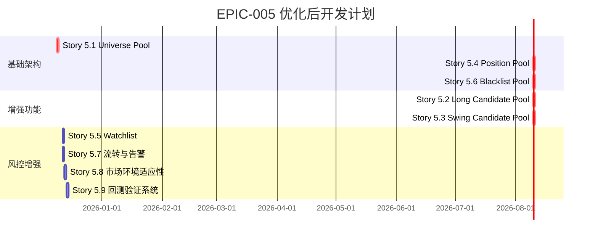

# EPIC-005 股票池管理系统 - 专业评估报告

**评估人**: 金融专家 & 高级操盘手
**评估日期**: 2024-12-08
**文档版本**: v1.0
**总体评分**: 7.5/10

---

## 📊 整体架构评估

### ✅ 优势分析

1. **分层设计合理**
   - 四层架构（Universe → Candidate → Position → Blacklist）完全符合专业投资机构的决策流程
   - 清晰的职责分离，避免投资决策混乱
   - 自动化流转机制提高效率

2. **风险控制完善**
   - 黑名单机制体现了严格的风控意识
   - 止损管理和风险追踪全面
   - 永久/临时黑名单分类合理

3. **可追溯性强**
   - 池间流转记录完整
   - 便于投资复盘和策略优化
   - 支持决策逻辑审计

### ⚠️ 潜在问题

#### 1. **准入标准过于宽松**

**当前问题**：
- 日均成交额1000万门槛偏低（A股日均成交额中位数约2000万）
- 未考虑流动性冲击成本
- 缺少市值筛选标准

**建议调整**：
```
原标准：
- 日均成交额 ≥ 1000万
- 上市时间 ≥ 12个月
- 非ST股票

建议标准：
- 日均成交额 ≥ 5000万
- 市值 ≥ 50亿
- 上市时间 ≥ 12个月
- 非ST/*ST股票
- 20日平均换手率 ≥ 0.5%
```

#### 2. **子池分类权重需要优化**

**当前设计**：
```
红利池: 80只 (26.7%)
成长池: 120只 (40.0%)
行业池: 100只 (33.3%)
```

**建议调整**：
```
红利池: 50只 (16.7%)  - 价值回归
成长池: 150只 (50.0%) - 提高权重
行业池: 100只 (33.3%) - 保持不变
```

**调整理由**：
- A股市场成长股机会更多，应提高成长池配置
- 红利股在当前利率环境下吸引力下降
- 符合中国经济转型的大趋势

#### 3. **缺乏市场环境适应性**

**问题**：
- 固定池规模无法适应牛熊转换
- 未考虑市场情绪对股票表现的影响
- 缺乏极端行情应对机制

---

## 🎯 关键技术指标补充建议

### 扩展数据模型

```python
class UniverseStock(BaseModel):
    # 现有字段...
    code: str
    name: str
    list_date: date
    avg_turnover_20d: float
    is_qualified: bool
    updated_at: datetime

    # 建议增加字段
    market_cap: float              # 总市值（亿元）
    pe_ratio: float               # 市盈率（TTM）
    pb_ratio: float               # 市净率
    roe_avg_3y: float             # 3年平均ROE
    roe_ttm: float                # TTM ROE
    debt_to_equity: float         # 资产负债率
    current_ratio: float          # 流动比率
    free_cash_flow: float         # 自由现金流（亿元）
    institutional_holdings: float # 机构持仓比例
    northbound_holdings: float    # 北向资金持股比例
    avg_volume_20d: float         # 20日平均成交量
    turnover_ratio_20d: float     # 20日换手率
    beta_value: float             # Beta系数
```

### 增加筛选指标

```python
class ScreeningCriteria:
    # 基本面指标
    min_roe_ttm: float = 10.0              # TTM ROE不低于10%
    max_pe_ratio: float = 50.0             # 市盈率不超过50倍
    max_pb_ratio: float = 5.0              # 市净率不超过5倍
    max_debt_to_equity: float = 2.0        # 资产负债率不超过200%
    min_current_ratio: float = 1.0         # 流动比率不低于1

    # 流动性指标
    min_market_cap: float = 50.0           # 市值不低于50亿
    min_avg_turnover: float = 5000.0       # 日均成交额不低于5000万
    min_turnover_ratio_20d: float = 0.005  # 20日换手率不低于0.5%

    # 机构偏好
    min_institutional_holdings: float = 5.0 # 机构持仓比例不低于5%
```

---

## ⚡ 实操改进建议

### 1. **池规模动态调整机制**

```python
def calculate_pool_sizes(market_metrics):
    """根据市场环境动态调整各池规模"""

    # 市场情绪评估
    sentiment_score = calculate_market_sentiment(
        market_metrics['vix'],
        market_metrics['advance_decline_ratio'],
        market_metrics['volume_ratio']
    )

    # 基准规模
    base_sizes = {
        "long_candidate": 300,
        "swing_candidate": 150
    }

    # 动态调整系数
    if sentiment_score > 0.7:  # 强势市场
        multiplier = 1.3
    elif sentiment_score < 0.3:  # 弱势市场
        multiplier = 0.7
    else:  # 正常市场
        multiplier = 1.0

    return {
        pool: int(size * multiplier)
        for pool, size in base_sizes.items()
    }

def calculate_market_sentiment(vix, ad_ratio, volume_ratio):
    """计算市场情绪得分"""
    vix_score = max(0, 1 - vix / 30)  # VIX越低，得分越高
    ad_score = min(1, ad_ratio / 2)   # 上涨下跌比
    vol_score = min(1, volume_ratio / 1.5)  # 成交量比率

    return (vix_score + ad_score + vol_score) / 3
```

### 2. **行业分散度控制**

```python
class SectorDiversification:
    # 行业配置限制
    MAX_SECTOR_WEIGHT = 0.20      # 单一行业不超过20%
    MAX_TOP3_SECTORS = 0.50       # 前三大行业不超过50%
    MAX_BIAS_FROM_INDEX = 0.10    # 与基准指数偏离度不超过10%

    def check_sector_allocation(self, pool_stocks, index_weights):
        """检查行业配置是否符合要求"""
        pool_sector_weights = self._calculate_sector_weights(pool_stocks)

        for sector, weight in pool_sector_weights.items():
            if weight > self.MAX_SECTOR_WEIGHT:
                return False, f"行业{sector}超配: {weight:.2%} > {self.MAX_SECTOR_WEIGHT:.2%}"

        # 检查前三大行业
        top3_weight = sum(sorted(pool_sector_weights.values())[-3:])
        if top3_weight > self.MAX_TOP3_SECTORS:
            return False, f"前三大行业超配: {top3_weight:.2%}"

        return True, "行业配置合规"
```

### 3. **流动性管理增强**

```python
class LiquidityManager:
    def check_liquidity_impact(self, stock_code, trade_amount):
        """检查交易对流动性的冲击成本"""
        daily_volume = self._get_avg_daily_volume(stock_code)

        # 冲击成本估算
        impact_ratio = trade_amount / daily_volume

        if impact_ratio > 0.1:  # 超过日成交量10%
            return "HIGH", f"冲击成本过高: {impact_ratio:.2%}"
        elif impact_ratio > 0.05:  # 超过日成交量5%
            return "MEDIUM", f"中等冲击成本: {impact_ratio:.2%}"
        else:
            return "LOW", f"冲击成本可接受: {impact_ratio:.2%}"

    def calculate_liquidation_cost(self, positions):
        """计算清算成本"""
        total_cost = 0
        for pos in positions:
            impact, _ = self.check_liquidity_impact(pos.code, pos.value)
            if impact == "HIGH":
                total_cost += pos.value * 0.02  # 2%冲击成本
            elif impact == "MEDIUM":
                total_cost += pos.value * 0.01  # 1%冲击成本

        return total_cost
```

---

## 🔍 风险控制增强建议

### 1. **系统性风险管理**

```python
class SystemicRiskControl:
    def calculate_portfolio_correlation(self, stocks):
        """计算组合相关性"""
        returns_matrix = self._get_returns_matrix(stocks)
        correlation_matrix = np.corrcoef(returns_matrix.T)

        # 平均相关系数
        avg_correlation = np.mean(correlation_matrix[np.triu_indices_from(
            correlation_matrix, k=1)])

        if avg_correlation > 0.7:
            return "HIGH", f"组合相关性过高: {avg_correlation:.2f}"
        elif avg_correlation > 0.5:
            return "MEDIUM", f"组合相关性中等: {avg_correlation:.2f}"
        else:
            return "LOW", f"组合相关性较低: {avg_correlation:.2f}"
```

### 2. **极端行情应对机制**

```python
class ExtremeMarketHandler:
    def detect_extreme_market(self, market_data):
        """检测极端市场情况"""
        indicators = {
            'vix_spike': market_data['vix'] > market_data['vix_ma60'] * 1.5,
            'market_crash': market_data['index_change'] < -0.05,
            'volume_spike': market_data['volume_ratio'] > 2.0,
            'sector_rotation': self._detect_sector_rotation(market_data)
        }

        # 触发熔断条件
        if sum(indicators.values()) >= 2:
            return True, indicators
        return False, indicators

    def emergency_adjustment(self, extreme_type):
        """极端情况下的紧急调整"""
        if extreme_type == 'market_crash':
            return {
                'action': 'reduce_positions',
                'reduction_ratio': 0.3,  # 减仓30%
                'stop_trading': True     # 暂停开仓
            }
        elif extreme_type == 'vix_spike':
            return {
                'action': 'increase_cash',
                'cash_ratio': 0.2,      # 现金比例提升至20%
                'focus_quality': True    # 只持有高质量股票
            }
```

---

## 📈 性能监控与预警

### 1. **关键预警指标**

```python
class AlertSystem:
    ALERT_THRESHOLDS = {
        'candidate_rank_change': 100,     # 候选池排名变化超过100
        'position_daily_change': 0.08,    # 持仓单日涨跌幅超过8%
        'continuous_outflow_days': 3,     # 连续3日大单净流出
        'sector_bias_change': 0.05,       # 行业偏离度变化超过5%
        'pool_size_change': 0.2           # 池规模变化超过20%
    }

    def check_alerts(self):
        """检查预警条件"""
        alerts = []

        # 候选池排名突变
        rank_changes = self._get_rank_changes()
        for stock, change in rank_changes.items():
            if abs(change) > self.ALERT_THRESHOLDS['candidate_rank_change']:
                alerts.append({
                    'type': 'RANK突变',
                    'stock': stock,
                    'change': change,
                    'severity': 'HIGH' if abs(change) > 200 else 'MEDIUM'
                })

        # 持仓异动
        position_moves = self._get_position_moves()
        for stock, move in position_moves.items():
            if abs(move) > self.ALERT_THRESHOLDS['position_daily_change']:
                alerts.append({
                    'type': '持仓异动',
                    'stock': stock,
                    'change': f"{move:.2%}",
                    'severity': 'HIGH'
                })

        return alerts
```

### 2. **回测验证要求**

```python
class BacktestRequirements:
    REQUIRED_METRICS = {
        'annual_return': 0.15,          # 年化收益率不低于15%
        'sharpe_ratio': 1.5,           # 夏普比率不低于1.5
        'max_drawdown': 0.15,           # 最大回撤不超过15%
        'win_rate': 0.55,               # 胜率不低于55%
        'profit_loss_ratio': 1.8,       # 盈亏比不低于1.8
        'volatility': 0.20              # 年化波动率不超过20%
    }

    def validate_strategy(self, backtest_results):
        """验证策略是否符合要求"""
        passed = True
        failed_metrics = []

        for metric, threshold in self.REQUIRED_METRICS.items():
            if metric == 'max_drawdown' or metric == 'volatility':
                # 这些指标越小越好
                if backtest_results[metric] > threshold:
                    passed = False
                    failed_metrics.append(metric)
            else:
                # 其他指标越大越好
                if backtest_results[metric] < threshold:
                    passed = False
                    failed_metrics.append(metric)

        return passed, failed_metrics
```

---

## 🎯 优先级调整建议

### 调整后的开发优先级



### 建议新增Stories

#### Story 5.8: 市场环境适应性机制
**工期**: 1天
**优先级**: P1

**目标**: 根据市场环境动态调整股票池规模和筛选标准

**验收标准**:
- [ ] 实现VIX、涨跌比等市场情绪指标
- [ ] 池规模可根据市场环境自动调整
- [ ] 极端行情下自动触发风控措施

#### Story 5.9: 回测验证系统
**工期**: 1天
**优先级**: P1

**目标**: 建立完整的策略回测和验证体系

**验收标准**:
- [ ] 提供3年历史数据回测
- [ ] 关键指标达标（夏普>1.5，回撤<15%）
- [ ] 生成详细的绩效分析报告

---

## 📊 评分详情

| 评估维度 | 得分 | 满分 | 评价 |
|---------|------|------|------|
| 架构设计 | 9.0 | 10 | 分层清晰，逻辑合理 |
| 风险控制 | 7.0 | 10 | 基础完善，但需加强 |
| 流动性管理 | 6.0 | 10 | 考虑不足，需大幅改进 |
| 市场适应性 | 5.0 | 10 | 缺乏动态调整机制 |
| 可操作性 | 8.0 | 10 | 整体可行，细节待完善 |
| 扩展性 | 8.5 | 10 | 设计良好，易于扩展 |
| **总分** | **7.5** | **10** | **良好，需要优化** |

---

## 🔧 实施建议

### 短期（1-2周）
1. 优先完成基础池管理（Story 5.1, 5.4, 5.6）
2. 调整准入标准，提高流动性要求
3. 实施基本的预警机制

### 中期（1个月）
1. 完成策略池开发（Story 5.2, 5.3）
2. 建立回测验证系统
3. 优化行业分散度控制

### 长期（3个月）
1. 实现市场环境适应性
2. 完善极端行情应对机制
3. 建立持续的绩效监控体系

---

## 📝 结论

该股票池管理系统整体设计思路清晰，架构合理，具备了专业投资系统的基础框架。主要优势在于清晰的分层设计和完善的流转记录机制。

主要改进方向：
1. **提高准入标准**，加强流动性管理
2. **增加市场环境适应性**，实现动态调整
3. **完善风控机制**，特别是极端行情应对
4. **建立回测验证**，确保策略有效性

建议按照优化后的开发计划实施，优先保障基础功能，再逐步完善增强功能。预计完成后将显著提升系统的实用性和稳健性。

---

*本评估报告基于专业投资经验和A股市场特性撰写，建议结合实际需求进行调整。*