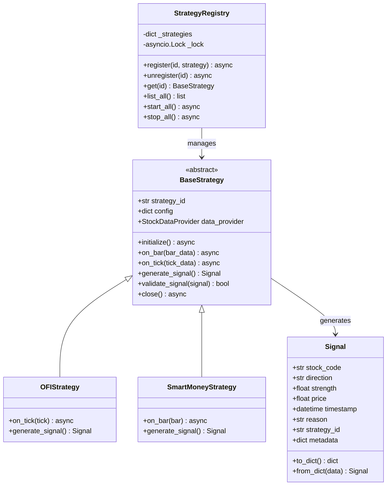

# Story Implementation Plan: 策略基类设计

**Story ID**: 1.3  
**Story Name**: 策略基类设计 (BaseStrategy)  
**开始日期**: 2025-12-13  
**预期完成**: 2025-12-15  
**负责人**: 开发团队  
**AI模型**: Claude 4.5 Sonnet（设计+实现）

---

## 📋 Story概述

### 目标
设计并实现策略引擎的核心抽象层，为所有量化策略提供统一的接口规范、生命周期管理和注册机制。

### 验收标准
- [x] BaseStrategy抽象类定义完整，包含所有必需方法
- [x] Signal数据结构标准化，包含所有必需字段
- [x] StrategyRegistry实现策略注册、查询、管理功能
- [x] 单元测试覆盖率 ≥ 80%
- [x] 并发测试验证StrategyRegistry的线程安全
- [x] 所有公开接口有完整的docstring和类型提示

### 依赖关系
- **依赖Story**: Story 1.2（数据适配层已完成）
- **外部依赖**: 
  - StockDataProvider (数据获取)
  - Redis (可选缓存)
  - SQLAlchemy (策略配置持久化)

---

## 🎯 需求分析

### 功能需求

#### 1. BaseStrategy抽象基类
**核心职责**: 定义所有策略的标准接口和生命周期

**必需方法**:
- `initialize()`: 策略初始化（加载配置、连接数据源）
- `on_bar(bar_data)`: 处理K线数据
- `on_tick(tick_data)`: 处理Tick数据
- `generate_signal()`: 生成交易信号
- `validate_signal(signal)`: 信号验证
- `close()`: 清理资源

**生命周期**:
```
创建 → 初始化 → 运行(接收数据) → 生成信号 → 关闭
```

#### 2. Signal标准数据结构
**必需字段**:
```python
{
    "stock_code": str,      # 股票代码，如 "600519"
    "direction": str,       # 方向: "BUY", "SELL", "HOLD"
    "strength": float,      # 信号强度: 0.0-1.0
    "price": float,         # 目标价格
    "timestamp": datetime,  # 信号生成时间
    "reason": str,          # 生成原因（可解释性）
    "strategy_id": str,     # 策略标识
    "metadata": dict        # 其他元数据
}
```

#### 3. StrategyRegistry注册表
**核心功能**:
- 策略注册: `register(strategy_id, strategy_instance)`
- 策略查询: `get(strategy_id)`, `list_all()`
- 策略移除: `unregister(strategy_id)`
- 批量管理: `start_all()`, `stop_all()`

**并发安全**: 支持多协程并发访问

### 非功能需求

- **性能要求**: 
  - 信号生成延迟 < 100ms（基类开销应 < 10ms）
  - Registry查询延迟 < 1ms
  
- **并发要求**: 
  - StrategyRegistry支持100+并发协程
  - 策略实例线程安全（如果涉及共享状态）
  
- **扩展性**: 
  - 易于继承实现具体策略
  - 支持插件式策略加载

---

## 🏗️ 技术设计

### 架构设计



### 核心组件

#### 组件1: BaseStrategy（抽象基类）
**职责**: 定义策略标准接口和默认行为

**接口设计**:
```python
from abc import ABC, abstractmethod
from typing import Optional, Dict, Any
from datetime import datetime
import asyncio

class BaseStrategy(ABC):
    """策略抽象基类
    
    所有量化策略必须继承此类并实现抽象方法。
    基类提供生命周期管理、数据接入、信号验证等通用功能。
    """
    
    def __init__(
        self,
        strategy_id: str,
        config: Dict[str, Any],
        data_provider: 'StockDataProvider'
    ):
        """初始化策略
        
        Args:
            strategy_id: 策略唯一标识符
            config: 策略配置参数
            data_provider: 数据提供者实例
        """
        self.strategy_id = strategy_id
        self.config = config
        self.data_provider = data_provider
        self._initialized = False
        self._lock = asyncio.Lock()  # 保护内部状态
    
    async def initialize(self) -> None:
        """初始化策略资源
        
        在策略开始运行前调用，用于：
        - 加载历史数据
        - 初始化模型参数
        - 建立数据连接
        
        Raises:
            InitializationError: 初始化失败
        """
        async with self._lock:
            if self._initialized:
                return
            await self._do_initialize()
            self._initialized = True
    
    @abstractmethod
    async def _do_initialize(self) -> None:
        """子类实现具体初始化逻辑"""
        pass
    
    @abstractmethod
    async def on_bar(self, bar_data: Dict[str, Any]) -> None:
        """处理K线数据
        
        Args:
            bar_data: K线数据字典，包含
                - stock_code: 股票代码
                - open/high/low/close: OHLC价格
                - volume: 成交量
                - timestamp: 时间戳
        """
        pass
    
    @abstractmethod
    async def on_tick(self, tick_data: Dict[str, Any]) -> None:
        """处理Tick数据
        
        Args:
            tick_data: Tick数据字典，包含
                - stock_code: 股票代码
                - price: 最新价
                - volume: 成交量
                - bid/ask: 买卖盘口
                - timestamp: 时间戳
        """
        pass
    
    @abstractmethod
    def generate_signal(self) -> Optional['Signal']:
        """生成交易信号
        
        Returns:
            Signal对象或None（无信号）
        """
        pass
    
    def validate_signal(self, signal: 'Signal') -> bool:
        """验证信号有效性
        
        Args:
            signal: 待验证的信号
            
        Returns:
            True if valid, False otherwise
        """
        # 基础验证
        if not signal.stock_code or not signal.direction:
            return False
        if signal.strength < 0 or signal.strength > 1:
            return False
        if signal.direction not in ["BUY", "SELL", "HOLD"]:
            return False
        return True
    
    async def close(self) -> None:
        """清理策略资源
        
        在策略停止运行时调用，用于：
        - 保存状态
        - 关闭连接
        - 释放资源
        """
        async with self._lock:
            if not self._initialized:
                return
            await self._do_close()
            self._initialized = False
    
    @abstractmethod
    async def _do_close(self) -> None:
        """子类实现具体清理逻辑"""
        pass
```

**并发安全**: 
- 使用 `asyncio.Lock` 保护 `_initialized` 状态
- 初始化和关闭方法可以并发调用，但会串行执行

---

#### 组件2: Signal（数据模型）
**职责**: 标准化交易信号数据结构

**接口设计**:
```python
from pydantic import BaseModel, Field, validator
from typing import Dict, Any, Literal
from datetime import datetime

class Signal(BaseModel):
    """交易信号标准数据结构
    
    使用Pydantic进行数据验证和序列化。
    """
    
    stock_code: str = Field(..., description="股票代码，如 '600519'")
    direction: Literal["BUY", "SELL", "HOLD"] = Field(..., description="交易方向")
    strength: float = Field(..., ge=0.0, le=1.0, description="信号强度 0-1")
    price: float = Field(..., gt=0, description="目标价格")
    timestamp: datetime = Field(default_factory=datetime.now, description="信号时间")
    reason: str = Field(..., description="信号生成原因")
    strategy_id: str = Field(..., description="策略标识")
    metadata: Dict[str, Any] = Field(default_factory=dict, description="其他元数据")
    
    @validator('stock_code')
    def validate_stock_code(cls, v):
        """验证股票代码格式"""
        if not v or len(v) != 6:
            raise ValueError("股票代码必须是6位数字")
        return v
    
    class Config:
        json_encoders = {
            datetime: lambda v: v.isoformat()
        }
```

---

#### 组件3: StrategyRegistry（注册表）
**职责**: 管理所有策略实例，支持并发安全访问

**接口设计**:
```python
from typing import Dict, List, Optional
import asyncio
from contextlib import asynccontextmanager

class StrategyRegistry:
    """策略注册表
    
    管理所有策略实例的生命周期，支持并发安全访问。
    使用单例模式确保全局唯一。
    """
    
    _instance: Optional['StrategyRegistry'] = None
    _lock_create = asyncio.Lock()
    
    def __new__(cls):
        if cls._instance is None:
            cls._instance = super().__new__(cls)
        return cls._instance
    
    def __init__(self):
        if not hasattr(self, '_initialized'):
            self._strategies: Dict[str, BaseStrategy] = {}
            self._lock = asyncio.Lock()
            self._initialized = True
    
    async def register(
        self,
        strategy_id: str,
        strategy: BaseStrategy
    ) -> None:
        """注册策略
        
        Args:
            strategy_id: 策略唯一标识
            strategy: 策略实例
            
        Raises:
            ValueError: 策略ID已存在
        """
        async with self._lock:
            if strategy_id in self._strategies:
                raise ValueError(f"Strategy {strategy_id} already exists")
            self._strategies[strategy_id] = strategy
            await strategy.initialize()
    
    async def unregister(self, strategy_id: str) -> None:
        """注销策略
        
        Args:
            strategy_id: 策略标识
        """
        async with self._lock:
            if strategy_id in self._strategies:
                strategy = self._strategies.pop(strategy_id)
                await strategy.close()
    
    def get(self, strategy_id: str) -> Optional[BaseStrategy]:
        """获取策略实例（非阻塞）
        
        Args:
            strategy_id: 策略标识
            
        Returns:
            策略实例或None
        """
        return self._strategies.get(strategy_id)
    
    def list_all(self) -> List[str]:
        """列出所有策略ID
        
        Returns:
            策略ID列表
        """
        return list(self._strategies.keys())
    
    async def start_all(self) -> None:
        """启动所有策略"""
        tasks = [
            strategy.initialize() 
            for strategy in self._strategies.values()
        ]
        await asyncio.gather(*tasks, return_exceptions=True)
    
    async def stop_all(self) -> None:
        """停止所有策略"""
        tasks = [
            strategy.close() 
            for strategy in self._strategies.values()
        ]
        await asyncio.gather(*tasks, return_exceptions=True)
        async with self._lock:
            self._strategies.clear()
```

**并发安全**: 
- 使用 `asyncio.Lock` 保护 `_strategies` 字典
- `get()` 和 `list_all()` 不加锁（读操作，非严格一致性要求）
- `register()` 和 `unregister()` 加锁（写操作）

---

## 📁 文件变更

### 新增文件
- [x] `src/strategies/base.py` - BaseStrategy抽象类
- [x] `src/strategies/signal.py` - Signal数据模型
- [x] `src/strategies/registry.py` - StrategyRegistry注册表
- [x] `src/strategies/__init__.py` - 包导出
- [x] `tests/unit_tests/test_base_strategy.py` - BaseStrategy单元测试
- [x] `tests/unit_tests/test_signal.py` - Signal单元测试
- [x] `tests/unit_tests/test_registry.py` - Registry单元测试
- [x] `tests/unit_tests/test_registry_concurrency.py` - Registry并发测试

### 修改文件
- [x] `src/__init__.py` - 添加strategies模块导出
- [x] `docs/TASK_PROGRESS.md` - 更新Story 1.3状态

### 删除文件
无

---

## 🔄 实现计划

### Phase 1: 核心逻辑实现
**预期时间**: 4小时

- [x] 实现Signal数据模型（使用Pydantic）
- [x] 实现BaseStrategy抽象类
- [x] 实现StrategyRegistry注册表
- [x] 添加完整类型提示
- [x] 添加详细docstring

### Phase 2: 测试实现
**预期时间**: 3小时

- [x] Signal单元测试（数据验证、序列化）
- [x] BaseStrategy单元测试（使用Mock子类）
- [x] StrategyRegistry单元测试（注册、查询、管理）
- [x] StrategyRegistry并发测试（10+协程并发访问）

### Phase 3: 质量检查
**预期时间**: 1小时

- [x] 执行code_quality_check workflow
- [x] 修复发现的问题
- [x] 确保覆盖率 ≥ 80%

---

## ⚙️ 技术细节

### 并发安全设计

#### BaseStrategy内部Lock
```python
class BaseStrategy:
    def __init__(self, ...):
        self._lock = asyncio.Lock()
        self._initialized = False
    
    async def initialize(self):
        async with self._lock:  # 保护状态变更
            if self._initialized:
                return
            await self._do_initialize()
            self._initialized = True
```

**原因**: 防止多次初始化

#### StrategyRegistry全局Lock
```python
class StrategyRegistry:
    def __init__(self):
        self._lock = asyncio.Lock()
        self._strategies = {}
    
    async def register(self, id, strategy):
        async with self._lock:  # 保护字典写入
            if id in self._strategies:
                raise ValueError(...)
            self._strategies[id] = strategy
```

**原因**: 防止并发注册导致的race condition

### 错误处理策略

**初始化失败**:
```python
async def initialize(self):
    try:
        await self._do_initialize()
    except Exception as e:
        logger.error(f"Strategy {self.strategy_id} init failed: {e}")
        raise InitializationError(f"Failed to initialize: {e}")
```

**信号验证失败**:
```python
def generate_signal(self):
    signal = self._calculate_signal()
    if not self.validate_signal(signal):
        logger.warning(f"Invalid signal generated: {signal}")
        return None
    return signal
```

**资源清理失败**:
```python
async def close(self):
    try:
        await self._do_close()
    except Exception as e:
        logger.error(f"Strategy {self.strategy_id} close failed: {e}")
    finally:
        self._initialized = False  # 确保状态更新
```

### 性能优化

#### Registry查询优化
```python
def get(self, strategy_id):
    # 不加锁，允许读取中的脏读（acceptable）
    return self._strategies.get(strategy_id)
```

**权衡**: 牺牲严格一致性换取性能（查询延迟 < 1ms）

#### 信号生成优化
```python
def generate_signal(self):
    # 应该是同步方法，避免async开销
    # 复杂计算应在on_bar/on_tick中完成
    return self._latest_signal
```

---

## 🧪 测试策略

### 单元测试覆盖

#### Signal测试
- [x] 正常创建Signal对象
- [x] 股票代码验证（长度、格式）
- [x] 信号强度范围验证（0-1）
- [x] 方向枚举验证
- [x] 序列化/反序列化

#### BaseStrategy测试
- [x] 创建Mock子类
- [x] 初始化流程测试
- [x] 重复初始化防护
- [x] 信号验证逻辑
- [x] 资源清理流程

#### StrategyRegistry测试
- [x] 单个策略注册
- [x] 重复注册异常
- [x] 策略查询
- [x] 策略注销
- [x] 批量管理（start_all/stop_all）

### 并发测试

#### 并发注册测试
```python
async def test_concurrent_register():
    registry = StrategyRegistry()
    
    async def register_strategy(i):
        strategy = MockStrategy(f"strategy_{i}", {}, mock_provider)
        await registry.register(f"strategy_{i}", strategy)
    
    # 10个协程并发注册
    tasks = [register_strategy(i) for i in range(10)]
    await asyncio.gather(*tasks)
    
    # 验证所有策略都成功注册
    assert len(registry.list_all()) == 10
```

#### 并发读写测试
```python
async def test_concurrent_read_write():
    # 一边注册，一边查询
    async def register_loop():
        for i in range(100):
            await registry.register(f"s_{i}", strategy)
    
    async def query_loop():
        for _ in range(1000):
            registry.get("s_50")
    
    await asyncio.gather(register_loop(), *[query_loop() for _ in range(10)])
```

### 性能测试

#### Registry查询延迟
```python
def test_registry_query_latency():
    registry = StrategyRegistry()
    # 预先注册100个策略
    
    latencies = []
    for _ in range(1000):
        start = time.perf_counter()
        registry.get("strategy_50")
        end = time.perf_counter()
        latencies.append((end - start) * 1000)
    
    p95 = sorted(latencies)[949]
    assert p95 < 1.0  # P95 < 1ms
```

---

## 🚨 风险与缓解

| 风险 | 影响 | 可能性 | 缓解措施 |
|------|------|--------|----------|
| 并发测试不稳定 | 高 | 中 | 多次运行测试，参考mootdx并发测试模式 |
| 性能指标未达标 | 中 | 低 | Registry使用简单dict，性能应无问题 |
| 子类实现不规范 | 中 | 中 | 提供详细文档和示例策略 |
| 初始化失败影响其他策略 | 高 | 低 | 使用gather(return_exceptions=True) |

---

## 📚 参考资料

- [量化策略编码标准](../../CODING_STANDARDS.md)
- [项目开发规范](../../standards/PROJECT_DEVELOPMENT_STANDARD.md)
- [并发测试参考](../../../tests/test_mootdx_connection_concurrency.py)

---

## ✅ 完成检查清单

### 代码质量
- [ ] Ruff检查通过
- [ ] Mypy类型检查通过（严格模式）
- [ ] 测试覆盖率 ≥ 80%
- [ ] 并发测试通过
- [ ] 性能测试达标（Registry查询 < 1ms）

### 文档完整性
- [ ] 所有公开API有docstring
- [ ] README更新（如需要）
- [ ] API文档更新

### 审查确认
- [ ] 技术设计已审核 ← **当前步骤**
- [ ] 代码已实现
- [ ] 测试已验证
- [ ] 质量报告已生成
- [ ] Walkthrough已完成

---

*Implementation Plan版本: 1.0*  
*创建日期: 2025-12-13*  
*参考规范: PROJECT_DEVELOPMENT_STANDARD.md*  
*参考模板: story_implementation_plan.md*
