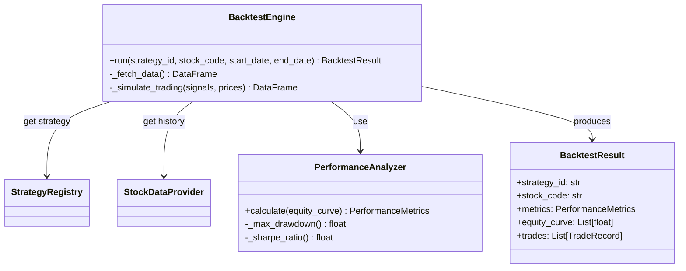

# Story Implementation Plan: 基础回测引擎

**Story ID**: 1.5  
**Story Name**: 基础回测引擎 (Backtest Engine)  
**开始日期**: 2025-12-13  
**预期完成**: 2025-12-15  
**负责人**: Antigravity  
**AI模型**: Claude (Design & Code)

---

## 📋 Story概述

### 目标
开发一个轻量级的向量化回测引擎，支持对已注册的策略均值进行历史数据回测，并生成核心绩效指标报告。

### 验收标准
- [ ] 实现 `BacktestEngine` 类，支持单策略单标的回测
- [ ] 实现 `PerformanceAnalyzer`，计算收益率、最大回撤、夏普比率、胜率
- [ ] 支持通过 `StrategyRegistry` 加载策略进行回测
- [ ] 输出标准化的回测报告（JSON/Dict格式）
- [ ] 单元测试覆盖率 ≥ 80%

### 依赖关系
- **依赖Story**: 
  - Story 1.3 (BaseStrategy & Registry) - 已完成
  - Story 1.2 (StockDataProvider) - 已完成
- **外部依赖**: 
  - Pandas/Numpy (向量化计算)
  - StockDataProvider (历史数据)

---

## 🎯 需求分析

### 功能需求

#### 1. BacktestEngine (核心引擎)
**职责**: 协调数据获取、策略运行和结果计算。
**输入**: 
- `strategy_id`: 策略ID
- `stock_code`: 标的代码
- `start_date`, `end_date`: 回测区间
- `initial_capital`: 初始资金

**流程**:
1. 从 `StrategyRegistry` 获取策略实例
2. 通过 `StockDataProvider` 获取历史K线除权数据
3. 调用策略的 `on_bar` (或向量化接口) 生成信号序列
4. 根据信号模拟交易（假设以收盘价成交）
5. 计算每日净值曲线

#### 2. PerformanceAnalyzer (绩效分析)
**职责**: 基于净值曲线计算绩效指标。
**指标**:
- **Total Return**: 总收益率
- **Annualized Return**: 年化收益率
- **Max Drawdown**: 最大回撤
- **Sharpe Ratio**: 夏普比率 (无风险利率默认 3%)
- **Win Rate**: 胜率 (盈利交易次数/总交易次数)

### 非功能需求
- **性能**: 1年历史数据回测应在 1s 内完成 (Python Loop vs Vectorized)
- **精度**: 资金计算保留4位小数
- **可扩展性**: 为未来支持多标的、多策略组合预留接口

---

## 🏗️ 技术设计

### 架构设计



### 核心组件设计

#### 1. Vectorized Backtesting (向量化回测)
虽然 `BaseStrategy` 定义了 `on_bar` (逐K线)，但为了性能，回测引擎应优先尝试向量化计算。
如果策略支持向量化生成信号，则调用之；否则回退到循环调用 `on_bar`。

**数据流**:
1. 获取 DataFrame (Date, Open, High, Low, Close, Volume)
2. 策略生成 Signal Series (Buy=1, Sell=-1, Hold=0)
3. Position Series = Signal.shift(1).cumsum() (简化模型)
4. Daily Return = Position * Market Return
5. Equity Curve = (1 + Daily Return).cumprod() * Initial Capital

#### 2. 交易模拟假设
- **成交价格**: 次日开盘价 (Open) 或 当日收盘价 (Close) —— **决策**: 默认使用**当日收盘价**进行简化回测 (MOC - Market On Close)，后续可配置。
- **交易成本**: 佣金 0.03% (万三)，印花税 0.1% (卖出时)
- **滑点**: 默认 0

### 接口定义

```python
class BacktestConfig(BaseModel):
    initial_capital: float = 100000.0
    commission_rate: float = 0.0003
    stamp_duty: float = 0.001
    use_next_open: bool = False  # True: 次日开盘成交, False: 当日收盘成交

class BacktestResult(BaseModel):
    strategy_id: str
    stock_code: str
    time_range: Tuple[datetime, datetime]
    metrics: Dict[str, float]
    equity_curve: List[float]  # 简化传输，实际可能是JSON
    trades: List[Dict]

class BacktestEngine:
    def __init__(self, data_provider: StockDataProvider):
        self.data_provider = data_provider
    
    async def run(
        self, 
        strategy_id: str, 
        stock_code: str, 
        start_date: str, 
        end_date: str,
        config: BacktestConfig = BacktestConfig()
    ) -> BacktestResult:
        # Implementation
        pass
```

---

## 📁 文件变更

### 新增文件
- `src/backtest/engine.py` - 回测引擎核心
- `src/backtest/analyzer.py` - 绩效分析器
- `src/backtest/models.py` - 回测配置与结果模型
- `tests/unit_tests/test_backtest_engine.py`
- `tests/unit_tests/test_performance_analyzer.py`

### 修改文件
- `src/strategies/base.py` - (可选) 增加 `generate_signals_vectorized` 接口支持向量化

---

## 🔄 实现计划

### Phase 1: 基础框架 (4h)
- 定义数据模型 (`BacktestConfig`, `BacktestResult`)
- 实现 `PerformanceAnalyzer` (纯数学计算)
- 编写 Analyzer 单元测试

### Phase 2: 引擎实现 (6h)
- 实现 `BacktestEngine.run` 主逻辑
- 集成 `StockDataProvider` (Mock数据用于开发)
- 实现基于 Loop 的回测逻辑 (兼容所有 `BaseStrategy`)
- (Optional) 实现向量化回测逻辑

### Phase 3: 测试与验证 (2h)
- 编写集成测试：使用简单均线策略验证回测准确性
- 对比手动计算结果

---

## 🚨 风险与缓解

| 风险 | 缓解 |
|------|------|
| 历史数据获取慢 | 实现本地数据缓存 (Pickle/Parquet) |
| 循环回测速度慢 | 优先实现 Numba 加速或向量化路径 |
| 策略Lookahead Bias | 严格使用 `shift(1)` 确保只能用过去数据 |

---

## ✅ 完成检查清单

- [ ] 实现 BacktestEngine
- [ ] 实现 PerformanceAnalyzer
- [ ] 单元测试覆盖率 >= 80%
- [ ] 通过已知的简单策略(如买入持有)验证结果准确性
