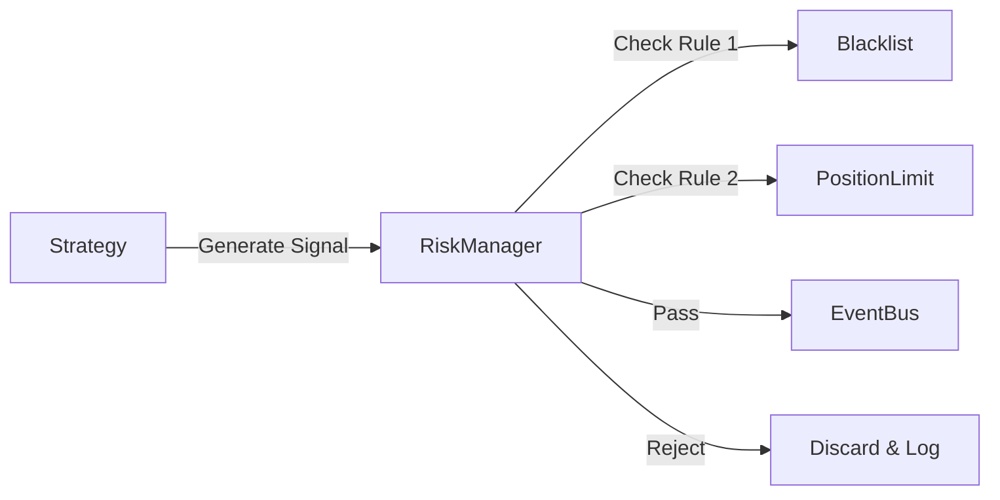

# Story 1.7: 风险控制模块实施方案

## 1. 目标描述

构建一个独立于策略逻辑之外的风控层 (`Risk Control Layer`)。
它的职责是**拦截**和**验证**所有由策略生成的交易信号，确保交易符合全局风控约束（如单股持仓限制、黑名单、资金上限等）。

## 2. 核心组件设计

### 2.1 架构设计

采用 **拦截过滤器模式 (Intercepting Filter Pattern)**。
在策略生成 `Signal` 后，发送到 `EventBus` 之前（或由 `RiskManager` 统一处理），必须经过一系列 `RiskRule` 的检查。



### 2.2 核心类定义

#### RiskRule (Base Class)
所有风控规则的基类。

```python
class RiskRule(ABC):
    async def check(self, signal: Signal, context: Dict) -> bool:
        """返回 True 表示通过，False 表示拒绝"""
```

#### RiskManager (Core)
负责加载规则并串行执行检查。

```python
class RiskManager:
    def add_rule(self, rule: RiskRule): ...
    async def validate(self, signal: Signal) -> bool: ...
```

### 2.3 预置规则 (MVP Scope)

1.  **StaticBlacklistRule**: 静态黑名单过滤（如 ST 股、人工拉黑）。
2.  **TradingHoursRule**: 交易时间检查（避免非交易时间发单）[之前有实现，可以复用]。
3.  **PriceLimitRule**: 价格有效性检查（避免 0 元或负数价格）。

## 3. 详细变更 (Proposed Changes)

### 3.1 新增模块 [NEW]

-   **src/core/risk.py**: 定义 `RiskManager` 和 `RiskRule` 基类。
-   **src/strategies/rules.py**: 实现具体的风控规则类。

### 3.2 现有代码修改 [MODIFY]

-   **src/strategies/base.py**: 在 `generate_signal` 或后续流程中注入 `RiskManager`。
-   **src/main.py**: 初始化 `RiskManager` 单例。

## 4. 验证计划

1.  **单元测试**: 
    - 测试黑名单规则是否正确拦截。
    - 测试 RiskManager 能否正确执行多条规则。
2.  **集成测试**: 
    - 模拟策略发出违规信号，验证最终未进入 EventBus 或被标记为 Rejected。

## 5. 风险与假设

-   **假设**: 暂时不需要复杂的资金/持仓风控（因为目前没有实盘持仓数据同步）。
-   **风险**: 风控检查可能增加微小的延迟，需确保规则逻辑高效。
