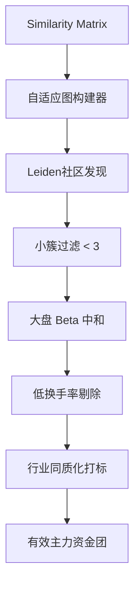

# Story Implementation Plan

**Story ID**: 003.02
**Story Name**: 社区发现与特征去噪引擎 (ClusteringEngine)
**Epic**: 003 (Tick Data Strategy Core Analysis)
**开始日期**: 2026-02-25
**预期完成**: 2026-02-27
**负责人**: Antigravity
**AI模型**: o1 (算法设计与规划)

---

## 确认的设计决策 (Confirmed Decisions)

> [!NOTE]
> **设计已确认**:
> 1. **社区提取算法**：已确认采用最优的 `leidenalg` (Leiden算法) 进行社区发现，需要增加 C++ 扩展依赖 (`igraph`, `leidenalg`)。
> 2. **噪音过滤阈值**：已确认采用严格过滤机制，不要降权。一旦触发大盘 Beta 高度相关(>0.9)或行业极度同质化(>80%)，直接予以剔除。

---

## 📋 Story概述

### 目标
承接前置的 `SimilarityEngine` 输出的稀疏距离矩阵，将其解析为无向加权图。应用复杂的社区检测（Community Detection）算法寻找紧密联动的股票群组。并应用四大数据过滤防线（小簇、Beta中和、同质化、流动性）洗出具有高信噪比的真实资金联动团伙。

### 验收标准
- [ ] 构建自适应相似度阈值的无向图，稀疏化率维持在保留 Top 5%-10% 优质边。
- [ ] 成功使用 Leiden/Louvain 算法完成高质量群落划分。
- [ ] 成功应用 4 层过滤规则（成员数<3、大盘相关性>0.9、交易极度不活跃等）。
- [ ] 算法具有平滑性：针对同一批次数据的跨日稳定性进行 Jaccard 相似度评估 (需要稳定 > 0.5)。
- [ ] 最终单日输出精选有效 Cluster 数量稳定在 5-20 个之间。

### 依赖关系
- **输入**: `SimilarityMatrix` (阶段 1 产生的成对距离数据)
- **前置依赖**: Epic-002 (K线基准数据，用于计算收益率 Beta)、get-stockdata 基础财务属性（所属行业）。

---

## Proposed Changes

### 架构设计

### [Clustering Engine Component]

#### [NEW] src/analysis/clustering/graph_builder.py
将二维距离矩阵转换为 `networkx` 或 `igraph` 格式。包含自适应截断机制，动态决定切断哪些长距离边以保证网络稀疏度。

#### [NEW] src/analysis/clustering/leiden_detector.py
核心图划分算法，调用 `leidenalg`。实现基于模块度（Modularity）最大优化的群组切割。包括调整 Resolution parameter 避免过度碎裂。

#### [NEW] src/analysis/clustering/noise_filters.py
所有噪音过滤器的纯函数实现：
- `filter_small_clusters()`
- `filter_market_beta_clusters()`
- `filter_industry_homogeneity()`
- `filter_low_turnover_clusters()`

#### [NEW] src/analysis/clustering/engine.py
组装整个分步执行的管线（Pipeline），对外暴露单一的 `run_clustering()` API。负责调用 `get-stockdata` 拉取用于过滤的外部辅助数据（如大盘K线、行业映射等）。

#### [NEW] src/core/models/cluster.py
定义 `FundCluster` 模型类，包含聚类内部所有 `stock_code` 及其平均相似度、行业占比分布等元数据。

---

## Verification Plan

### Automated Tests
- **隔离测试**: 针对 `noise_filters.py` 中的各类噪音，人工伪造“全证券类”簇、“全跌停”簇进行精准猎杀验证。
- **稳定性测试**: 随机打乱输入 `SimilarityMatrix` 中节点的顺序，断言 Leiden 算法输出的 Cluster 划分应保持高度一致（容忍微小变动，但核心群组不变）。

### Manual Verification
- 抽样查看最终输出的 5 个 Cluster，拉取近期的新闻研报或 K 线肉眼查验是否真的具备明显的“同板块但非同行业、异动时间极为一致”的主力介入特征。
