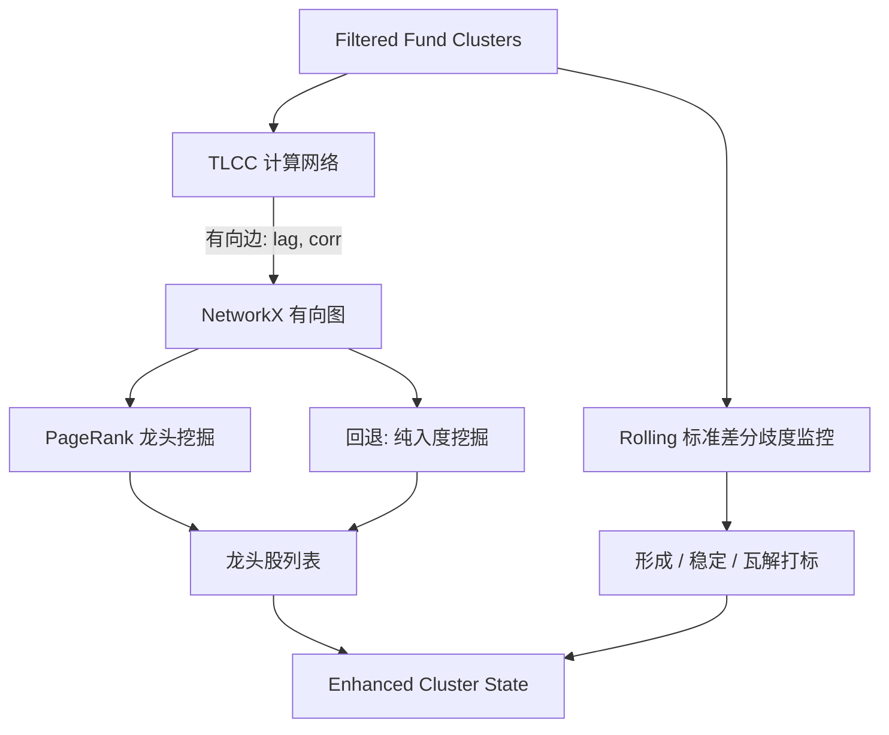

# Story Implementation Plan

**Story ID**: 003.03
**Story Name**: 龙头识别与趋势判定 (LeadLagAnalyzer)
**Epic**: 003 (Tick Data Strategy Core Analysis)
**开始日期**: 2026-02-25
**预期完成**: 2026-02-28
**负责人**: Antigravity
**AI模型**: o1 (算法设计与规划)

---

## User Review Required

> [!IMPORTANT]
> 这是整个分析管线中最核心的“点石成金”环节。我们需要在清洗过的资金团伙中，利用“时间差”和“影响力图”揪出最终的领涨龙头，并判断行情周期。
> 
> 请您评估：
> 1. **TLCC 算法性能**：对于计算每一对股票的 `max_lag=15`（即正负15分钟共31次平移计算相关性），相比原生的 Pandas/Numpy 循环，是否有必要像 DTW 环节一样引入 Numba 加速？（本案预估群组规模较小，拟暂用 Numpy 向量化计算即可，保留引入 Numba 的空间）。
> 2. **小集群容错机制**：设计文档指出当 Cluster 规模 < 5 时，可能因为矩阵过小导致 PageRank 不稳定，建议降级使用加权入度 (Weighted In-degree)。该机制已纳入本方案，是否同意执行？
> 3. **OBI 动量增强**：设计文档提到这是一个 (可选) 环节。考虑到我们需要优先跑通主流程，本次 Story 是否先将 OBI 动量作为预留接口，后续迭代再深入开发？

---

## 📋 Story概述

### 目标
在 Story 003.02 输出的高质量“主力资金团伙 (FundClusters)”内进行微观层面的战术挖掘。利用时滞互相关 (TLCC) 构建集群内的领先-跟随有向网，运用 PageRank 找到发号施令的龙头老大；同时，使用成员收益率的滚动标准差计算分歧度，研判该群组目前处于形成期 (Formation)、稳定期 (Steady) 还是瓦解期 (Dissolution)。

### 验收标准
- [ ] 成功编写 Numpy 向量化的 TLCC 引擎提取最佳时滞差 `best_lag` 和显著相关性 `max_corr`（要求 `max_corr > 0.5` 且 `|best_lag| >= 2`）。
- [ ] 构建 `NetworkX` 有向图并应用 `PageRank` 提取龙头，包含对于小集群节点的智能降级机制。
- [ ] 依据时序收益率数组计算 `Rolling STD` 以评估动态分歧度，精准划分资金派系趋势。
- [ ] 完整集成 `LeadLagAnalyzer` 并输出带有强特征标记的增强数据结构。

### 依赖关系
- **输入**: `FundCluster` 列表及原始的 `240` 维分钟收益率时序矩阵。
- **外部依赖**: NetworkX, Numpy, Pandas, Scipy。

---

## Proposed Changes

### 架构设计

### [LeadLag Analyzer Component]

#### [NEW] src/analysis/leadlag/tlcc_calculator.py
纯粹的数学引擎。接收两组对齐的 Numpy 数组，利用 Numpy 全向量化平移计算 `-max_lag` 到 `+max_lag` 之间的皮尔逊系数。返回拥有最大 `corr` 的偏移量及其数值。

#### [NEW] src/analysis/leadlag/pagerank_sorter.py
负责接收 TLCC 连边，建立包含节点重量的有向图（边从领先股指向跟随股）。执行标准 `alpha=0.85` 的阻尼有向图计算。内置一个自动策略：当节点数 `<5` 时切换为简单的统计入度计算规避马尔可夫链稀疏矩阵报错。

#### [NEW] src/analysis/leadlag/divergence_monitor.py
定义 `TrendPhase` 枚举值及计算滚动标准差（Rolling STD）。它要求对集群所有股票组合矩阵后执行 `std().mean(axis=1)` 然后拿最新值同历史分位数做比较。

#### [NEW] src/analysis/leadlag/engine.py
上层门面 (Facade)。暴露一个 `analyze_clusters(clusters, returns_data) -> List[EnhancedCluster]` 的主调函数处理业务流。

#### [MODIFY] src/core/models/cluster.py
对现有模型扩充结构以接纳增广特征，亦或在其旁新建 `EnhancedCluster` 承载：
- `leader_stock: str`
- `pagerank_score: float`
- `current_divergence: float`
- `trend_phase: str`

---

## Verification Plan

### Automated Tests
- **TLCC 准确度断言**: 强行伪造序列 B 就是序列 A 整体向后移动 5 步产生的数据。断言 `tlcc_calculator` 能否完美命中 `best_lag = +5, corr = 1.0`。
- **平稳图论回退测试**: 传给 `pagerank_sorter` 只有 3 个节点的玩具图，断言系统正确放弃复杂 PageRank 并改用入度求和得出预期龙头。
- **趋势划分测试**: 构造一组高度发散的收益率（导致 std 高企）断言枚举值跌入 `DISSOLUTION`。

### Manual Verification
人工核对 `get-stockdata` 日志与输出的 JSON。查看被标记为龙头的特定股票在 K 线上是否真的发生提拉领先动作。
