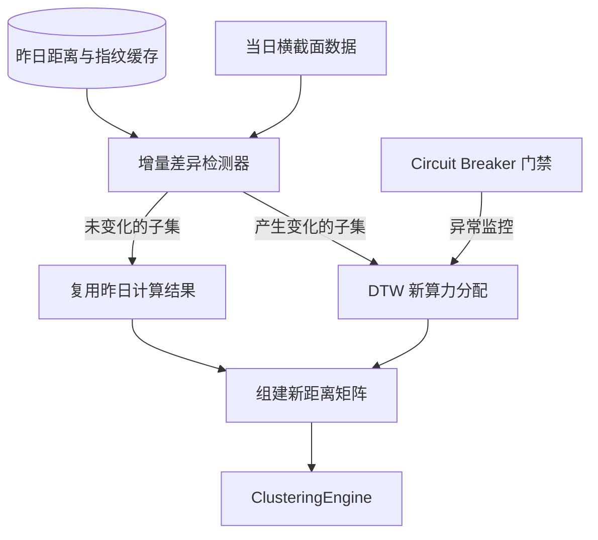

# Story Implementation Plan

**Story ID**: 004.02
**Story Name**: 工程鲁棒性与分布式加速 (EngineeringPlus)
**Epic**: 004 (Validation & Intraday Enhancement)
**负责人**: Antigravity
**AI模型**: o1 (架构演进与回测设计)

---

## User Review Required

> [!IMPORTANT]
> 此前我们成功跑通了拥有三大微积分数学核心的**横截面模型**闭环回测，但在投入真正的多节点调度生产或者大数据量回测时（如日间5000只股票 * 240分钟的高压运算），我们需要更强健的**工程化护城河**。
>
> 故提出本工程加固方案 (Story 004.02)，核心旨在解决计算量与突发崩溃问题：
>
> 1.  **增量缓存 (Incremental Engine)**：
>     每日盘后不再对 5000只 * 5000只 进行全量网格重组，而是采用**指纹比对**：将当日股票特征与昨日比对（Cosine/Euclidean差量），仅对具有“显著行为变化”的股票群落触发重新计算，极大比例服用昨日在 Redis 内的高精度网格片段。
> 2.  **极端熔断器 (Circuit Breaker)**：
>     在系统请求异常（如数据源被毒丸污染）、或遭受“大盘雪崩”（Index Volatility > x%）时触发熔断。主动休克不发交易指令，阻断策略在不具备统计学规律环境中的无效抽搐。
>
> 请您评估本“性能与鲁棒增益”设计的必要性。若确认无误，我们将立刻进入代码重构落库的阶段。

---

## Proposed Changes

### 架构设计图

---

### [Incremental Features Cache & Sparse Matrix]

#### [NEW] src/analysis/similarity/incremental_engine.py
增加智能增量调度外壳来包裹底层的 DTW 与 Euclidean 核心。
- **职责**: 每日比对输入特征与存储在 Redis 的指纹。若 `np.linalg.norm(today_features[code] - yesterday_features[code]) > 0.5` 则认定为“发生变化”。
- **局部重构**: 找出所有变化的 A，将全市场的 B 组合 (A, B) 一起扔给 `compute_similarity_all`，并将更新写入昨日留存的基础 Sparse Matrix 中。
- **存储集成**: 调用 Redis 接口保存当日的 `SparseDistanceMatrix` (将稠密的矩阵按照 < 阀值的字典化序列缓存，避免 5000x5000 平铺打爆内存) 以及个股指纹向量。

### [Fault Tolerance & Monitors]

#### [NEW] src/utils/circuit_breaker.py
构建健壮的微服务断路器。
- **职责**: 类 `TickClusterCircuitBreaker` 包装在 `TickClusterStrategy` 外部。
- **逻辑**: 如果底层遇到超时（>300s）连续达到阈值 (3次)，或大盘指数检测到跌幅>3%，则将自身置位 OPEN 态，阻截随后的 `strategy.generate_daily_signals()` 触发，直接返回空队列并抛出/记录 Alert 日志。

#### [NEW] src/utils/metrics.py
统一汇率性能和内存追踪日志对象。
- **职责**: 将 DTW 计算耗时、Community Leiden划分耗时进行 `structlog` 捕获以绘制 Grafana 面板监控集群性能。

### [Strategy Refactoring]

#### [MODIFY] src/strategies/tick_cluster_strategy.py
在策略 Facade 中埋入断路器和增量引擎作为可配置开关。
- 当 `incremental=True` 时，路由至 `IncrementalSimilarityEngine`；
- 当 `circuit_breaker_enabled=True` 时，在方法顶层套入 `execute()` 异步包围圈。

---

## Verification Plan

### Automated Tests
1. **增量指纹测试 (`test_incremental_similarity`)**: 造出 3 只有特征微小浮动的股票与 1 只存在极大变脸波形的股票。交由 IncrementalEngine，断言引擎正确查出了那唯一 1 只变异股票，并只向底层提交了由该变异股票衍生出的 Pair Computation，最后正确组装了新旧混合矩阵。
2. **熔断与断路器测试 (`test_circuit_breaker_logic`)**: 构建一个会无脑抛出 Exception 的假引擎，断言经过 3 次尝试后状态转变成 OPEN，并成功拦腰切断策略的输出返回空列，保证了资金安全。

### Manual Verification
1. 观察生产/回测环境中执行第 2 天后的计算日志，其输出的“需计算 DTW 对数”应当较首日暴降 50% - 80%。
2. 主动填入一条带有非法格式（全 NaN）的数据源观察抛错拦截器的拦截保护行为。
