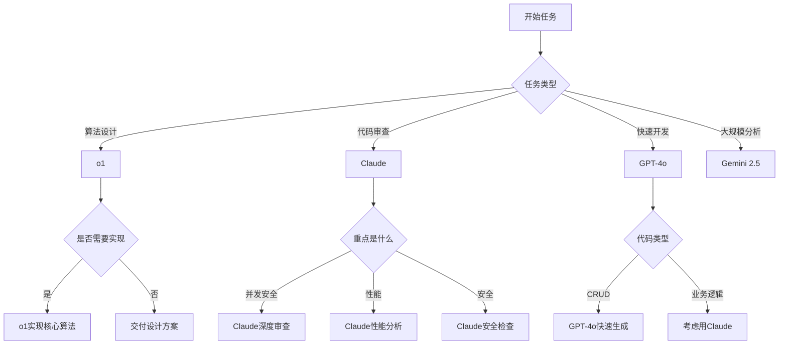

# AI模型选择指南
**项目**: quant-strategy microservice  
**适用范围**: 所有开发阶段的AI协作  
**最后更新**: 2025-12-13

---

## 🎯 指南目的

本指南帮助开发者在不同开发阶段选择最优的AI模型，充分发挥Antigravity的协作能力，提升开发效率和代码质量。

---

## 📊 模型能力矩阵

| 能力维度 | Claude 4.5 Sonnet | GPT-4o | Gemini 2.5 Pro | o1 |
|---------|------------------|--------|----------------|-----|
| **代码审查** | ⭐⭐⭐⭐⭐ | ⭐⭐⭐⭐ | ⭐⭐⭐⭐ | ⭐⭐⭐ |
| **代码生成速度** | ⭐⭐⭐ | ⭐⭐⭐⭐⭐ | ⭐⭐⭐⭐ | ⭐⭐ |
| **复杂推理** | ⭐⭐⭐⭐ | ⭐⭐⭐⭐ | ⭐⭐⭐⭐ | ⭐⭐⭐⭐⭐ |
| **并发安全检查** | ⭐⭐⭐⭐⭐ | ⭐⭐⭐⭐ | ⭐⭐⭐⭐ | ⭐⭐⭐ |
| **文档生成** | ⭐⭐⭐⭐ | ⭐⭐⭐⭐⭐ | ⭐⭐⭐⭐ | ⭐⭐⭐ |
| **上下文窗口** | 200K tokens | 128K tokens | 1M tokens | 128K tokens |
| **响应速度** | 中 | 快 | 中 | 慢 |
| **成本效益** | 中 | 高 | 中 | 低 |

---

## 🔧 按开发阶段选择

### 阶段1: Story规划
**推荐模型**: Claude 4.5 Sonnet 或 GPT-4o

**原因**:
- 需要理解业务需求和技术约束
- 需要分解复杂任务
- 需要识别依赖关系

**使用示例**:
```
用Claude分析EPIC-002 Story 2.1风险否决过滤器，
生成详细的任务分解和技术需求
```

---

### 阶段2: 技术设计

#### 2a. 常规设计
**推荐模型**: Claude 4.5 Sonnet

**原因**:
- 理解力强，能准确把握技术细节
- 擅长架构设计和API设计
- 能识别潜在的并发安全问题

**使用示例**:
```
用Claude为Story 1.3策略基类设计，
生成implementation_plan，包括：
- BaseStrategy抽象类设计
- Signal数据结构定义
- 策略注册表机制
```

#### 2b. 算法密集型设计
**推荐模型**: o1

**原因**:
- 擅长数学推导和复杂推理
- 能优化算法复杂度
- 适合量化策略的数学模型设计

**使用示例**:
```
用o1设计OFI（订单流失衡）策略算法，
包括：
- 主动买卖单识别算法
- 失衡度计算公式推导
- 信号触发阈值优化
```

#### 2c. 大规模系统设计
**推荐模型**: Gemini 2.5 Pro

**原因**:
- 大上下文窗口（1M tokens）
- 能理解多文件依赖关系
- 适合微服务架构设计

**使用示例**:
```
用Gemini分析整个quant-strategy服务，
生成EPIC-003波段增强策略的系统设计：
- 与get-stockdata的集成方案
- Redis缓存架构
- 任务调度设计
```

---

### 阶段3: 代码实现

#### 3a. 快速原型开发
**推荐模型**: GPT-4o

**原因**:
- 生成速度最快
- 适合CRUD、数据模型等常规代码
- 并行能力强

**使用示例**:
```
用GPT-4o快速实现StockDataProvider的增删改查API
```

#### 3b. 核心业务逻辑
**推荐模型**: Claude 4.5 Sonnet

**原因**:
- 代码质量高
- 自动添加完整的类型提示和文档
- 错误处理更完善

**使用示例**:
```
用Claude实现策略引擎的信号生成逻辑，
要求严格遵循CODING_STANDARDS.md
```

#### 3c. 算法实现
**推荐模型**: o1

**原因**:
- 能将数学公式准确转换为代码
- 优化算法性能
- 避免数值计算错误

**使用示例**:
```
用o1实现VWAP乖离策略的核心算法：
- 滑动窗口VWAP计算
- 价格乖离度计算
- 信号强度量化
```

---

### 阶段4: 代码审查

#### 4a. 并发安全审查（推荐）
**推荐模型**: Claude 4.5 Sonnet

**原因**:
- 最擅长识别race condition
- 能检查asyncio.Lock的正确使用
- 能发现资源泄漏问题

**使用示例**:
```
用Claude审查ConnectionPool类的并发安全性，
重点检查：
- Lock的使用是否正确
- 是否有race condition
- 资源释放是否完整
```

#### 4b. 性能审查
**推荐模型**: Claude 4.5 Sonnet 或 GPT-4o

**使用示例**:
```
审查信号生成函数的性能，
确保延迟 < 100ms
```

#### 4c. 安全审查
**推荐模型**: Claude 4.5 Sonnet

**使用示例**:
```
审查API端点的输入验证和错误处理
```

---

### 阶段5: 测试生成

#### 5a. 单元测试
**推荐模型**: GPT-4o

**原因**:
- 生成速度快
- 适合批量生成测试用例
- 覆盖面广

**使用示例**:
```
用GPT-4o为BaseStrategy类生成完整的单元测试，
包括正常case和边界case
```

#### 5b. 并发测试（重要）
**推荐模型**: Claude 4.5 Sonnet

**原因**:
- 能设计复杂的并发测试场景
- 参考 `test_mootdx_connection_concurrency.py` 风格

**使用示例**:
```
用Claude为StrategyRegistry生成并发测试，
模拟多协程同时注册和查询策略
```

---

### 阶段6: 文档生成

#### 6a. API文档
**推荐模型**: GPT-4o

**原因**:
- 生成速度快
- 格式规范

**使用示例**:
```
用GPT-4o为新增的策略管理API生成OpenAPI文档
```

#### 6b. 技术文档
**推荐模型**: Claude 4.5 Sonnet

**原因**:
- 准确性高
- 能生成详细的技术说明

**使用示例**:
```
用Claude生成EPIC-002的技术设计文档，
包括架构图和核心算法说明
```

#### 6c. Walkthrough演示
**推荐模型**: GPT-4o

**原因**:
- 快速生成演示文档
- 能自动截图和录屏

**使用示例**:
```
用GPT-4o生成Story 1.3的walkthrough文档，
展示策略注册和信号生成流程
```

---

## 📌 量化策略项目专用推荐

### 核心场景映射

| 开发场景 | 推荐模型 | 备选模型 | 原因 |
|---------|---------|----------|------|
| **策略算法设计** | o1 | Claude | 需要数学推导 |
| **异步代码审查** | Claude | GPT-4o | 并发安全关键 |
| **数据适配层开发** | GPT-4o | Claude | 快速生成CRUD |
| **回测引擎实现** | Claude | o1 | 业务逻辑复杂 |
| **风控算法实现** | o1 | Claude | 数学模型精确性 |
| **API快速开发** | GPT-4o | Claude | 开发速度优先 |
| **大规模重构** | Gemini 2.5 | Claude | 大上下文需求 |
| **性能优化** | Claude | o1 | 深度分析能力 |

---

## 🚀 模型组合策略

### 策略1: 双模型协作（推荐）
**场景**: 复杂Story开发

```
1. 设计阶段: Claude生成implementation_plan
2. 算法部分: o1实现核心算法
3. 其他代码: GPT-4o快速生成
4. 代码审查: Claude审查全部代码
5. 测试生成: GPT-4o生成测试
6. 并发测试: Claude生成并发测试
```

### 策略2: 单模型主导
**场景**: 简单Story或Bug修复

```
全程使用Claude或GPT-4o
```

### 策略3: 流水线模式
**场景**: 批量开发多个类似功能

```
1. Claude设计第一个功能的方案
2. GPT-4o批量生成相似功能的代码
3. Claude统一审查代码质量
```

---

## ⚠️ 注意事项

### 避免的使用方式
❌ 频繁在同一任务中切换模型（会丢失上下文）  
❌ 用o1做简单的CRUD代码（浪费成本和时间）  
❌ 用GPT-4o做复杂的并发安全审查（可能遗漏问题）

### 推荐的使用方式
✅ 在任务开始时选定主模型  
✅ 仅在特定子任务时切换到专用模型  
✅ 保持上下文连贯性

---

## 📝 快速决策树



---

## 🔗 相关文档

- [项目开发规范](./PROJECT_DEVELOPMENT_STANDARD.md)
- [质量门控清单](./QUALITY_GATE_CHECKLIST.md)
- [Python编码标准](../CODING_STANDARDS.md)

---

## 💡 实战案例

### 案例1: Story 1.3 策略基类设计
```
设计阶段: Claude 生成 implementation_plan
实现阶段: Claude 实现 BaseStrategy（并发安全关键）
测试阶段: GPT-4o 生成单元测试 + Claude 生成并发测试
文档阶段: GPT-4o 生成 API 文档
```

### 案例2: EPIC-002 风险否决过滤器
```
算法设计: o1 设计评分算法和阈值优化
数据适配: GPT-4o 实现数据获取接口
核心逻辑: Claude 实现风险评估引擎
性能优化: o1 优化批量处理算法
测试: GPT-4o 生成测试 + Claude 审查
```

---

*版本: 1.0*  
*维护者: 项目开发团队*  
*基于: Antigravity实际模型能力 + 量化策略项目实践经验*
