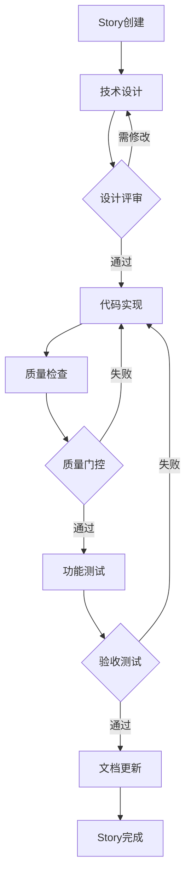

# 量化策略项目开发规范
**项目**: quant-strategy microservice  
**适用范围**: 所有EPIC、Story、Task开发  
**最后更新**: 2025-12-13

---

## 📋 规范目的

本规范基于 **Antigravity AI 协作能力**，结合 **量化金融系统的特殊要求**，定义标准化开发流程，确保：
- ✅ 代码质量和安全性
- ✅ 开发效率和可维护性
- ✅ 团队协作一致性
- ✅ AI协作最佳实践

---

## 🎯 开发流程概览



---

## 📐 阶段1: Story规划

### 人工职责
- 在 `TASK_PROGRESS.md` 中创建Story
- 定义验收标准和优先级
- 识别依赖关系

### AI辅助内容
- 任务分解建议
- 工作量估算
- 技术风险识别

### 交付物
- [ ] `TASK_PROGRESS.md` 更新（新Story条目）
- [ ] Story技术需求明确

---

## 📝 阶段2: 技术设计（半自动模式）

### 推荐AI模型
- **设计方案生成**: Claude 4.5 Sonnet（理解力强）
- **架构图绘制**: GPT-4o（快速生成Mermaid图）
- **算法设计**: o1（复杂推理）

### 标准流程
```bash
# 1. AI生成设计方案
"请为Story X.X创建技术设计方案，参考implementation_plan模板"

# 2. 人工审核要点
- 数据模型设计是否合理
- API接口是否符合RESTful规范
- 是否考虑并发安全
- 是否符合编码标准（见CODING_STANDARDS.md）

# 3. 确认后进入实现阶段
```

### 交付物
- [ ] `plans/stories/epic00X/story_X.X_implementation_plan.md`
- [ ] 架构图（Mermaid格式）
- [ ] 数据模型定义
- [ ] API接口设计

### 质量检查点
- [ ] 是否考虑异步安全（asyncio.Lock）
- [ ] 是否定义资源清理（initialize/close）
- [ ] 是否包含错误处理策略
- [ ] 是否符合 `Asia/Shanghai` 时区要求

---

## 💻 阶段3: 代码实现（AI主导）

### 推荐AI模型
- **快速开发**: GPT-4o（生成速度快）
- **复杂逻辑**: Claude 4.5 Sonnet（代码质量高）
- **算法实现**: o1（推理能力强）

### 标准流程
```bash
# 1. 创建文件结构
"根据implementation_plan创建文件结构"

# 2. 实现核心逻辑
"实现Story X.X的核心功能，严格遵循CODING_STANDARDS.md"

# 3. 添加类型提示和文档
"为所有函数添加类型提示和docstring"
```

### 强制要求
- ✅ **类型提示**: 所有函数参数和返回值必须有类型提示
- ✅ **异步安全**: 共享状态必须使用 `asyncio.Lock`
- ✅ **文档字符串**: 所有公开接口必须有docstring
- ✅ **错误处理**: 使用具体异常类型，不允许bare `except`
- ✅ **资源管理**: 使用 `try...finally` 或 `async with`

### 人工审查重点
- 并发安全性（尤其是连接池、统计数据）
- 资源释放逻辑
- 时区处理（必须 `Asia/Shanghai`）
- 性能关键路径

### 交付物
- [ ] 源代码文件（`src/` 目录）
- [ ] 单元测试文件（`tests/` 或 `unit_tests/` 目录）
- [ ] 配置文件更新（如有）

---

## 🔍 阶段4: 质量检查（自动化）

### 质量门控标准
详见 [`QUALITY_GATE_CHECKLIST.md`](./QUALITY_GATE_CHECKLIST.md)

### 自动化检查流程
```bash
# 使用workflow自动执行
/.agent/workflows/code_quality_check.md
```

### 必须通过的检查
1. **代码风格**: `ruff check` 无错误
2. **类型安全**: `mypy` 无错误（严格模式）
3. **测试覆盖率**: 核心模块 ≥ 80%
4. **并发测试**: 如有共享资源，必须有并发测试

### 推荐AI模型
- **代码审查**: Claude 4.5 Sonnet（最细致）
- **测试生成**: GPT-4o（速度快）

### 交付物
- [ ] 质量检查报告（`docs/qa/story_X.X_quality_report.md`）
- [ ] 测试覆盖率报告
- [ ] 修复后的代码（如有问题）

---

## ✅ 阶段5: 功能测试与验收

### 测试类型
1. **单元测试**: 独立模块功能
2. **集成测试**: 与外部服务交互（get-stockdata, Redis）
3. **并发测试**: 多线程/协程安全性（必须）
4. **性能测试**: 关键路径延迟（如信号生成 < 100ms）

### 执行环境
```bash
# 必须在Docker环境中执行
docker compose -f docker-compose.dev.yml run --rm quant-strategy pytest
```

### 验收标准
- [ ] 所有单元测试通过
- [ ] 集成测试通过（真实环境或mock）
- [ ] 并发测试无race condition（如适用）
- [ ] 性能指标达标

### 推荐AI模型
- **测试用例生成**: GPT-4o
- **边界case识别**: Claude 4.5 Sonnet

### 交付物
- [ ] 测试执行报告
- [ ] 性能测试结果（如适用）

---

## 📚 阶段6: 文档更新

### 必须更新的文档
1. **`TASK_PROGRESS.md`**: Story状态标记为完成
2. **`docs/reports/PROGRESS_REPORT_YYYYMMDD.md`**: 重大功能需要
3. **API文档**: 如有新增API（`docs/api/`）
4. **Walkthrough**: 复杂功能需要演示（`brain/xxx/walkthrough.md`）

### 推荐AI模型
- **文档生成**: GPT-4o（速度快）
- **技术文档**: Claude 4.5 Sonnet（准确性高）

### 交付物
- [ ] 更新后的项目文档
- [ ] Walkthrough文档（如适用）

---

## � 阶段7: Git代码提交

### 提交规范
- 必须遵循 Conventional Commits
- 格式: `<type>(<scope>): <subject>`
  - `feat`: 新功能
  - `fix`: 修复
  - `docs`: 文档
  - `refactor`: 重构

### 流程
```bash
# 1. 检查更改
git status
git diff

# 2. 添加文件
git add .

# 3. 提交 (自动或人工)
git commit -m "feat(module): description (Story X.X)"
```

### 交付物
- [ ] Git Commit Hash

---

## �🚀 特殊场景处理

### 场景1: 算法密集型Story（如策略算法）
**推荐模型**: o1  
**流程调整**: 设计阶段需要数学推导和证明

### 场景2: 大规模重构
**推荐模型**: Gemini 2.5 Pro（大上下文）  
**流程调整**: 先生成重构方案，人工确认后批量执行

### 场景3: 紧急Bug修复
**简化流程**: 跳过设计阶段，直接进入实现 → 质量检查 → 测试

---

## 📊 质量度量指标

### 代码质量
- 类型覆盖率: ≥ 90%
- 测试覆盖率: ≥ 80%（核心模块）
- Ruff检查: 0 errors

### 性能指标
- 信号生成延迟: < 100ms
- API响应时间: < 200ms（P95）
- 内存使用: 稳定无泄漏

### 开发效率
- Story完成周期: ≤ 3个工作日（中等复杂度）
- Bug修复时间: ≤ 1个工作日

---

## 🔗 相关文档

- [AI模型选择指南](./AI_MODEL_SELECTION_GUIDE.md)
- [质量门控清单](./QUALITY_GATE_CHECKLIST.md)
- [Python编码标准](../CODING_STANDARDS.md)
- [Story开发Workflow](../../.agent/workflows/story_development.md)

---

## 📌 快速启动

### 开始新Story
```bash
"我要开始开发Story X.X，请生成技术设计方案"
```

### 代码质量检查
```bash
"对Story X.X的代码进行质量检查，生成详细报告"
```

### 生成Walkthrough
```bash
"为Story X.X生成walkthrough文档，展示功能和测试结果"
```

---

*版本: 1.0*  
*维护者: 项目开发团队*  
*参考: Antigravity开发指南 + 量化策略项目特殊要求*
