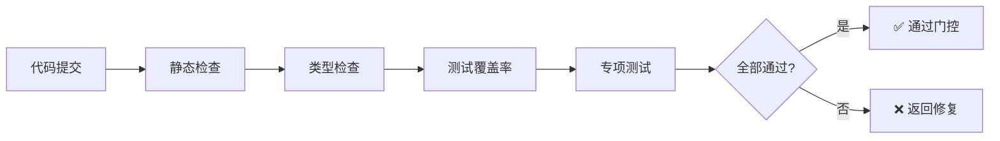

# 质量门控清单
**项目**: quant-strategy microservice  
**适用范围**: 所有Story代码交付前的质量检查  
**最后更新**: 2025-12-13

---

## 🎯 质量门控目的

本清单定义**强制性质量标准**，所有代码必须通过质量门控才能合并到主分支。

---

## ✅ 质量门控总览



---

## 🔍 检查项详细清单

### 1️⃣ 代码风格检查（强制）

#### 工具: Ruff
```bash
# 自动运行
ruff check src/ tests/

# 期望结果
✅ All checks passed!
```

#### 检查项
- [ ] 无语法错误
- [ ] 无未使用的导入
- [ ] 无未使用的变量
- [ ] 行长度 ≤ 100字符（可配置）
- [ ] 无尾随空格

#### 自动修复
```bash
ruff check --fix src/ tests/
```

#### 不通过条件
❌ 任何 `ruff` 报错

---

### 2️⃣ 类型安全检查（强制）

#### 工具: Mypy
```bash
# 严格模式
mypy src/ --strict

# 期望结果
✅ Success: no issues found
```

#### 检查项
- [ ] 所有函数参数有类型提示
- [ ] 所有函数返回值有类型提示
- [ ] 无 `Any` 类型滥用
- [ ] 无隐式 `Optional`

#### 示例：正确的类型提示
```python
from typing import Optional, List
import asyncio

async def fetch_stock_data(
    stock_code: str,
    start_date: str,
    end_date: Optional[str] = None,
    lock: Optional[asyncio.Lock] = None
) -> List[dict]:
    """获取股票数据"""
    pass
```

#### 不通过条件
❌ 任何 `mypy` 类型错误  
❌ 核心模块类型覆盖率 < 90%

---

### 3️⃣ 单元测试（强制）

#### 工具: Pytest
```bash
# 在Docker环境中运行
docker compose -f docker-compose.dev.yml run --rm quant-strategy pytest

# 带覆盖率报告
pytest --cov=src --cov-report=term-missing
```

#### 最低标准
- [ ] 核心模块覆盖率 ≥ 80%
  - BaseStrategy
  - StrategyRegistry
  - StockDataProvider
  - RiskController
- [ ] 工具模块覆盖率 ≥ 60%
- [ ] 所有公开API有测试

#### 测试类型要求
- [ ] 正常流程测试
- [ ] 边界条件测试
- [ ] 异常处理测试

#### 不通过条件
❌ 任何测试失败  
❌ 核心模块覆盖率 < 80%

---

### 4️⃣ 并发安全测试（条件强制）

> **触发条件**: 代码涉及以下任一场景
> - 管理共享状态（连接池、缓存、统计数据）
> - 多协程并发访问
> - 使用 `asyncio.Lock` 或其他同步原语

#### 测试要求
- [ ] 参考 `test_mootdx_connection_concurrency.py` 风格
- [ ] 模拟至少10个并发协程
- [ ] 验证无race condition
- [ ] 验证资源无泄漏

#### 示例测试结构
```python
import asyncio
import pytest

@pytest.mark.asyncio
async def test_strategy_registry_concurrent_access():
    """测试策略注册表并发访问安全性"""
    registry = StrategyRegistry()
    
    async def register_strategy(strategy_id: str):
        await registry.register(strategy_id, SampleStrategy())
    
    # 并发注册10个策略
    tasks = [register_strategy(f"strategy_{i}") for i in range(10)]
    await asyncio.gather(*tasks)
    
    # 验证所有策略都成功注册
    assert len(registry.list_strategies()) == 10
    
    # 验证无重复注册
    strategy_ids = [s.id for s in registry.list_strategies()]
    assert len(strategy_ids) == len(set(strategy_ids))
```

#### 不通过条件
❌ 并发测试失败  
❌ 检测到race condition  
❌ 资源泄漏（连接未关闭、文件句柄未释放）

---

### 5️⃣ 性能测试（条件强制）

> **触发条件**: 代码属于性能关键路径
> - 信号生成逻辑
> - 数据查询接口
> - 回测引擎

#### 性能指标
| 场景 | 指标 | 目标值 |
|------|------|--------|
| 信号生成延迟 | P95延迟 | < 100ms |
| API响应时间 | P95延迟 | < 200ms |
| 批量数据处理 | 吞吐量 | ≥ 1000条/秒 |
| 内存使用 | 峰值内存 | < 500MB |

#### 测试示例
```python
import time
import pytest

@pytest.mark.performance
def test_signal_generation_latency():
    """测试信号生成延迟"""
    strategy = OFIStrategy()
    
    latencies = []
    for _ in range(100):
        start = time.perf_counter()
        signal = strategy.generate_signal(sample_data)
        end = time.perf_counter()
        latencies.append((end - start) * 1000)  # ms
    
    p95_latency = sorted(latencies)[94]  # 第95百分位
    assert p95_latency < 100, f"P95延迟 {p95_latency:.2f}ms 超过100ms"
```

#### 不通过条件
❌ 延迟超过目标值  
❌ 内存泄漏  
❌ CPU使用率异常高

---

### 6️⃣ 代码规范检查（强制）

#### 检查项（参考 CODING_STANDARDS.md）

##### 6.1 异步与并发
- [ ] 所有I/O操作使用 `async/await`
- [ ] 共享状态使用 `asyncio.Lock` 保护
- [ ] 无全局可变状态（除非有Lock保护）

##### 6.2 资源管理
- [ ] 所有服务类实现 `initialize()` 和 `close()` 方法
- [ ] 使用 `try...finally` 或 `async with` 管理资源
- [ ] 数据库连接、HTTP会话正确关闭

##### 6.3 错误处理
- [ ] 使用具体异常类型（不允许 bare `except`）
- [ ] 关键操作有错误日志
- [ ] 外部调用使用重试机制

##### 6.4 时区处理
- [ ] 所有时间使用 `Asia/Shanghai` (CST)
- [ ] 交易时间判断正确（09:30-11:30, 13:00-15:00）

#### 人工审查要点
```python
# ❌ 错误示例
try:
    result = await some_operation()
except:  # bare except
    pass

# ✅ 正确示例
try:
    result = await some_operation()
except ConnectionError as e:
    logger.error(f"Connection failed: {e}")
    raise
finally:
    await cleanup_resources()
```

---

### 7️⃣ 文档完整性（强制）

#### 检查项
- [ ] 所有公开类有docstring
- [ ] 所有公开函数有docstring
- [ ] Docstring包含参数说明
- [ ] Docstring包含返回值说明
- [ ] 复杂逻辑有行内注释

#### Docstring标准格式
```python
async def fetch_realtime_quote(
    self,
    stock_code: str,
    provider: str = "auto"
) -> dict:
    """获取实时行情数据
    
    Args:
        stock_code: 股票代码，格式如 '600519'
        provider: 数据源提供商，可选 'mootdx', 'akshare', 'auto'
    
    Returns:
        实时行情字典，包含:
        - price: 当前价
        - volume: 成交量
        - timestamp: 时间戳
    
    Raises:
        ConnectionError: 数据源连接失败
        ValidationError: 股票代码格式错误
    """
    pass
```

#### 不通过条件
❌ 公开API缺少docstring  
❌ Docstring缺少参数或返回值说明

---

### 8️⃣ 安全检查（推荐）

#### 工具: Bandit
```bash
bandit -r src/
```

#### 检查项
- [ ] 无硬编码密码/密钥
- [ ] 无SQL注入风险
- [ ] 无不安全的随机数生成
- [ ] 无不安全的文件操作

#### 不通过条件
❌ 高危安全漏洞（severity: HIGH）

---

## 🚀 自动化检查流程

### Workflow执行
```bash
# 使用定义的workflow自动执行所有检查
/.agent/workflows/code_quality_check.md
```

### 手动执行（完整检查）
```bash
# 1. 代码风格
ruff check src/ tests/

# 2. 类型检查
mypy src/ --strict

# 3. 单元测试 + 覆盖率
docker compose -f docker-compose.dev.yml run --rm quant-strategy \
  pytest --cov=src --cov-report=term-missing

# 4. 安全检查
bandit -r src/
```

---

## 📊 质量报告模板

检查完成后，应生成质量报告（参考模板：`templates/quality_report.md`）

### 报告必须包含
- [ ] 所有检查项的通过/失败状态
- [ ] 测试覆盖率数据
- [ ] 性能测试结果（如适用）
- [ ] 发现的问题清单
- [ ] 修复建议

---

## ⚠️ 豁免机制

### 允许豁免的情况
1. **原型代码/POC**: 可降低测试覆盖率要求至60%
2. **紧急Bug修复**: 可优先合并，但必须在24小时内补齐测试
3. **第三方库问题**: 类型检查可忽略第三方库错误

### 豁免申请流程
1. 在代码中添加豁免注释
2. 在质量报告中说明豁免原因
3. 记录技术债务

```python
# mypy豁免示例
# type: ignore[attr-defined]  # 第三方库缺少类型定义

# ruff豁免示例
# ruff: noqa: E501  # 超长SQL语句
```

---

## 🔗 相关文档

- [项目开发规范](./PROJECT_DEVELOPMENT_STANDARD.md)
- [AI模型选择指南](./AI_MODEL_SELECTION_GUIDE.md)
- [Python编码标准](../CODING_STANDARDS.md)
- [质量报告模板](../templates/quality_report.md)

---

## 💡 快速检查命令

### 快速检查（开发中使用）
```bash
ruff check src/ && mypy src/ && pytest tests/ -v
```

### 完整检查（提交前使用）
```bash
# 在项目根目录执行
docker compose -f docker-compose.dev.yml run --rm quant-strategy bash -c "
  ruff check src/ tests/ &&
  mypy src/ --strict &&
  pytest --cov=src --cov-report=term-missing &&
  bandit -r src/
"
```

---

*版本: 1.0*  
*维护者: 项目开发团队*  
*基于: 量化金融系统质量要求 + Python最佳实践*
