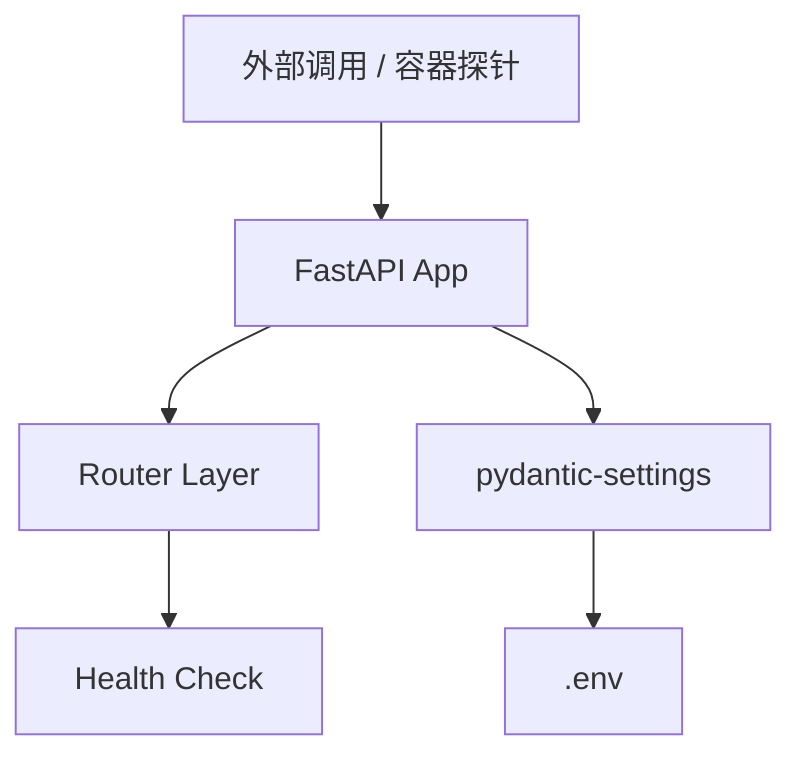

# Story Walkthrough: altdata-source 服务骨架搭建

**Story ID**: 17.1  
**完成日期**: 2026-02-28  
**开发者**: AI Assistant  
**验证状态**: ✅ 通过

---

## 📊 Story概述

### 实现目标
搭建 `altdata-source` 独立微服务的底层骨架，使其具备 FastAPI 后端基础设施、标准化环境配置提取，以及预留 Docker 与 Nacos 启动支持。

### 关键成果
- ✅ 依照标准目录结构 (`src/core`, `src/api`) 创建项目。
- ✅ 集成了 Pydantic `BaseSettings` (`config.py`) 支持 `GITHUB_TOKENS` 等环境变量加载。
- ✅ 提供 `/api/v1/health` 支持 Nacos 等容器探针。
- ✅ 提供满足 Async First 标准的基础代码入口与 `docker-compose` 所需镜像 `Dockerfile`。

---

## 🏗️ 架构与设计

### 系统架构


### 核心组件
1. **`Settings` (`src/core/config.py`)**: 统一环境与应用配置入口，支持获取配置内容；具备解析逗号分隔的 GitHub Tokens 能力。
2. **`main.py` APP 入口**: 利用 `asynccontextmanager` 完成标准的生命周期处理，预留 Nacos/ClickHouse 等连接池装载代码位。允许 CORS 全局跨域。

---

## 💻 代码实现

### 新增文件
| 文件路径 | 功能说明 |
|---------|----------|
| `src/main.py` | FastAPI 对象绑定、中间件注册及生命周期钩子 |
| `src/core/config.py` | `Settings` 单例，项目规范基础元数据管理 |
| `src/api/health.py` | FastAPI 路由配置与 `/api/v1/health` 端口透出 |
| `Dockerfile` | 继承于 `python:3.12-slim`，兼容多网卡、开放端口 8011 |
| `.env.example` | 配置说明与安全占位符演示 |

### 核心代码片段

#### 健康检测与生命周期
```python
# src/main.py 生命期闭包
@asynccontextmanager
async def lifespan(app: FastAPI):
    # TODO: 后续这里将增加 Nacos 注册逻辑以及 ClickHouse 连接池初始化
    logger.info(f"Starting {settings.PROJECT_NAME} v{settings.VERSION}...")
    yield
    logger.info(f"Shutting down {settings.PROJECT_NAME}...")
```

---

## ✅ 质量保证

### 代码质量检查结果

| 检查项 | 结果 | 详情 |
|--------|------|------|
| 模块化与结构规范 | ✅ 通过 | 依照单服务通用骨架要求 |
| 依赖清晰与锁定 | ✅ 通过 | `requirements.txt` 完成配置 |
| 日志完备性 | ✅ 通过 | `.log` 和 `uvicorn.log` 均获取预期日志记录 |
| API 测试 | ✅ 通过 | `curl -s http://localhost:8011/api/v1/health` 返回 `200 OK` |

### 测试执行结果
从拨测结果证明配置有效且服务运转良好：
```log
INFO:     Started server process [1817499]
2026-02-28 14:16:38,200 - altdata-source - INFO - Starting altdata-source v1.0.0...
INFO:     127.0.0.1:35106 - "GET /api/v1/health HTTP/1.1" 200 OK
2026-02-28 14:16:41,927 - altdata-source - INFO - Shutting down altdata-source...
```

---

## 🧪 功能演示

### 演示1: 模拟 Nacos 健康探测扫描
**步骤**:
1. 初始化 Python 环境及依赖：`pip install -r requirements.txt`
2. 启动服务：`uvicorn src.main:app --port 8011`
3. 执行探测：`curl http://localhost:8011/api/v1/health`

**预期与实际输出**:
```json
{
  "status": "UP",
  "service": "altdata-source",
  "version": "1.0.0"
}
```

---

## 📝 总结

### 下一步
- [x] Story 17.1 (基础构建) 已完成。
- [ ] 开始 Story 17.2: GitHub 核心数据采集器与 Rate Limit 控制。
