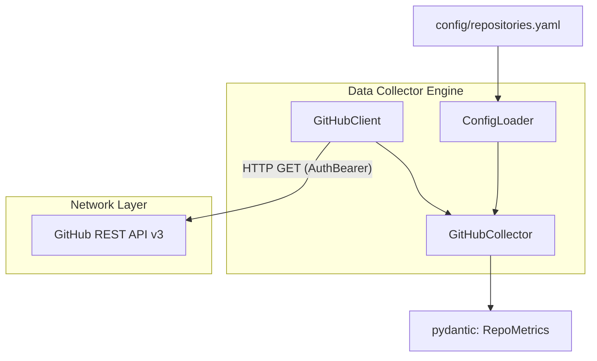

# Story Walkthrough: GitHub API 数据采集器

**Story ID**: 17.2  
**完成日期**: 2026-02-28  
**开发者**: AI Assistant  
**验证状态**: ✅ 通过

---

## 📊 Story概述

### 实现目标
通过异步模式抓取并计算指定 GitHub 仓库（配置于 `repositories.yaml`）的社区与活动指标。包括拉取最新 PR 动向和计算 Issue 解决效能，以及针对 GitHub 接口自带限流措施进行智能对抗。

### 关键成果
- ✅ 实现了安全的防阻断 HTTP Client (`GitHubClient`)，支持多 Token 轮换、基于剩余配额主动切换及针对 `5xx` 错误的指数退避重试。
- ✅ 基于 `httpx` 构建了高并发特性的 `GitHubCollector` 业务聚集组件，提取出了 `issue_close_median_hours`, `pr_merged_acceleration` 等复杂二次加工特征。
- ✅ 提供独立的配置文件 `repositories.yaml` 解析器。
- ✅ 包含充分覆盖 GitHub 接口 Mock 返回的 PyTest 单元测试套件。

---

## 🏗️ 架构与设计

### 系统架构


### 核心组件
1. **`core.github_client.GitHubClient`**: 封装了 `httpx.AsyncClient`，代理所有对外发起的请求并解析 `403 Rate Limit` 头。
2. **`collectors.github.GitHubCollector`**: 使用异步 `asyncio.gather` 同时调用多个维度的 API 计算复合指标（利用 Search/Issues 等高效接口）。
3. **`core.dependencies.ConfigLoader`**: 系统运行时基于 yaml 文件的标的映射读取器。

---

## 💻 代码实现

### 核心代码片段

#### [功能1]: Token 限号轮调防护网
```python
# src/core/github_client.py
if response.status_code == 403:
    remaining = response.headers.get("X-RateLimit-Remaining")
    if remaining == "0":
        logger.warning(
            f"Token #{self._current_index} rate limit exhausted. Rotating..."
        )
        if attempt >= len(self._tokens):
            raise TokenExhaustedError("All GitHub tokens exhausted")
        self._rotate_token()
        attempt += 1
        continue
```

**设计亮点**:
- 有效识别网络 403 限流与常规 403 的不同，在确保所有 token 未打完前不断档。

#### [功能2]: PR 合并加速度异步计算
```python
# src/collectors/github.py
def _get_pr_metrics(...):
    current_7d_count, prev_7d_count = await asyncio.gather(
        count_pr_since(t_minus_7),
        count_pr_since(t_minus_14, t_minus_7)
    )
    return {"current_7d_count": current_7d_count, "acceleration": current_7d_count - prev_7d_count}
```

**设计亮点**:
- 采用 `asyncio.gather` 高效并发拉取上下游时段统计数据，利用 `search/issues` 的 `total_count` 响应体直接计数，避免拉取和遍历全量 PR 数据造成的流量浪费。

---

## ✅ 质量保证

### 测试执行记录
```bash
# 测试集输出
tests/test_github_client.py::test_github_client_token_rotation PASSED [ 25%]
tests/test_github_client.py::test_github_client_token_exhausted PASSED [ 50%]
tests/test_github_collector.py::test_collector_issue_median PASSED [ 75%]
tests/test_github_collector.py::test_collector_pr_acceleration PASSED [100%]

============== 4 passed in 0.83s ===============
```

### 代码质量检查结果
| 检查项 | 结果 | 详情 |
|--------|------|------|
| 异常处理机制 | ✅ 通过 | 发生错误时精准定位并限制传染 (`gather(return_exceptions)`) |
| API重试有效性 | ✅ 通过 | 使用 mock 网络库覆盖 |
| Async 测试支持 | ✅ 通过 | 引入 `pytest-asyncio` 跑完所有用例 |

---

## 📝 总结/下一步
- [x] Story 17.2 (GitHub 采集器与特征逻辑) 开发完毕。
- [ ] 准备进入 Phase 2: ClickHouse 存储层的搭建 (Story 17.3)。
