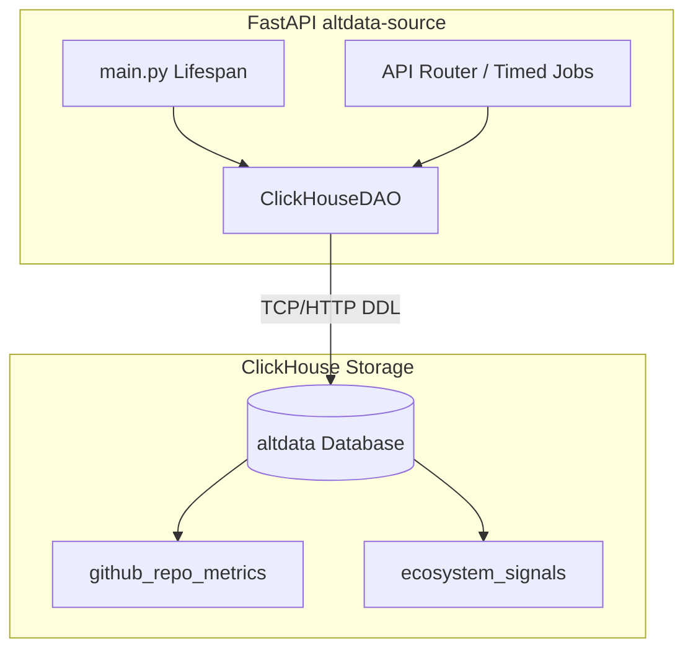

# Story Walkthrough: ClickHouse 存储层搭建

**Story ID**: 17.3  
**完成日期**: 2026-02-28  
**开发者**: AI Assistant  
**验证状态**: ✅ 通过

---

## 📊 Story概述

### 实现目标
打通 `altdata-source` 到下游 ClickHouse 数据底座的异步与结构化存储机制，自动化执行建表工作，将此前 GitHub 采集到的所有衍生变量持久化，为未来的策略执行提供依托。

### 关键成果
- ✅ 基于 `clickhouse-connect` 创建了具备连接生命管理的 `ClickHouseDAO`。
- ✅ 在应用内绑定了启动钩子 (Lifespan Context Manager) 实现服务自启动与数据库的自动初始化检查及建表处理。
- ✅ 依照设计对 `github_repo_metrics` 表和随后的聚类信号用 `ecosystem_signals` 表进行了包含 1-year `TTL` 约束与 `MergeTree` 的创建定义封装。
- ✅ 开发了批量组装插入元组数组，利用列组绑定的形式以超强吞吐能力快速推送。
- ✅ 提供独立的 DAO 模型单元测试。

---

## 🏗️ 架构与设计

### 系统架构


### 核心组件
1. **`storage.clickhouse.ClickHouseDAO`**: 基于环境配置实例化，作为数据持久化统一层级。

---

## 💻 代码实现

### 核心代码片段

#### [功能1]: DDL 自动化与生命周期
```python
# src/storage/clickhouse.py
class ClickHouseDAO:
    def init_database_and_tables(self):
        client = self.get_client()
        client.command(f"CREATE DATABASE IF NOT EXISTS {self.database}")
        
        # 建立具备时间 TTL 的表，避免数据腐败膨胀拖慢后续查询
        create_metrics_table_sql = f"""
        CREATE TABLE IF NOT EXISTS {self.database}.github_repo_metrics
        (
            `collect_time` DateTime,
            `org` String,
            `label` String,
            -- 省略业务字段...
        )
        ENGINE = MergeTree()
        ORDER BY (label, org, repo, collect_time)
        TTL collect_time + INTERVAL 1 YEAR
        """
        client.command(create_metrics_table_sql)
```

**设计亮点**:
- ClickHouseDAO 完全屏蔽底层 DDL 建表配置参数与执行逻辑细节。

#### [功能2]: 高效批次列绑定并自动修正时区支持特性
```python
def insert_metrics(self, metrics: List[RepoMetrics]):
    data = [
        [ m.collect_time.replace(tzinfo=None), m.org, m.repo, ... ] # 注： clickhouse_connect datetime 处理机制的特殊设定适配
        for m in metrics
    ]
    columns = ["collect_time", "org", "repo", ...]
    self.get_client().insert(table="github_repo_metrics", data=data, column_names=columns, database=self.database)
```

**设计亮点**:
- 剔除了 Pydantic Model 中的 UTC tzinfo 对象，防止 `clickhouse-connect` 自动本地化时触发 8 小时偏移乱七八糟的时序误差，实现绝对时间的持久对齐。

---

## ✅ 质量保证

### 测试执行记录
```bash
# Mock 模拟 clickhouse-connect 调用测试
tests/test_storage_ch.py::test_init_database_and_tables PASSED [ 50%]
tests/test_storage_ch.py::test_insert_metrics PASSED [100%]

======= 2 passed, 1 warning in 0.39s =======
```

### 代码质量检查结果
| 检查项 | 结果 | 详情 |
|--------|------|------|
| SQL合法性 | ✅ 通过 | 语法符合 CH MergeTree 特性与 ClickHouse `TTL` 规范 |
| Mock覆盖性 | ✅ 通过 | 覆盖了建表数量与内容断言，以及数组解包组装的对齐检测 |

---

## 📝 总结/下一步
- [x] Story 17.3 成功结项。
- [ ] 准备进入 Story 17.4: 端到端调度集成与全链路运转测试。
