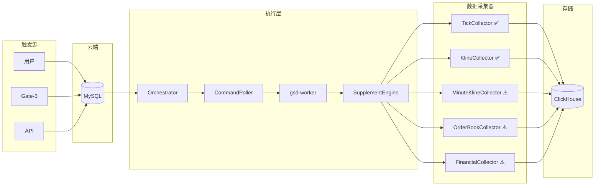

# 定向个股数据补充方案 (stock_data_supplement)

## 1. 需求背景

### 1.1 问题现状

- 现有系统侧重**全量批处理**采集
- 缺乏对**特定个股**进行灵活、全面数据补充的机制
- 量化分析需要多维度数据，当前仅覆盖 Tick 和 K 线

### 1.2 业务场景

| 场景 | 描述 | 典型数量 |
| :--- | :--- | :---: |
| 策略研究 | 分析师对特定股票进行深度回测 | 1-5 只 |
| 异常修复 | Gate-3 发现数据异常，定向补采 | 5-20 只 |
| 热点追踪 | 快速补充新增自选股数据 | 1-10 只 |
| 建仓调研 | 对目标股票进行全维度数据采集 | 1-10 只 |

---

## 2. 数据范围定义

### 2.1 量化分析所需数据全景

定向补充应覆盖量化分析的**全部数据维度**：

| 分类 | 数据类型 | 用途 | 实现状态 |
| :--- | :--- | :--- | :---: |
| **行情数据** | 分笔数据 (Tick) | 高频策略、订单流分析 | ✅ 已实现 |
| | 日 K 线 | 趋势分析、技术指标 | ✅ 已实现 |
| | 分钟 K 线 (1/5/15/30/60) | 日内策略、短线分析 | ⚠️ 待实现 |
| | 盘口深度 (Order Book) | 流动性分析、挂单策略 | ⚠️ 待实现 |
| **资金数据** | 资金流向 (主力/散户) | 资金策略、追踪大单 | ⚠️ 待实现 |
| | 大宗交易 | 机构动向、折价分析 | ⚠️ 待实现 |
| | 融资融券 | 杠杆情绪、做空信号 | ⚠️ 待实现 |
| | 龙虎榜 | 游资追踪、席位分析 | ⚠️ 待实现 |
| **基本面** | 财务报表 | 价值投资、财务分析 | ⚠️ 待实现 |
| | 估值指标 (PE/PB/PS) | 估值策略、对比分析 | ⚠️ 待实现 |
| | 股东数据 | 筹码分布、持股变化 | ⚠️ 待实现 |
| | 分红配股 | 事件驱动、除权处理 | ⚠️ 待实现 |
| **事件数据** | 公告 | 事件驱动策略 | ⚠️ 待实现 |
| | 研报 | 预期差分析 | ⚠️ 待实现 |

### 2.2 数据类型详细说明

#### 2.2.1 分笔数据 (Tick) ✅

```
字段: stock_code, trade_date, tick_time, price, volume, turnover, direction, order_id
频率: 每笔成交 (约 3 秒/笔)
存储: ClickHouse tick_data 表
用途: OFI 策略、订单流分析、高频交易
```

#### 2.2.2 日 K 线 ✅

```
字段: stock_code, trade_date, open, high, low, close, volume, turnover, amplitude, change_pct
频率: 每日一条
存储: ClickHouse stock_kline_daily 表
用途: 趋势策略、技术指标、动量分析
```

#### 2.2.3 分钟 K 线 ⚠️ 待实现

```
字段: stock_code, trade_date, time, open, high, low, close, volume, turnover
周期: 1分钟 / 5分钟 / 15分钟 / 30分钟 / 60分钟
存储: 待设计 stock_kline_minute 表
用途: 日内策略、分时突破、量价分析
```

#### 2.2.4 盘口深度 (Order Book) ⚠️ 待实现

```
字段: stock_code, timestamp, bid1-5_price, bid1-5_volume, ask1-5_price, ask1-5_volume
频率: 实时快照 (3 秒)
存储: 待设计 order_book 表
用途: 流动性策略、挂单压力分析、做市策略
```

#### 2.2.5 资金流向 ⚠️ 待实现

```
字段: stock_code, trade_date, main_inflow, main_outflow, retail_inflow, retail_outflow, net_inflow
频率: 每日汇总
数据源: 待定 (东方财富/同花顺 API)
用途: Smart Money 策略、主力追踪
```

#### 2.2.6 财务数据 ⚠️ 待实现

```
字段: stock_code, report_date, revenue, net_profit, eps, roe, debt_ratio, ...
频率: 季度
数据源: 待定 (Tushare/AKShare)
用途: 价值投资、财务因子
```

#### 2.2.7 估值指标 ⚠️ 待实现

```
字段: stock_code, trade_date, pe_ttm, pb, ps, pcf, market_cap, circulating_cap
频率: 每日
数据源: 待定
用途: 估值策略、行业对比
```

---

## 3. 系统架构



---

## 4. 任务参数设计

### 4.1 命令格式

```sql
INSERT INTO alwaysup.task_commands (task_id, params, status) VALUES (
    'stock_data_supplement',
    '{
        "stocks": ["000001", "600519"],
        "date_range": {"start": "20260101", "end": "20260115"},
        "data_types": ["tick", "kline", "minute_kline", "financial"],
        "priority": "normal"
    }',
    'PENDING'
);
```

### 4.2 参数定义

| 字段 | 类型 | 必填 | 说明 |
| :--- | :--- | :---: | :--- |
| `stocks` | array | 是 | 股票代码列表 |
| `date_range` | object | 否 | `{start, end}` 格式，默认当日 |
| `data_types` | array | 否 | 见下表，默认 `["tick", "kline"]` |
| `priority` | string | 否 | `urgent`/`high`/`normal`/`low` |

### 4.3 data_types 枚举

| 值 | 说明 | 实现状态 |
| :--- | :--- | :---: |
| `tick` | 分笔数据 | ✅ |
| `kline` | 日 K 线 | ✅ |
| `minute_kline` | 分钟 K 线 | ⚠️ 待实现 |
| `order_book` | 盘口深度 | ⚠️ 待实现 |
| `capital_flow` | 资金流向 | ⚠️ 待实现 |
| `block_trade` | 大宗交易 | ⚠️ 待实现 |
| `margin` | 融资融券 | ⚠️ 待实现 |
| `top_list` | 龙虎榜 | ⚠️ 待实现 |
| `financial` | 财务数据 | ⚠️ 待实现 |
| `valuation` | 估值指标 | ⚠️ 待实现 |
| `shareholder` | 股东数据 | ⚠️ 待实现 |
| `dividend` | 分红配股 | ⚠️ 待实现 |
| `announcement` | 公告 | ⚠️ 待实现 |

---

## 5. 核心组件设计

### 5.1 新增文件

```
services/gsd-worker/src/
├── core/
│   └── supplement_engine.py   # [NEW] 数据补充引擎
└── jobs/
    └── supplement_stock.py    # [NEW] 任务入口
```

### 5.2 SupplementEngine

```python
class SupplementEngine:
    """
    定向数据补充引擎
    
    职责:
    1. 解析补充请求参数
    2. 分派到对应数据采集器
    3. 汇总结果并报告
    """
    
    # 采集器注册表
    collectors = {
        "tick": TickCollector,           # ✅ 复用现有
        "kline": KlineCollector,         # ✅ 复用现有
        "minute_kline": None,            # ⚠️ 待实现
        "order_book": None,              # ⚠️ 待实现
        "capital_flow": None,            # ⚠️ 待实现
        "financial": None,               # ⚠️ 待实现
        "valuation": None,               # ⚠️ 待实现
    }
    
    async def run(self, params: dict) -> dict:
        stocks = params["stocks"]
        date_range = params.get("date_range", {"start": today(), "end": today()})
        data_types = params.get("data_types", ["tick", "kline"])
        
        results = {"success": 0, "failed": 0, "skipped": 0, "details": []}
        
        for code in stocks:
            for dtype in data_types:
                collector = self.collectors.get(dtype)
                if collector is None:
                    results["skipped"] += 1
                    results["details"].append({
                        "code": code, "type": dtype, 
                        "status": "skipped", "reason": "未实现"
                    })
                    continue
                    
                try:
                    count = await collector.collect(code, date_range)
                    results["success"] += 1
                    results["details"].append({
                        "code": code, "type": dtype, 
                        "status": "success", "records": count
                    })
                except Exception as e:
                    results["failed"] += 1
                    results["details"].append({
                        "code": code, "type": dtype, 
                        "status": "failed", "error": str(e)
                    })
        
        return results
```

### 5.3 任务入口

```python
# jobs/supplement_stock.py

"""
定向数据补充任务

用法:
  python -m jobs.supplement_stock --stocks 000001,600519 --date-range 20260101-20260115
  python -m jobs.supplement_stock --stocks 000001 --data-types tick,kline,financial

说明:
  - 未实现的 data_types 会被跳过并记录
"""

if __name__ == "__main__":
    parser = argparse.ArgumentParser()
    parser.add_argument("--stocks", required=True, help="股票代码，逗号分隔")
    parser.add_argument("--date-range", default=None, help="日期范围 YYYYMMDD-YYYYMMDD")
    parser.add_argument("--data-types", default="tick,kline", help="数据类型，逗号分隔")
    parser.add_argument("--priority", default="normal")
    
    args = parser.parse_args()
    # ...
```

---

## 6. 任务配置

```yaml
# config/tasks.yml

stock_data_supplement:
  id: stock_data_supplement
  name: 定向数据补充
  type: docker
  enabled: true
  schedule:
    type: manual  # 仅支持手动/API 触发
  target:
    command: ["jobs.supplement_stock"]
    timeout: 1800  # 30 分钟超时
```

---

## 7. Gate-3 集成

```python
# post_market_gate_service.py

async def _trigger_targeted_supplement(self, failed_codes: List[str], date_str: str):
    """Gate-3 自动触发定向补充"""
    await self._insert_command(
        task_id="stock_data_supplement",
        params={
            "stocks": failed_codes,
            "date_range": {"start": date_str, "end": date_str},
            "data_types": ["tick"],  # 仅补充已实现的类型
            "priority": "high"
        }
    )
```

---

## 8. 实现路线图

### 8.1 Phase 1: 核心框架 (本期)

- [x] 设计方案文档
- [ ] `SupplementEngine` 核心引擎
- [ ] `supplement_stock.py` 任务入口
- [ ] 复用现有 Tick 和 K 线采集器
- [ ] Gate-3 集成

**工作量**: ~5 小时

### 8.2 Phase 2: 分钟 K 线 (待排期)

- [ ] 设计 `stock_kline_minute` 表结构
- [ ] 实现 `MinuteKlineCollector`
- [ ] 支持 1/5/15/30/60 分钟周期

### 8.3 Phase 3: 盘口深度 (待排期)

- [ ] 设计 `order_book` 表结构
- [ ] 实现 `OrderBookCollector`
- [ ] 评估实时采集 vs 快照采集

### 8.4 Phase 4: 资金数据 (待排期)

- [ ] 资金流向 (`CapitalFlowCollector`)
- [ ] 大宗交易 (`BlockTradeCollector`)
- [ ] 融资融券 (`MarginCollector`)
- [ ] 龙虎榜 (`TopListCollector`)

### 8.5 Phase 5: 基本面数据 (待排期)

- [ ] 财务数据 (`FinancialCollector`)
- [ ] 估值指标 (`ValuationCollector`)
- [ ] 股东数据 (`ShareholderCollector`)
- [ ] 分红配股 (`DividendCollector`)

---

## 9. FAQ

**Q1: 请求了未实现的数据类型会怎样？**
> 会被跳过并在结果中标记为 `skipped`，不影响已实现类型的补充。

**Q2: 一次最多补充多少只股票？**
> 建议不超过 50 只。超过时可考虑分批执行。

**Q3: 历史数据回补支持多长周期？**
> 无限制，但需考虑数据源可用性和采集耗时。

---

## 10. 相关文档

- [任务命令格式](file:///home/bxgh/microservice-stock/services/task-orchestrator/docs/development/TASK_COMMAND_FORMAT.md)
- [Gate-3 盘后审计](file:///home/bxgh/microservice-stock/services/task-orchestrator/docs/data_gates/03_post_market_gate.md)
- [任务调度清单](file:///home/bxgh/microservice-stock/services/task-orchestrator/docs/task_inventory.md)
