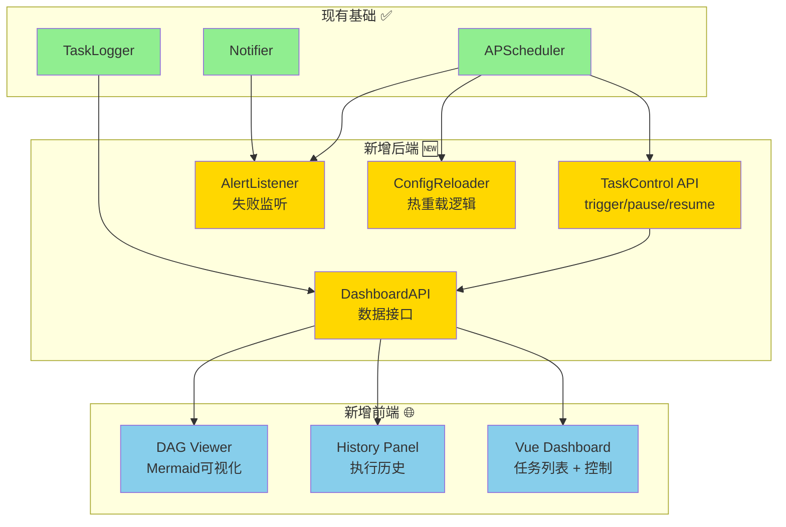

# Task Orchestrator 管理功能开发文档

**项目状态**: 📋 规划完成  
**创建时间**: 2026-01-14  
**预计完成**: 2026-01-23

---

## 📚 文档导航

### 核心开发文档
1. **[后端实施计划](file:///home/bxgh/microservice-stock/services/task-orchestrator/docs/development/backend_implementation.md)**  
   - 任务控制 API、配置热重载、自动告警、Dashboard 数据 API
   - 包含详细代码示例和测试要求
   - 预计工时：13 小时 / 13 个任务

2. **[前端实施计划](file:///home/bxgh/microservice-stock/services/task-orchestrator/docs/development/frontend_implementation.md)**  
   - Vue 3 + Tailwind CSS Dashboard
   - 任务列表、执行历史、DAG 可视化、系统总览
   - 预计工时：11 小时 / 9 个任务

3. **[开发跟踪](file:///home/bxgh/microservice-stock/services/task-orchestrator/docs/development/tracking.md)**  
   - 详细任务清单（Gantt 图）
   - 每日站会记录模板
   - 风险管理和验收标准

---

## 🎯 项目目标

为 Task Orchestrator 服务增加完整的可视化管理能力：

| 功能模块 | 优先级 | 工时 | 状态 |
|---------|--------|------|------|
| **任务控制 API** (触发/暂停/恢复) | P0 🔥 | 3h | ⬜ |
| **配置热重载** (无需重启) | P0 🔥 | 4h | ⬜ |
| **自动告警集成** (Webhook) | P1 ⚠️ | 2h | ⬜ |
| **Dashboard 后端 API** | P1 ⚠️ | 3h | ⬜ |
| **Dashboard 前端 UI** | P1 ⚠️ | 11h | ⬜ |
| **测试与文档** | P0 🔥 | 5h | ⬜ |

**总计**: ~28 小时 / 3-4 个工作日

---

## 📊 架构设计



---

## 🚀 快速开始

### 开发准备
```bash
# 1. 进入项目目录
cd /home/bxgh/microservice-stock/services/task-orchestrator

# 2. 确认 Docker 环境
docker compose ps

# 3. 查看当前任务配置
cat config/tasks.yml
```

### 后端开发流程
1. 阅读 [backend_implementation.md](file:///home/bxgh/microservice-stock/services/task-orchestrator/docs/development/backend_implementation.md)
2. 创建功能分支: `git checkout -b feature/task-management-backend`
3. 按任务清单顺序实现功能模块
4. 运行测试: `pytest tests/ -v`
5. 提交代码: `git commit -m "feat: implement task control APIs"`

### 前端开发流程
1. 阅读 [frontend_implementation.md](file:///home/bxgh/microservice-stock/services/task-orchestrator/docs/development/frontend_implementation.md)
2. 创建 `src/static/dashboard.html`
3. 按组件顺序开发（总览 → 列表 → 历史 → DAG）
4. 在浏览器测试: `http://localhost:18000/dashboard`
5. 优化样式和响应式布局

---

## 📋 任务拆分

### 阶段 1: 后端开发 (4 天)
```
BE-1  → 增强触发 API (1h)
BE-2  → 暂停/恢复 API (1h)
BE-3  → 控制测试 (1h)
BE-4  → 配置重载逻辑 (3h)
BE-5  → 重载 API (0.5h)
BE-6  → 重载测试 (0.5h)
BE-7  → 失败监听器 (1h)
BE-8  → 告警集成 (0.5h)
BE-9  → 告警测试 (0.5h)
BE-10 → Dashboard 路由 (1h)
BE-11 → 系统总览 API (1h)
BE-12 → DAG 数据 API (1h)
BE-13 → 路由注册 (0.5h)
```

### 阶段 2: 前端开发 (3 天)
```
FE-1 → HTML 框架 (1h)
FE-2 → 导航栏 (0.5h)
FE-3 → 总览卡片 (1h)
FE-4 → 任务列表 (3h)
FE-5 → 操作按钮 (1h)
FE-6 → 历史面板 (2h)
FE-7 → DAG 可视化 (1.5h)
FE-8 → 状态栏 (0.5h)
FE-9 → 样式优化 (1.5h)
```

### 阶段 3: 测试与文档 (2 天)
```
TEST-1 → 单元测试 (1h)
TEST-2 → 配置重载测试 (0.5h)
TEST-3 → 任务控制测试 (0.5h)
TEST-4 → 告警测试 (0.5h)
TEST-5 → Dashboard 功能测试 (1h)
TEST-6 → 性能测试 (0.5h)
DOC-1  → 更新文档 (0.5h)
DOC-2  → 使用指南 (0.5h)
```

---

## ✅ 关键验收标准

### 功能验收
- [ ] 手动触发任务立即执行
- [ ] 暂停任务后不再自动调度
- [ ] 修改 `tasks.yml` 后重载生效
- [ ] 任务失败收到 Webhook 告警
- [ ] Dashboard 正确展示所有任务
- [ ] DAG 图正确渲染依赖关系

### 性能验收
- [ ] API 响应 < 500ms
- [ ] Dashboard 加载 < 2s
- [ ] 告警延迟 < 5s

### 代码质量验收
- [ ] pytest 全部通过
- [ ] 测试覆盖率 > 80%
- [ ] 无 critical lint 错误

---

## 🔗 相关链接

- **API 文档**: `http://localhost:18000/docs` (Swagger)
- **现有任务调度文档**: [task_scheduling/README.md](file:///home/bxgh/microservice-stock/services/task-orchestrator/docs/task_scheduling/README.md)
- **任务清单**: [task_inventory.md](file:///home/bxgh/microservice-stock/services/task-orchestrator/docs/task_inventory.md)

---

## 📝 开发规范

遵循项目编码标准：
- ✅ 全程使用中文注释和文档
- ✅ 所有 I/O 操作使用 `async/await`
- ✅ 共享状态修改使用 `asyncio.Lock()`
- ✅ 时区固定为 `Asia/Shanghai`
- ✅ 异常处理使用具体异常类型
- ✅ 日志记录充分（INFO/WARNING/ERROR）

---

## 🎓 技术栈说明

### 后端
- **FastAPI**: Web 框架
- **APScheduler**: 任务调度器
- **aiomysql**: 异步 MySQL 客户端
- **docker-py**: Docker API 封装

### 前端
- **Vue 3**: 前端框架 (CDN 模式)
- **Tailwind CSS**: 样式框架 (CDN 模式)
- **Mermaid.js**: 图表渲染
- **Axios**: HTTP 客户端

### 测试
- **pytest**: 测试框架
- **pytest-asyncio**: 异步测试支持
- **httpx-mock**: HTTP Mock

---

## 📞 支持与反馈

开发过程中遇到问题可查阅：
1. [后端实施计划](file:///home/bxgh/microservice-stock/services/task-orchestrator/docs/development/backend_implementation.md) 的"技术注意事项"章节
2. [前端实施计划](file:///home/bxgh/microservice-stock/services/task-orchestrator/docs/development/frontend_implementation.md) 的"常见问题"章节（待补充）
3. [开发跟踪文档](file:///home/bxgh/microservice-stock/services/task-orchestrator/docs/development/tracking.md) 的"风险与阻塞项"

---

**最后更新**: 2026-01-14  
**文档维护**: 随开发进度实时更新
