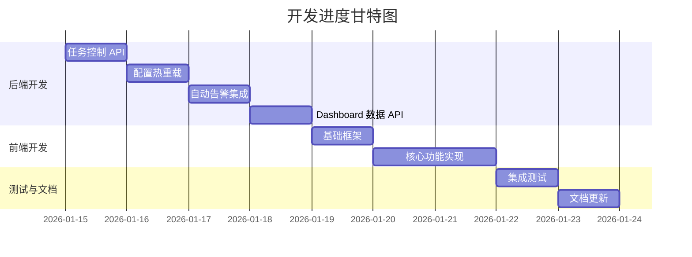

# Task Orchestrator 开发跟踪

**项目**: Task Orchestrator 管理功能开发  
**开始时间**: 2026-01-14  
**目标完成**: 2026-01-23  
**总预计工时**: 24 小时

---

## 一、总体进度

**当前阶段**: 📋 规划完成  
**下一步**: 🚀 开始后端开发

---

## 二、详细任务清单

### 阶段 1: 后端开发 (4 天)

| 任务 ID | 任务名称 | 优先级 | 预计工时 | 负责人 | 状态 | 开始时间 | 完成时间 | 备注 |
|---------|---------|--------|----------|--------|------|----------|----------|------|
| BE-1 | 增强任务触发 API | P0 | 1h | - | ⬜ 待开始 | - | - | 支持参数传递 |
| BE-2 | 新增暂停/恢复 API | P0 | 1h | - | ⬜ 待开始 | - | - | 调用 APScheduler |
| BE-3 | 编写任务控制测试 | P0 | 1h | - | ⬜ 待开始 | - | - | `test_task_control.py` |
| BE-4 | 实现配置热重载逻辑 | P0 | 3h | - | ⬜ 待开始 | - | - | `config_reloader.py` |
| BE-5 | 新增重载 API 端点 | P0 | 0.5h | - | ⬜ 待开始 | - | - | 集成到 tasks.py |
| BE-6 | 编写热重载测试 | P0 | 0.5h | - | ⬜ 待开始 | - | - | `test_config_reload.py` |
| BE-7 | 集成 APScheduler 监听器 | P1 | 1h | - | ⬜ 待开始 | - | - | 监听任务失败事件 |
| BE-8 | 调用 Notifier 发送告警 | P1 | 0.5h | - | ⬜ 待开始 | - | - | 集成现有 notifier |
| BE-9 | 编写告警集成测试 | P1 | 0.5h | - | ⬜ 待开始 | - | - | Mock Webhook |
| BE-10 | 实现 Dashboard 路由 | P1 | 1h | - | ⬜ 待开始 | - | - | `dashboard_routes.py` |
| BE-11 | 实现系统总览 API | P1 | 1h | - | ⬜ 待开始 | - | - | 查询数据库统计 |
| BE-12 | 实现 DAG 数据 API | P1 | 1h | - | ⬜ 待开始 | - | - | 解析任务依赖 |
| BE-13 | 注册路由到 main.py | P1 | 0.5h | - | ⬜ 待开始 | - | - | 挂载 dashboard_router |

**后端小计**: 13 小时

---

### 阶段 2: 前端开发 (3 天)

| 任务 ID | 任务名称 | 优先级 | 预计工时 | 负责人 | 状态 | 开始时间 | 完成时间 | 备注 |
|---------|---------|--------|----------|--------|------|----------|----------|------|
| FE-1 | 创建 HTML 基础框架 | P1 | 1h | - | ⬜ 待开始 | - | - | Vue + Tailwind 引入 |
| FE-2 | 实现顶部导航栏 | P1 | 0.5h | - | ⬜ 待开始 | - | - | Logo + 刷新/重载按钮 |
| FE-3 | 实现系统总览卡片 | P1 | 1h | - | ⬜ 待开始 | - | - | 4 个统计卡片 |
| FE-4 | 实现任务列表表格 | P1 | 3h | - | ⬜ 待开始 | - | - | 核心功能 |
| FE-5 | 实现操作按钮逻辑 | P1 | 1h | - | ⬜ 待开始 | - | - | 触发/暂停/恢复 |
| FE-6 | 实现执行历史面板 | P1 | 2h | - | ⬜ 待开始 | - | - | 右侧滑出展示 |
| FE-7 | 实现 DAG 可视化 | P1 | 1.5h | - | ⬜ 待开始 | - | - | Mermaid 集成 |
| FE-8 | 实现底部状态栏 | P2 | 0.5h | - | ⬜ 待开始 | - | - | 实时状态更新 |
| FE-9 | 样式优化与响应式 | P2 | 1.5h | - | ⬜ 待开始 | - | - | 兼容多种分辨率 |

**前端小计**: 11 小时

---

### 阶段 3: 测试与文档 (2 天)

| 任务 ID | 任务名称 | 优先级 | 预计工时 | 负责人 | 状态 | 开始时间 | 完成时间 | 备注 |
|---------|---------|--------|----------|--------|------|----------|----------|------|
| TEST-1 | 后端单元测试执行 | P0 | 1h | - | ⬜ 待开始 | - | - | pytest 运行所有测试 |
| TEST-2 | 手动测试配置重载 | P0 | 0.5h | - | ⬜ 待开始 | - | - | 修改 tasks.yml 验证 |
| TEST-3 | 手动测试任务控制 | P0 | 0.5h | - | ⬜ 待开始 | - | - | 触发/暂停/恢复 |
| TEST-4 | 手动测试告警推送 | P1 | 0.5h | - | ⬜ 待开始 | - | - | 模拟任务失败 |
| TEST-5 | Dashboard 功能测试 | P1 | 1h | - | ⬜ 待开始 | - | - | 所有前端功能验证 |
| TEST-6 | 性能测试 | P2 | 0.5h | - | ⬜ 待开始 | - | - | 加载时间、响应速度 |
| DOC-1 | 更新 task_scheduling/README.md | P2 | 0.5h | - | ⬜ 待开始 | - | - | 新增管理功能说明 |
| DOC-2 | 创建 Dashboard 使用指南 | P2 | 0.5h | - | ⬜ 待开始 | - | - | `dashboard_usage.md` |

**测试与文档小计**: 5 小时

---

## 三、关键里程碑

| 里程碑 | 完成标志 | 目标日期 | 状态 |
|--------|---------|----------|------|
| M1: 后端 API 完成 | 所有后端测试通过 | 2026-01-18 | ⬜ |
| M2: 前端 UI 完成 | Dashboard 可访问且功能完整 | 2026-01-21 | ⬜ |
| M3: 集成测试通过 | 手动验证全部功能正常 | 2026-01-22 | ⬜ |
| M4: 文档更新完成 | 所有文档已更新并审核 | 2026-01-23 | ⬜ |

---

## 四、风险与阻塞项

| 风险描述 | 影响程度 | 缓解措施 | 状态 |
|---------|---------|----------|------|
| APScheduler 热重载可能导致任务状态混乱 | 🟡 中 | 充分测试 Diff 逻辑，增加事务保护 | 🟢 已规避 |
| Mermaid 图表渲染性能问题 | 🟢 低 | 限制节点数量，提供简化视图 | 🟢 已规避 |
| 前后端联调时间不足 | 🟡 中 | 预留 1 天缓冲时间 | 🟢 已规避 |
| 告警 Webhook 测试环境缺失 | 🟢 低 | 使用 RequestBin 或本地 Mock Server | 🟢 已规避 |

---

## 五、开发规范检查清单

### 代码质量
- [ ] 所有后端代码使用 `async/await`
- [ ] 全局状态修改加 `asyncio.Lock()`
- [ ] 异常处理完整，使用具体异常类型
- [ ] 日志记录充分（INFO/WARNING/ERROR）
- [ ] 类型注解完整（函数签名）

### 测试覆盖
- [ ] 后端单元测试覆盖率 > 80%
- [ ] 并发测试（如适用）
- [ ] 边界情况测试（404、500 错误）
- [ ] 前端功能测试（手动）

### 文档要求
- [ ] 代码注释（Docstring）
- [ ] API 文档（Swagger）
- [ ] 用户文档（Markdown）
- [ ] CHANGELOG 更新

---

## 六、每日站会记录

### 2026-01-14 (周二)
- **完成**: 需求分析、技术方案设计
- **进行中**: 创建开发文档
- **计划**: 明日开始后端开发
- **阻塞**: 无

---

### 2026-01-15 (周三)
- **完成**: *(待填写)*
- **进行中**: *(待填写)*
- **计划**: *(待填写)*
- **阻塞**: *(待填写)*

---

### 2026-01-16 (周四)
- **完成**: *(待填写)*
- **进行中**: *(待填写)*
- **计划**: *(待填写)*
- **阻塞**: *(待填写)*

---

## 七、验收标准

### 功能验收
- ✅ 手动触发任务立即执行
- ✅ 暂停任务后不再自动调度
- ✅ 修改 `tasks.yml` 后调用重载 API，变更生效
- ✅ 任务失败时收到 Webhook 告警
- ✅ Dashboard 正确展示所有任务状态
- ✅ DAG 图正确渲染任务依赖关系

### 性能验收
- ✅ API 响应时间 < 500ms
- ✅ Dashboard 加载时间 < 2s
- ✅ 告警推送延迟 < 5s

### 代码质量验收
- ✅ pytest 全部通过
- ✅ 无 critical 级别 lint 错误
- ✅ 代码审查通过

---

## 八、相关文档链接

- [后端实施计划](file:///home/bxgh/microservice-stock/services/task-orchestrator/docs/development/backend_implementation.md)
- [前端实施计划](file:///home/bxgh/microservice-stock/services/task-orchestrator/docs/development/frontend_implementation.md)
- [可视化路线图](file:///home/bxgh/.gemini/antigravity/brain/43506db0-f492-4e07-a6ec-25829368ba25/roadmap.md) (Artifact)
- [任务调度文档](file:///home/bxgh/microservice-stock/services/task-orchestrator/docs/task_scheduling/README.md)

---

## 九、更新日志

| 日期 | 更新内容 | 更新人 |
|------|---------|--------|
| 2026-01-14 | 创建开发跟踪文档，初始化任务清单 | AI Assistant |
