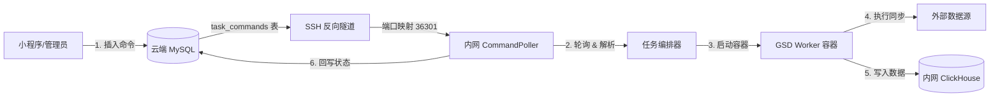

# 远程任务触发与参数化补采系统实现文档

## 1. 概述
为了实现移动端小程序对内网数据采集任务的控制，我们构建了一套“云端触发 -> 内网执行”的远程命令系统。该系统利用现有的 SSH 反向隧道基础设施，实现了安全的穿透控制，并支持带参数的任务执行（如按日期补采数据）。

## 2. 核心架构

### 2.1 数据流图


### 2.2 关键组件
1.  **AlwaysUp Cloud MySQL (`task_commands`)**: 作为命令队列，存储待执行的任务指令及参数。
2.  **CommandPoller (Local)**: 运行在 `task-orchestrator` 中的异步服务，负责周期性轮询云端数据库，拉取 `PENDING` 状态的命令。
3.  **DockerExecutor**: 增强版的执行器，支持动态注入环境变量和命令行参数（如 `--date 20260113`）。
4.  **GSD Worker (`sync_service`)**: 业务执行单元，新增了 `sync_by_date` 方法支持按日精准同步。

## 3. 数据库设计

### 云端表结构 (`alwaysup.task_commands`)
用于存储命令队列。

```sql
CREATE TABLE IF NOT EXISTS `task_commands` (
    `id` INT AUTO_INCREMENT PRIMARY KEY,
    `task_id` VARCHAR(64) NOT NULL COMMENT '对应 tasks.yml 中的任务ID',
    `params` JSON COMMENT '动态参数，如 {"date": "20260113"}',
    `status` ENUM('PENDING', 'RUNNING', 'DONE', 'FAILED') DEFAULT 'PENDING',
    `result` TEXT COMMENT '执行结果或错误日志',
    `created_at` DATETIME DEFAULT CURRENT_TIMESTAMP,
    `updated_at` DATETIME DEFAULT CURRENT_TIMESTAMP ON UPDATE CURRENT_TIMESTAMP,
    INDEX `idx_status` (`status`)
) ENGINE=InnoDB DEFAULT CHARSET=utf8mb4;
```

## 4. 功能实现细节

### 4.1 CommandPoller (轮询器)
*   **位置**: `services/task-orchestrator/src/core/command_poller.py`
*   **逻辑**:
    1.  每 15 秒通过本地隧道 (`127.0.0.1:36301`) 连接云端 MySQL。
    2.  查询 `status='PENDING'` 的记录。
    3.  锁定记录（`status='RUNNING'`）。
    4.  查找本地 `tasks.yml` 中对应的任务定义。
    5.  调用 `DockerExecutor` 执行任务，并阻塞等待完成。
    6.  更新执行结果 (`DONE`/`FAILED`) 和日志到云端。

### 4.2 支持的远程任务

目前系统支持以下专用补采任务，具体实现细节请参考各任务独立文档：

1.  **[分笔指定日期分片采集 (collect_tick_sharded)](remote_tasks/collect_tick_sharded.md)**
    *   用于分布式精确调度，无自动拆分逻辑。
    *   支持指定分片索引重跑。

2.  **[分笔数据按日补采 (repair_tick)](remote_tasks/repair_tick.md)**
    *   支持按日期、按股票列表补采。
    *   内置“智能分片”机制，应对大规模补采。

3.  **[K线数据按日补采 (repair_kline)](remote_tasks/repair_kline.md)**
    *   支持按日期触发智能自愈同步。
    *   自动联动盘后门禁审计。

4.  **[定向个股数据补充 (stock_data_supplement)](remote_tasks/stock_data_supplement.md)**
    *   支持多维度（Tick/K线/财务）个股深度体检与修复。

### 4.3 业务层支持 (GSD Worker)
*   **K线同步**: `KLineSyncService` 新增 `sync_by_date` 方法。
*   **Redis 兼容性**: 修复了 `sync_service.py`，根据 `REDIS_CLUSTER` 环境变量自动切换 `Redis` (单机) 或 `RedisCluster` (集群) 客户端，确保在不同环境下的稳定性。

### 4.4 高级特性 (Advanced Features)
*(参见 repair_tick.md 中的智能分片和自动联动描述)*

### 5.2 监控与排查
*   **查看进度**:
    ```sql
    SELECT * FROM task_commands ORDER BY id DESC LIMIT 5;
    ```
*   **查看日志**:
    *   成功: `result` 字段会包含 "Success (Ad-hoc). Logs tail..."
    *   失败: `result` 字段会包含错误堆栈。

## 6. 验证记录
*   **测试脚本**: `services/task-orchestrator/tests/verify_command_execution.py`
*   **测试结果**: 全流程验证通过。不仅验证了命令下发，还验证了容器内的 Redis 连接和 ClickHouse 写入能力。

## 7. 后续计划
*   **接口封装**: 在云端 FastAPI 封装 `/api/v1/commands` 接口，供小程序调用。
*   **告警集成**: 任务执行失败时发送 Feishu/DingTalk 消息。
