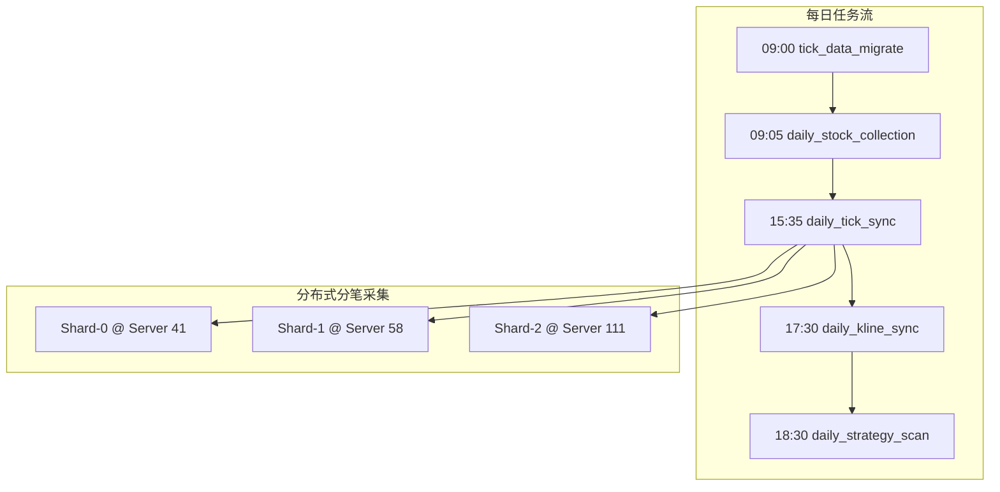

# 现有任务调度清单与状态

**最后更新**: 2026-01-14

---

## 1. 任务调度架构总览

### 配置文件分布

| 节点 | 配置文件 | 职责 | IP |
|:-----|:---------|:-----|:---|
| **Server 41** | `config/tasks.yml` | 主调度节点，管理全局任务 | 192.168.151.41 |
| **Server 58** | `config/tasks_58.yml` | 分片节点，负责 Shard-1 | 192.168.151.58 |
| **Server 111** | `config/tasks_111.yml` | 分片节点，负责 Shard-2 | 192.168.151.111 |

### 调度类型说明

| 类型 | 说明 | 示例 |
|:-----|:-----|:-----|
| `cron` | 标准 Cron 表达式 | `"5 9 * * *"` (每日 09:05) |
| `trading_cron` | 交易日感知 Cron | `"30 17 * * *"` (交易日 17:30) |
| `docker` | Docker 容器任务 | 启动 gsd-worker 执行 job |
| `http` | HTTP 请求任务 | 调用服务 API 端点 |
| `workflow` | 工作流编排 | 多步骤依赖任务 |

---

## 2. 完整任务清单

### 2.1 数据同步任务 (Server 41)

#### `daily_stock_collection` - 每日股票代码采集

```yaml
id: daily_stock_collection
name: 每日股票代码采集
type: docker
enabled: true
schedule:
  type: cron
  expression: "5 9 * * *"  # 09:05 每日
target:
  command: ["jobs.daily_stock_collection"]
  environment:
    REDIS_HOST: "127.0.0.1"
    HTTP_PROXY: "http://192.168.151.18:3128"
    CLOUD_API_URL: "http://124.221.80.250:8000/api/v1/stocks/all"
```

**职责**: 从云端拉取最新股票代码列表，进行分片缓存到 Redis

---

#### `daily_kline_sync` - K线每日同步

```yaml
id: daily_kline_sync
name: K线每日同步
type: workflow
enabled: true
schedule:
  type: trading_cron
  expression: "30 17 * * *"  # 17:30 交易日
workflow:
  - id: sync-shards
    parallel: true
    tasks:
      - {id: shard-0, command: ["jobs.sync_kline", "--mode", "adaptive", "--shard-index", "0"]}
      - {id: shard-1, command: ["jobs.sync_kline", "--mode", "adaptive", "--shard-index", "1"]}
      - {id: shard-2, command: ["jobs.sync_kline", "--mode", "adaptive", "--shard-index", "2"]}
```

**职责**: 3分片并行从云端同步 K 线数据到本地 ClickHouse

---

#### `tick_data_migrate` - 分笔数据归档

```yaml
id: tick_data_migrate
name: 分笔数据归档
type: http
enabled: true
schedule:
  type: trading_cron
  expression: "0 9 * * 1-5"  # 09:00 交易日
target:
  url: "http://127.0.0.1:8123/?multiquery=true"
  method: POST
  body: |
    INSERT INTO stock_data.tick_data SELECT * FROM stock_data.tick_data_intraday;
    TRUNCATE TABLE stock_data.tick_data_intraday;
```

**职责**: 将当日分笔表数据归档到历史表，并清空当日表

---

### 2.2 分笔数据采集 (3节点分布式)

#### Server 41: `daily_tick_sync_shard_0`

```yaml
id: daily_tick_sync_shard_0
name: 盘后分笔采集与补采(Shard-0)
type: workflow
enabled: true
schedule:
  type: trading_cron
  expression: "35 15 * * 1-5"  # 15:35 交易日
workflow:
  - id: collect
    command: ["jobs.sync_tick", "--scope", "all", "--shard-index", "0", "--shard-total", "3"]
  - id: retry
    command: ["jobs.retry_tick", "--concurrency", "5"]
    depends_on: [collect]
```

#### Server 58: `daily_tick_sync_shard_1`

```yaml
id: daily_tick_sync_shard_1
name: 盘后分笔采集与补采(Shard-1)
type: workflow
enabled: true
schedule:
  type: trading_cron
  expression: "35 15 * * 1-5"
workflow:
  - id: collect
    command: ["jobs.sync_tick", "--scope", "all", "--shard-index", "1", "--shard-total", "3"]
  - id: retry
    command: ["jobs.retry_tick", "--concurrency", "5"]
    depends_on: [collect]
```

#### Server 111: `daily_tick_sync_shard_2`

```yaml
id: daily_tick_sync_shard_2
name: 盘后分笔采集与补采(Shard-2)
type: workflow
enabled: true
schedule:
  type: trading_cron
  expression: "35 15 * * 1-5"
workflow:
  - id: collect
    command: ["jobs.sync_tick", "--scope", "all", "--shard-index", "2", "--shard-total", "3"]
  - id: retry
    command: ["jobs.retry_tick", "--concurrency", "5"]
    depends_on: [collect]
```

**分片策略**: 全市场股票按 `stock_code hash % 3` 分配到 3 个节点

---

### 2.3 策略任务

#### `daily_strategy_scan` - 每日策略扫描

```yaml
id: daily_strategy_scan
name: 每日策略扫描
type: docker
enabled: true
schedule:
  type: trading_cron
  expression: "30 18 * * 1-5"  # 18:30 交易日
target:
  image: quant-strategy:latest
  command: ["jobs.daily_scan"]
dependencies:
  - daily_kline_sync  # 依赖 K线同步完成
```

**职责**: 运行策略扫描，生成每日买入/卖出信号

---

#### `weekly_backtest` - 周末策略回测 (待实现)

```yaml
id: weekly_backtest
name: 周末策略回测
type: docker
enabled: false  # 待实现
schedule:
  type: cron
  expression: "0 8 * * 0"  # 周日 08:00
target:
  image: quant-strategy:latest
  command: ["jobs.weekly_backtest"]
```

---

### 2.4 系统维护任务

#### `daily_db_backup` - 数据库备份

```yaml
id: daily_db_backup
name: 数据库备份
type: docker
enabled: true
schedule:
  type: cron
  expression: "0 3 * * *"  # 每日 03:00
target:
  command: ["jobs.db_backup"]
```

---

#### `daily_cache_warmup` - 缓存预热

```yaml
id: daily_cache_warmup
name: 缓存预热
type: http
enabled: true
schedule:
  type: trading_cron
  expression: "0 9 * * 1-5"  # 09:00 交易日
target:
  service: gsd-api
  endpoint: /api/v1/internal/warmup
  method: POST
```

---

#### `weekly_log_cleanup` - 日志清理

```yaml
id: weekly_log_cleanup
name: 日志清理
type: docker
enabled: true
schedule:
  type: cron
  expression: "0 2 * * 0"  # 周日 02:00
target:
  command: ["jobs.log_cleanup", "--days", "30"]
```

---

#### `weekly_clickhouse_log_cleanup` - ClickHouse 日志清理

```yaml
id: weekly_clickhouse_log_cleanup
name: ClickHouse日志清理
type: http
enabled: true
schedule:
  type: cron
  expression: "0 3 * * 0"  # 周日 03:00
target:
  url: "http://127.0.0.1:8123/?multiquery=true"
  method: POST
  body: |
    ALTER TABLE system.trace_log DELETE WHERE event_date < today() - 7;
    ALTER TABLE system.text_log DELETE WHERE event_date < today() - 7;
    ALTER TABLE system.query_log DELETE WHERE event_date < today() - 14;
    ALTER TABLE system.metric_log DELETE WHERE event_date < today() - 7;
    ALTER TABLE system.asynchronous_metric_log DELETE WHERE event_date < today() - 7;
```

---

### 2.5 数据质量任务 (待实现)

#### `weekly_financial_sync` - 财务数据更新

```yaml
id: weekly_financial_sync
name: 财务数据更新
type: docker
enabled: false  # 待实现
schedule:
  type: cron
  expression: "0 6 * * 6"  # 周六 06:00
target:
  command: ["jobs.sync_financial"]
```

---

#### `monthly_valuation_sync` - 估值数据更新

```yaml
id: monthly_valuation_sync
name: 估值数据更新
type: docker
enabled: false  # 待实现
schedule:
  type: cron
  expression: "0 6 1 * *"  # 每月1号 06:00
target:
  command: ["jobs.sync_valuation"]
```

---

#### `weekly_deep_audit` - 每周深度审计

```yaml
id: weekly_deep_audit
name: 每周深度审计
type: docker
enabled: false  # 待实现
schedule:
  type: cron
  expression: "0 2 * * 0"  # 周日 02:00
target:
  command: ["jobs.weekly_audit"]
```

---

#### `monthly_audit` - 月度数据审计

```yaml
id: monthly_audit
name: 月度数据审计
type: docker
enabled: false  # 待实现
schedule:
  type: cron
  expression: "0 3 5 * *"  # 每月5号 03:00
target:
  command: ["jobs.data_audit"]
```

---

## 3. 任务依赖关系



---

## 4. 任务状态总结

### 按状态统计

| 状态 | 数量 | 任务列表 |
|:-----|:----:|:---------|
| ✅ **已启用** | 10 | stock_collection, kline_sync, tick_migrate, tick_sync×3, strategy_scan, db_backup, cache_warmup, log_cleanup, ch_log_cleanup |
| ⚠️ **待实现** | 5 | financial_sync, valuation_sync, weekly_backtest, weekly_audit, monthly_audit |

### 按优先级统计

| 优先级 | 任务数 | 说明 |
|:-------|:------:|:-----|
| **P0** (关键) | 5 | 股票采集、K线同步、数据归档、分笔采集、数据库备份 |
| **P1** (重要) | 4 | 策略扫描、缓存预热、财务同步、深度审计 |
| **P2** (一般) | 6 | 日志清理、估值更新、回测、月度审计、ClickHouse清理 |

---

## 5. 废弃组件

### AcquisitionScheduler (已废弃)

**原位置**: `services/get-stockdata/src/core/scheduling/scheduler.py`

**废弃原因**:
- ❌ 包含 `asyncio.sleep` 自循环
- ❌ 未被实际使用
- ❌ 违反"单一调度源"原则

**替代方案**: 由 `task-orchestrator` 统一调度

---

## 6. 下一步计划

### 短期 (本周)

1. [ ] 实现 `weekly_financial_sync` 财务数据更新
2. [ ] 实现 `weekly_deep_audit` 深度审计
3. [ ] 完善任务执行日志和监控

### 中期 (本月)

1. [ ] 实现 `monthly_valuation_sync` 估值数据更新
2. [ ] 实现 `weekly_backtest` 策略回测
3. [ ] 添加任务告警通知到企业微信

### 长期 (Q1)

1. [ ] 实现完整的任务 DAG 可视化
2. [ ] 支持任务手动触发 API
3. [ ] 添加任务执行历史分析
