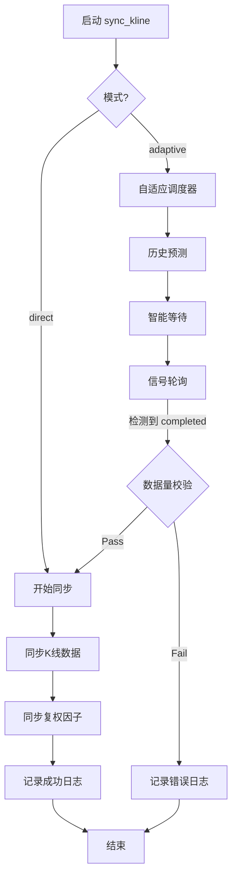

# K线同步任务：自适应调度详细设计 (最终实现版)

## 1. 背景与目标

**核心挑战**: 云端数据采集(Baostock)完成时间不固定,通常在 **18:30 - 19:30** 之间波动。
**目标**: 设计一种"自适应触发机制",在确保数据完整性的前提下,尽早启动本地同步任务,避免同步到未完成的脏数据。

## 2. 核心逻辑：历史预测 + 自适应轮询

代码实现类: `core.adaptive_scheduler.AdaptiveKLineSyncScheduler`

整个同步任务分为三个阶段：**历史预测阶段**、**智能等待阶段**、**信号量轮询阶段**。

### 2.1 历史预测阶段 (Historical Predictor)
当 `gsd-worker` 启动后 (`jobs.sync_kline`)，首先执行：

**对象**: 腾讯云 MySQL (`alwaysup`)
**SQL**:
```sql
SELECT updated_at, total_count
FROM sync_progress 
WHERE task_name = 'full_market_sync' 
  AND status = 'completed' 
ORDER BY updated_at DESC 
LIMIT 1;
```

**逻辑**:
- 获取前一交易日的实际完成时间。
- 计算**目标观察窗口** = `历史完成时间 - 缓冲时间(KLINE_SYNC_HISTORY_BUFFER_MIN)`。

### 2.2 智能等待阶段 (Adaptive Wait)
- 如果当前时间早于“目标观察窗口”：系统进入长休眠。
- 在休眠期间，每隔 `KLINE_SYNC_SLEEP_CHECK_INTERVAL_MIN` (默认15分钟) “抬头”检查一次云端是否有提早完成的信号。

### 2.3 信号量轮询阶段 (Polling)
进入窗口期后，系统转为高频轮询（每 `KLINE_SYNC_POLL_INTERVAL_MIN` 分钟检查一次）：
- **检测目标**: 今日日期且状态为 `completed` 的 `full_market_sync` 记录。
- **阈值校验**: 验证 `total_count` 是否大于 `KLINE_SYNC_MIN_RECORDS` (默认4800)。

## 3. 异常处理机制

| 异常场景 | 异常类 | 处理动作 |
|:---------|:-------|:---------|
| **云端采集失败** | `CloudSyncFailedException` | 检测到 `status='failed'`，停止任务，记录FAILED日志 |
| **云端采集超时** | `CloudSyncTimeoutException` | 超过 `KLINE_SYNC_TIMEOUT_TIME` (21:00) 仍未完成，记录FAILED日志 |
| **数据量异常** | `DataVolumeAnomalyException` | `total_count` < 阈值，抛出异常，记录FAILED日志 |

## 4. 任务执行日志 (Task Logger)

代码实现类: `core.task_logger.TaskLogger`

本地同步任务的执行结果（无论成功还是失败）都会写入腾讯云 MySQL 的 `sync_execution_logs` 表。

### 4.1 表结构定义
```sql
CREATE TABLE sync_execution_logs (
    id INT AUTO_INCREMENT PRIMARY KEY,
    task_name VARCHAR(100) NOT NULL,    -- 任务名称 (e.g., 'kline_daily_sync')
    status ENUM('RUNNING', 'SUCCESS', 'FAILED', 'TIMEOUT') NOT NULL,
    records_processed INT DEFAULT 0,    -- 同步记录数
    details TEXT,                       -- 错误详情或执行摘要
    duration_seconds FLOAT,             -- 耗时(秒)
    execution_time DATETIME NOT NULL,   -- 执行开始时间
    created_at TIMESTAMP DEFAULT CURRENT_TIMESTAMP
);
```

### 4.2 写入策略
- **成功**: 由 `KLineSyncService` 内部调用 `_log_to_db` 写入 `SUCCESS`。
- **失败**: 由 `jobs.sync_kline` 顶层 `try...except` 捕获异常，调用 `TaskLogger` 写入 `FAILED`，包含完整错误堆栈或消息。

## 5. 复权因子同步策略

代码实现方法: `KLineSyncService.sync_adjust_factors`

采用**智能增量同步**策略，确保高效性。

### 5.1 执行逻辑
1. **查询断点**: 查询本地 ClickHouse `stock_adjust_factor` 表的最大 `ex_date`。
2. **增量获取**: 
   - 如果本地有数据: `SELECT ... FROM stock_adjust_factor WHERE adjust_date > {max_ex_date}`
   - 如果本地无数据: 执行全量查询
3. **写入本地**: 将获取到的新因子批量写入 ClickHouse。

## 6. 配置参数清单

| 环境变量 | 默认值 |说明 |
|:--------|:------|:-----|
| `KLINE_SYNC_HISTORY_BUFFER_MIN` | `5` | 历史预测缓冲时间(分钟) |
| `KLINE_SYNC_SLEEP_CHECK_INTERVAL_MIN` | `15` | 等待期检查间隔(分钟) |
| `KLINE_SYNC_POLL_INTERVAL_MIN` | `2` | 轮询期检查间隔(分钟) |
| `KLINE_SYNC_TIMEOUT_TIME` | `21:00` | 最晚等待时间 |
| `KLINE_SYNC_MIN_RECORDS` | `4800` | 最小合规K线数量 |
| `MYSQL_HOST` | - | 腾讯云MySQL地址 |
| `CLICKHOUSE_HOST` | - | 本地ClickHouse地址 |

## 7. 数据流示意图


