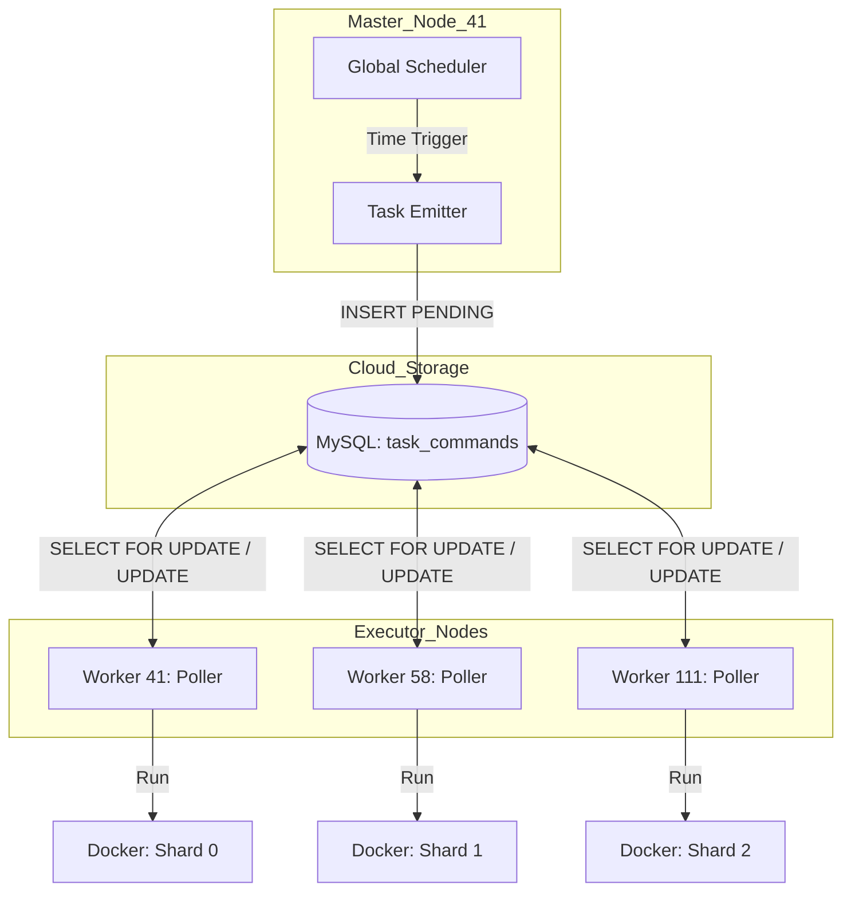

# 任务调度 3.0：指令驱动型分布式架构 (Command-Driven Architecture)

> **版本**: 1.0  
> **状态**: 架构设计 (Draft)  
> **更新日期**: 2026-01-20  

---

## 1. 概述

在架构 2.0 中，系统采用了“主从分片、独立调度”的模式。虽然解决了计算压力，但带来了配置分散（三个节点三个配置文件）、观察性差（无法统一查看集群执行状态）以及运维复杂等问题。

**架构 3.0** 引入“指令驱动”模式，通过 **中心化决策 (Master Emitter)** + **去中心化执行 (Worker Poller)** 彻底解耦调度与执行。

---

## 2. 核心架构逻辑

### 2.1 调度与执行分离 (Decoupling)
*   **调度中心 (Master Node - 41)**: 负责“发令”。它持有唯一的 `Cron` 引擎，负责按照时间表向云端指令库 (`task_commands`) 注入任务指令。
*   **执行节点 (Worker Nodes - 41, 58, 111)**: 负责“受令”。它们运行 `CommandPoller`，根据自身的 `shard_id` 或属性，从云端抓取任务并执行，执行过程与结果回写至指令库。

### 2.2 逻辑架构图



---

## 3. 组件详细设计

### 3.1 统一任务配置文件 (SSOT)
所有任务定义回归到 Node 41 的 `tasks.yml`。引入 `type: command_emitter` 任务类型：

```yaml
tasks:
  - id: distributed_tick_sync
    name: "集群分笔数据采集"
    schedule: "0 18 * * 1-5"
    type: command_emitter
    params:
      task_template: "sync_tick"
      mode: "incremental"
      shards: [0, 1, 2]  # 自动生成 3 条指令
```

### 3.2 任务发射器 (Master Emitter)
*   **职责**: 定时触发，生成任务元数据。
*   **行为**: 
    1. 计算目标日期（应用 6AM 规则）。
    2. 根据 `shards` 列表，生成多条 `INSERT INTO task_commands` SQL。
    3. 支持动态依赖：只有当 Emitter 确认前置任务（如 K 线同步）在 `task_execution_logs` 中成功后，才发射补采指令。

### 3.3 指令执行引擎 (Worker Poller)
*   **职责**: 持续轮询，隔离执行。
*   **过滤规则**: `WHERE status = 'PENDING' AND shard_id = ${LOCAL_SHARD_ID}`。
*   **特性**:
    *   **行级锁**: 使用 `FOR UPDATE SKIP LOCKED` 确保多实例竞争安全。
    *   **原子性**: 每次仅处理一条指令，处理完后才 ACK 下一条。
    *   **可观测**: 执行结果（含日志尾部）直接回写到 `result` 字段。

---

## 4. 架构优势

| 维度 | 优势说明 |
|:---|:---|
| **单一事实源** | 调度逻辑仅存在于 Master，避免多节点 Cron 步调不一。 |
| **集群可观测性** | 通过查询 `task_commands` 即可实时掌握全集群 3 个分片的进度和报错。 |
| **高度弹性** | 扩容节点无需改配置，只需启动新节点并指定新的 `shard_id` 即可。 |
| **天然的容错** | 任务执行失败后，Master 可根据 `status='FAILED'` 自动重发指令（Auto-Retry）。 |
| **维护简单** | 维护者只需关注数据库状态，不再需要 SSH 到各个节点查 `crontab -l`。 |

---

## 5. 防死锁机制：任务超时自愈 (Stale Task Recovery)

### 5.1 问题描述
如果某个 Worker 进程在执行任务时崩溃或卡死，其领取的任务将永久停留在 `RUNNING` 状态。由于 `FOR UPDATE SKIP LOCKED` 的行锁机制，后续同分片的指令会被持续阻塞，导致"死锁"。

### 5.2 解决方案：Master 定时清道夫 (Stale Task Sweeper)
在 Master 节点 (`task-orchestrator`) 中增加一个后台任务，定期扫描并回收超时任务。

**核心逻辑**:
```sql
-- 每 10 分钟执行一次
UPDATE alwaysup.task_commands
SET 
    status = 'FAILED',
    result = CONCAT('Auto-recovered: Task stalled for over ', TIMESTAMPDIFF(MINUTE, executed_at, NOW()), ' minutes')
WHERE 
    status = 'RUNNING' 
    AND executed_at < NOW() - INTERVAL 2 HOUR;
```

**配置参数**:
| 参数 | 默认值 | 说明 |
|:-----|:-------|:-----|
| `STALE_TASK_TIMEOUT_MINUTES` | 120 | 任务超时阈值（分钟） |
| `SWEEPER_INTERVAL_SECONDS` | 600 | 清道夫扫描间隔（秒） |

### 5.3 自动重试机制 (Optional)
对于被标记为 `FAILED` 的超时任务，系统可以选择性自动重发：
1.  检查 `retry_count` 字段（需扩展表结构）。
2.  若 `retry_count < MAX_RETRIES`，则插入一条新的 `PENDING` 指令，并将原指令的 `retry_count + 1`。
3.  若已达最大重试次数，则保持 `FAILED` 状态，等待人工介入。

---

## 6. 迁移路线图

1.  **Phase 1 (底层就绪)**: 完善各节点的 `CommandPoller`，支持参数化 Docker 启动。 (✅ 已完成)
2.  **Phase 2 (Master 改造)**: 在 `task-orchestrator` 中开发 `CommandEmitter` 逻辑。 (✅ 已完成)
3.  **Phase 3 (配置统一)**: 合并 `tasks_58.yml` 和 `tasks_111.yml` 到主库。 (✅ 已完成)
3. **Phase 3 (配置整合)**: 将 `tasks_58.yml` 和 `tasks_111.yml` 逻辑合并入主 `tasks.yml`。 (✅ 已完成)
4.  **Phase 4 (执行切换)**: 停止各节点 Linux Cron，正式切换为指令驱动模式。 (✅ 已完成)

---

## 7. 结项说明 (Conclusion)
截至 2026-01-20，系统已完成 **架构 3.0** 的核心切换。
- **调度中心**: Server 41 统一发射分片指令。
- **执行节点**: 41, 58, 111 实时领取并执行。
- **可观测性**: 所有的指令执行详情均记录在 `alwaysup.task_commands` 表中。

---

**创建日期**: 2026-01-20  
**文档状态**: 已归档至任务调度架构体系
