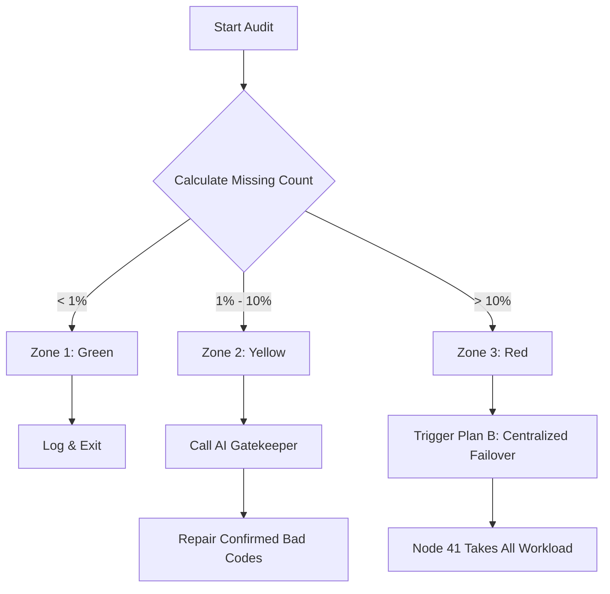

# Post-Market Resilience Strategy: The "Traffic Cop" & "Plan B"
## 1. 背景与挑战

我们的分笔数据采集采用分布式架构 (Shard 0/1/2 分别对应 Node 41/58/111)。
这种架构虽然提高了并发能力，但也引入了**单点故障扩散**的风险：
- **场景**：如果 Node 58 和 Node 111 同时或者部分宕机。
- **后果**：整个集群将缺失 66% (约 3300 只) 的股票数据。
- **局限**：目前的 AI 逐个审计逻辑 (AI Gatekeeper) 无法处理如此大规模的缺失，会导致 Token 消耗爆炸且修复效率极低。

## 2. 核心策略：智能流量交警 (Smart Traffic Cop)

我们需要在数据审计环节 (`calculate_data_quality`) 引入一个“分流器”，根据缺失规模将故障划分为三个等级，并路由到不同的修复策略。

### 2.1 故障分级 (Defcon Zones)

| 等级 | 颜色 | 触发条件 (Missing Rate) | 诊断结论 | 应对策略 |
| :--- | :--- | :--- | :--- | :--- |
| **Zone 1** | 🟢 Green | `< 1%` (e.g. < 50只) | 正常冗余/停牌 | **Ignore / Lazy Repair** (无需立即动作) |
| **Zone 2** | 🟡 Yellow | `1% - 10%` (e.g. 50-500只) | 局部异常/软故障 | **AI Audit** (启用 AI 逐个判决，精准修复) |
| **Zone 3** | 🔴 Red | `> 10%` (e.g. > 500只) | **集群级雪崩** | **Failover (Plan B)** (跳过 AI，全量暴力补采) |

### 2.2 路由逻辑

## 3. Plan B: 中央代偿机制 (Centralized Failover)

当进入 Zone 3 (Red) 状态时，系统判定分布式集群已不可信。此时激活 Node 41 (Master) 的**兜底模式**。

### 3.1 机制设计
- **执行者**: Node 41 (Task Orchestrator 所在节点)。
- **数据源**: 强制使用 Node 41 本地的 IP 代理池 + 云端 API/TDX 直连。
- **范围**: **忽略分片规则**。Node 41 将负责采集 `audit_list` 中的所有股票，无论这些股票原本属于哪个分片。

### 3.2 关键参数
Repair Task 将被注入特殊参数：
- `--distributed-source none`: 禁用分布式任务分发，强制本地执行。
- `--force-scope custom`: 指定目标为全量缺失名单。
- `--concurrency 64`: 适当降低并发度 (相比集群总和)，以防止单节点过载，以时间换空间。

## 4. 工作流编排 (Workflow 4.0 Update)

新的 `post_market_audit` 流程将通过 Python 脚本的输出来动态决定路径：

1. **Step 1: Audit**
   - 运行 `calculate_data_quality.py`。
   - 输出 JSON: `{"action": "FAILOVER", "codes": [...]}`。

2. **Step 2: Decision (Implicit)**
   - Orchestrator 读取 Step 1 的 output context。

3. **Step 3: Repair Execution**
   - **Branch A (AI)**: 如果 `action == 'AI_AUDIT'`，调用 `ai_quality_gatekeeper`，然后执行定向修复。
   - **Branch B (Failover)**: 如果 `action == 'FAILOVER'`，直接调用 `batch_repair_tick` (Mode: Local Failover)。

## 5. 预期效果

| 故障场景 | 原有表现 | 新策略表现 |
| :--- | :--- | :--- |
| **单节点闪断** (缺 5 只) | 进入 AI 流程，耗费 Token | **Zone 1**，忽略或下个周期自动补，节省成本 |
| **部分数据源污染** (缺 100 只) | 进入 AI 流程，耗费 Token | **Zone 2**，AI 介入，剔除停牌股票，精准修复 |
| **两个节点宕机** (缺 3300 只) | AI 流程超时/限流，修复失败 | **Zone 3**，Node 41 立即接管，2小时内完成数据追平 |

---
*Created by Antigravity Agent - 2026-01-26*
